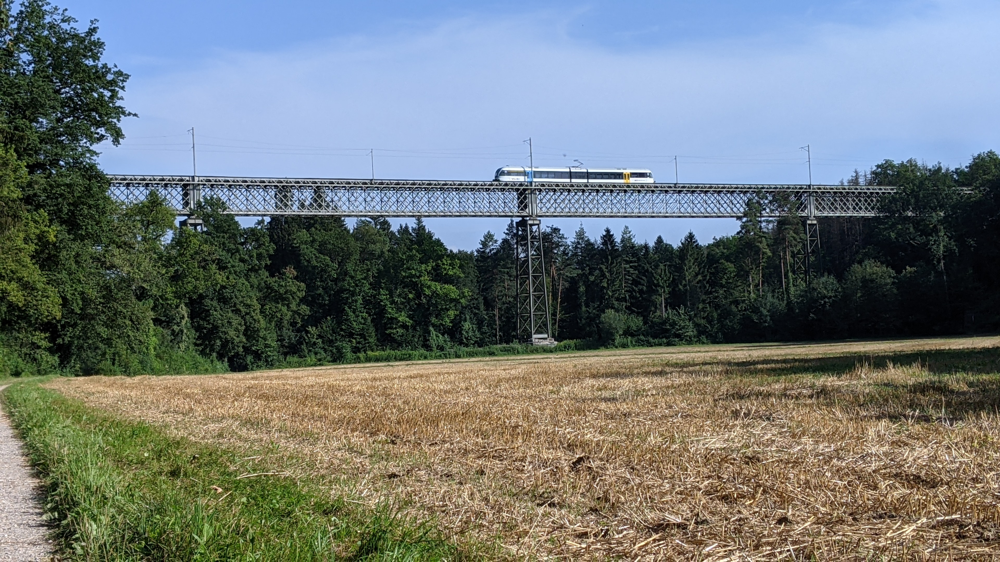
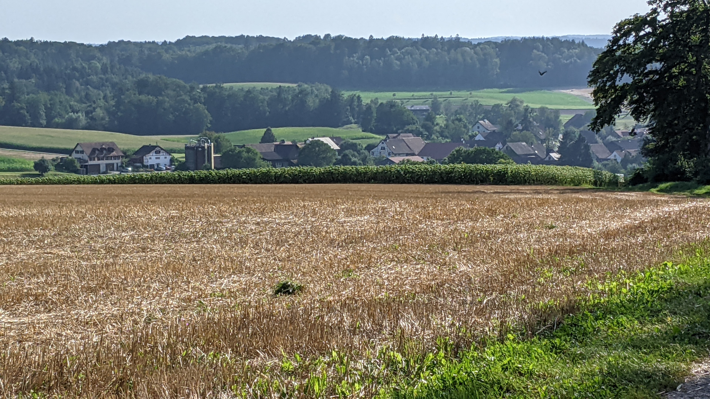
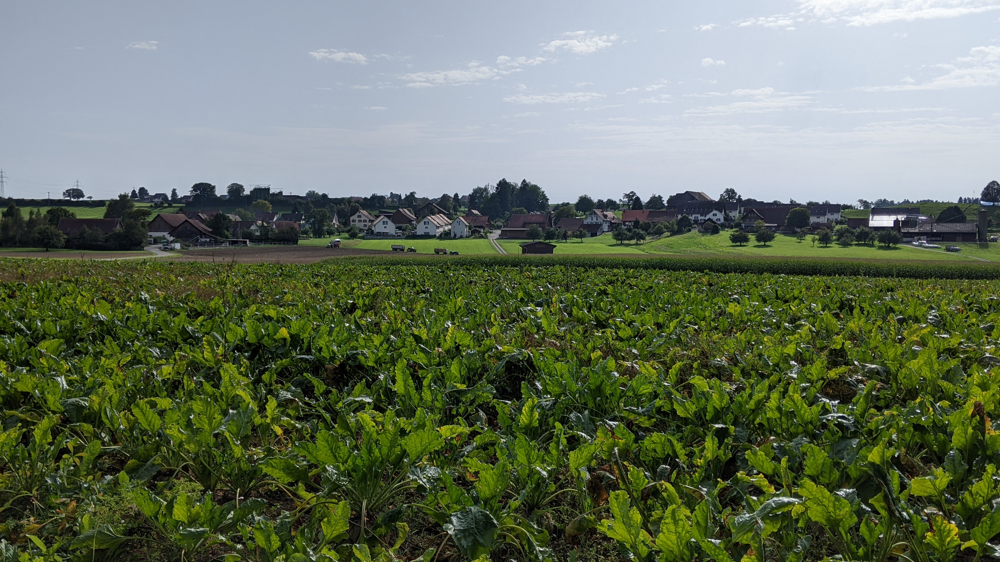
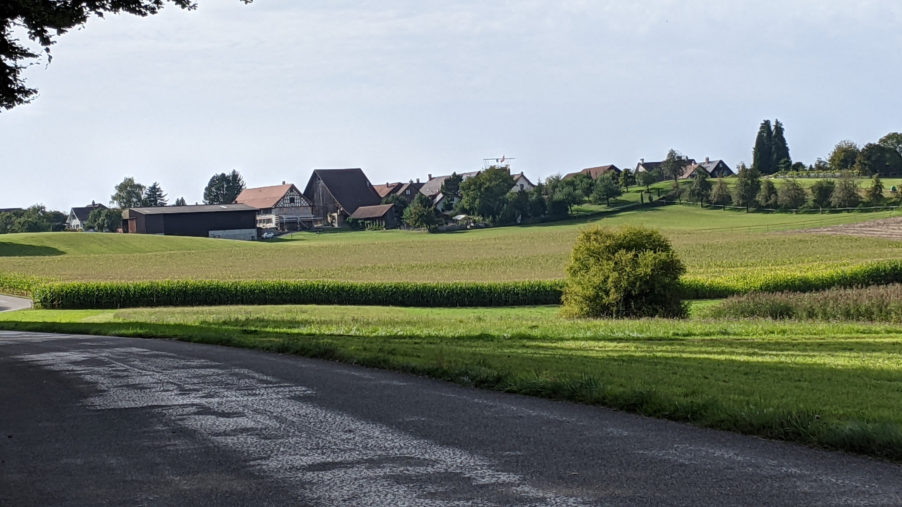
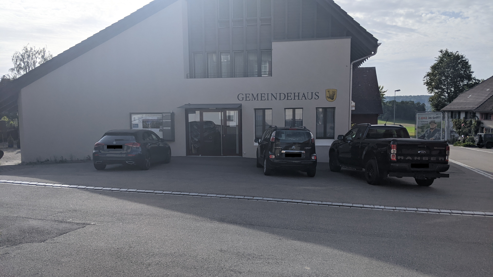
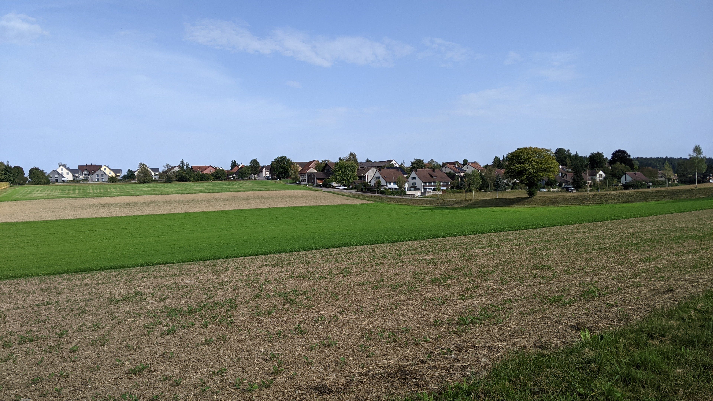

# Adlikon (bei Andelfingen)

*Update vom 18.03.2023: Die Webseite der Gemeinde Adlikon wird am 30. Juni 2023 verschwinden. Ich weiss nicht was danach mit der Domain passiert. Das anklicken von links, die zur Webseite führen könnte gefährlich sein.*

*Update vom 28.11.2021: Die Gemeinde Adlikon hat in einer Abstimmung entschieden, dass sie Teil der Gemeinde Andelfingen werden wollen. Die Abstimmungsunterlagen dazu kann man ~~[hier](https://www.adlikon.ch/_docn/3362330/Beiblatt_Fusionsabstimmung.pdf)~~ finden (Solange die Gemeinde Adklikon diese noch nicht gelöscht hat).*

~~[Webseite der Gemeinde](https://www.adlikon.ch/)~~  
[Gemeindegebiet auf Openstreetmap.org](https://www.openstreetmap.org/relation/1682076)

Die Gemeinde Adlikon ist eine ~~<q cite="https://www.adlikon.ch/portrait_uebersicht">kleine Landgemeinde mit rund 700 Einwohner*innen die aus den 3 Dörfern Adlikon, Dätwil und Niederwil besteht.</q>~~ Adlikon liegt 9.5 km nördlich von Winterthur.  
Zwischen Adlikon und Niederwil liegen 2.3 km, zwischen Adlikon und Dätwil liegen 2.4 km und zwischen Niederwil und Dätwil liegen 2.5 km.

## Transport

An Arbeitstagen hält die Buslinie 612 ein Mal stündlich in Adlikon und Niederwil. Vom Dorf Adlikon bis zum Bahnhof Andelfingen sind es 1.9 km, an welchem 3 Züge pro Stunde nach Winterthur verkehren. Vom Dorf Dätwil bis zum Bahnhof Ossingen sind es 3.1 km und vom Dorf Niederwil bis zum Bahnhof Thalheim-Altikon sind es 3.6 km. Von beiden Bahnhöfen verkehrt die S29 im Halbstundentakt.  
Die Autobahnausfahrt 11 der Autobahn A4 befindet sich nur 600 m vom Dorf Adlikon entfernt.

## Erfahrungsbericht als Fussgänger

*Dieser Abschnitt enthält Persönliche Meinungen und gefährliches Halbwissen. Alle Aussagen in diesem Abschnitt sollten mit Vorsicht genossen werden, da es gut Möglich ist dass er fehler enthält. Meine Quelle für diesen Abschnitt sind lediglich 2 Besuche auf dem Gemeindegebiet die ich als Fussgänger gemacht habe.*

Auf dem Gemeindegebiet scheint es nur sehr wenige Gehwege(Schweizerdeutsch: Trottoirs) und Fahrradstreifen zu geben. Der einzige Ort an dem ich einen Gehweg neben der Strasse gesehen habe, war der kurze Abschnitt der Thurtalstrasse, der sich im Gemeindegebiet befindet.  
Andererseits gibt es sehr viele Feld- und/oder Waldwege auf denen entweder kaum oder gar keine Autos fahren und nur/vor allem Fussgänger und Fahrräder unterwegs sind. Diese Feld- und Waldwege scheinen in einem guten Zustand zu sein.

Das Fahrrad scheint in der Region ziemlich beliebt zu sein.

## Fotos

  
Die Thurbrücke Ossingen, fotografiert von [hier](https://www.openstreetmap.org/search?whereami=1&amp;query=47.60345%2C8.72081#map=19/47.60345/8.72081) am 14.08.2021

  
Das Dorf Dätwil, fotografiert von [hier](https://www.openstreetmap.org/search?whereami=1&amp;query=47.60103%2C8.71749#map=17/47.60102/8.71749) am 14.08.2021

  
Das Dorf Niederwil, fotografiert von [hier](https://www.openstreetmap.org/search?whereami=1&amp;query=47.58392%2C8.72056#map=19/47.58392/8.72056) am 25.09.2021

  
Das Dorf Adlikon, fotografiert von [hier](https://www.openstreetmap.org/search?whereami=1&amp;query=47.58138%2C8.70125#map=19/47.58138/8.70125) am 25.09.2021

  
Das Gemeindehaus von Adlikon, fotografiert am 25.09.2021 *(Die Nummernschilder wurden aus Datenschutzgründen unkenntlich gemacht)*

  
Das Dorf Adlikon, fotografiert von [hier](https://www.openstreetmap.org/search?whereami=1&amp;query=47.58290%2C8.68542#map=18/47.58290/8.68542&amp;layers=N) am 25.09.2021
