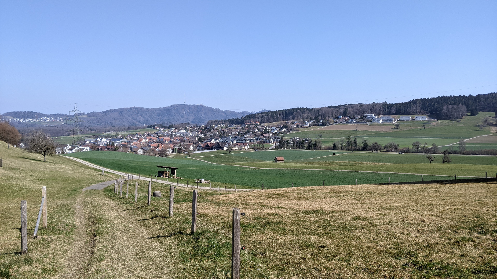

# Aesch ZH

[Webseite der Gemeinde](https://www.aesch-zh.ch)  
[Gemeindegebiet auf Openstreetmap.org](https://www.openstreetmap.org/relation/1682078)

Die Gemeinde Aesch ZH (früher auch Aesch bei Birmensdorf genannt) ist eine Gemeinde mit rund 1'700 Einwohner*innen. Aesch ZH liegt direkt südlich von Birmensdorf und ist 8.7 km Luftlinie Südwestlich vom Hauptbahnhof Zürich.

## Transport

### Privatverkehr

Die Strasse K 406 (in Aesch ZH "Dorfstrasse" genannt) verbindet Aesch in die eine Richtung mit Arni (Kanton Aargau) und Oberlunkhofen (Kanton Aargau) und in die andere Richtung mit Birmensdorf. Die Autobahn A3/A4 kann über Birmensdorf erreicht werden ohne dass durch das Birmensdorfer Zentrum gefahren werden muss.  
Das Aescher Tunnel der Autobahn A3/A4 verläuft unter der Gemeinde Aesch ZH.

### Öffentlicher Verkehr

Auf dem Gemeindegebiet von Aesch gibt es 2 Bushaltestellen, die von den gleichen 2 Buslinien bedient werden. Die Buslinien 215 und 245 halten beide jeweils im Halbstundentakt (am Sonntag im Stundentakt) an den Stationen "Heiligenmattstrasse" und "Gemeindehaus". Die 2 Buslinien ergänzen sich nicht ganz zu einem 15 Minuten Takt, vermutlich weil die Anschlüsse in Birmensdorf ebenfalls nicht exakt einen 15 Minuten Takt haben.  
Die Buslinien haben in Birmensdorf Anschluss an die Zürcher S5 nach Zug, die Zürcher S14 nach Affoltern am Albis, die Zürcher S5 nach Pfäffikon SZ via Zürich Altstetten, Zürich Hardbrücke, Zürich HB, Zürich Stadelhofen und Uster und die Zürcher S14 nach Hinwil via Zürich Altstetten, Zürich HB, Zürich Oerlikon und Uster. In Muri Aargau hat die Buslinie 245 Anschluss an die Aargauer S25 nach Brugg AG, die Aargauer S26 nach Rotkreuz, die Aargauer S26 nach Olten via Lenzburg und Aarau und teilweise auch an die Aargauer S42 nach Zürich HB via Dietikon und Zürich Altstetten, den RE nach Lenzburg, Aarau und Olten und den RE nach Rotkreuz. Der Bus 215 fährt noch Affoltern am Albis an und beide Buslinien könnten verwendet werden um in Uitikon auf die Zürcher S10 oder in Zürich Wiedikon auf die Zürcher S24, S8 und S2 umzusteigen. Diese Verbindungen schätze ich allerdings als weniger wichtig ein.

Aesch ist Teil des ZVV in der Tarifzone 154.

Im Zürcher Nachtnetz werden beide Bushaltestellen in Aesch ZH vom Bus N22 4 Mal im Stundentakt angefahren. Einsteigen darf man allerdings jeweils nicht. In Birmensdorf kann von der SN5 auf den N22 umgestiegen werden.

## Einkaufsmöglichkeiten

Aesch hat nicht sehr viele Einkaufsmöglichkeiten, braucht es aber auch nicht, da es eine eher kleine Gemeinde ist und die Einkaufsmöglichkeiten in Birmensdorf weniger als 2km entfernt sind. Es gibt allerdings trotzdem eine Volg Filiale, einige kleine Restaurants und einen Selecta Automaten an der Bushaltestelle beim "Gemeindehaus".

## Gemeindewappen

Das Gemeindewappen ist sehr simpel (Drei rote, nach unten zeigende Pfeile auf weissem Hintergrund) und ist auf dem Gemeindegebiet überraschend oft sichtbar.

## Erfahrungsbericht als Fussgänger

*Dieser Abschnitt enthält Persönliche Meinungen und gefährliches Halbwissen. Alle Aussagen in diesem Abschnitt sollten mit Vorsicht genossen werden, da es gut Möglich ist dass er fehler enthält. Meine Quelle für diesen Abschnitt sind lediglich 2 Besuche auf dem Gemeindegebiet, die ich als Fussgänger gemacht habe.*

Die Anzahl Gehwege (Schweizerdeutsch: Trottoirs) auf dem Gemeindegebiet ist ganz okay. Die Dorfstrasse hat auf der gesamten länge einen Gehweg, die Lielistrasse hat einen Gehweg von der Dorfstrasse bis zum Primarschulhaus und die Haldenstrasse hat fast auf der gesamten länge einen Gehweg. Explizite Fahrradwege oder Fahrradstreifen habe ich allerdings keine gesehen.  
Abgesehen von der Dorfstrasse sind die meisten Strassen nicht sehr stark befahren und können deswegen auch problemlos von Fussgänger\*innen und Fahrradfahrer\*innen genutzt werden.

Auf dem gesamten Gemeindegebiet gibt es ziemlich viele Feld- und Waldwege, die in einem guten Zustand sind. Es gibt auch ziemlich viele Sitzbänke und ganz im Osten der Gemeinde gibt es sogar eine [Feuerstelle](https://www.openstreetmap.org/node/4693679993).

Bei meinem Besuch habe ich überraschend viele (vorallem im Verhältnis zur grösse der Gemeinde) andere Fussgänger gesehen und auch Fahrradfahrer waren nicht selten.

## Fotos

  
Das Dorf Aesch ZH, fotografiert von [hier](https://www.openstreetmap.org/search?whereami=1&amp;query=47.33778%2C8.42983#map=19/47.33778/8.42983) am 20.03.2022.

  
Das Dorf Aesch ZH, fotografiert von [hier](https://www.openstreetmap.org/search?whereami=1&amp;query=47.33316%2C8.42717#map=19/47.33316/8.42717) am 20.03.2022. *(Zwei Personen wurden aus Datenschutzgründen durch ein schwarzes Rechteck unkenntlich gemacht.)*

  
Das Dorf Aesch ZH, fotografiert von [hier](https://www.openstreetmap.org/search?whereami=1&amp;query=47.33430%2C8.44500#map=18/47.33430/8.44500) am 09.04.2022.

  
Das Dorf Aesch ZH, fotografiert von [hier](https://www.openstreetmap.org/search?whereami=1&amp;query=47.33213%2C8.44339#map=19/47.33213/8.44339) am 09.04.2022.

  
Die Autobahnausfahrt Birmensdorf, fotografiert von [hier](https://www.openstreetmap.org/search?whereami=1&amp;query=47.34216%2C8.42544#map=19/47.34216/8.42544) am 20.03.2022.
