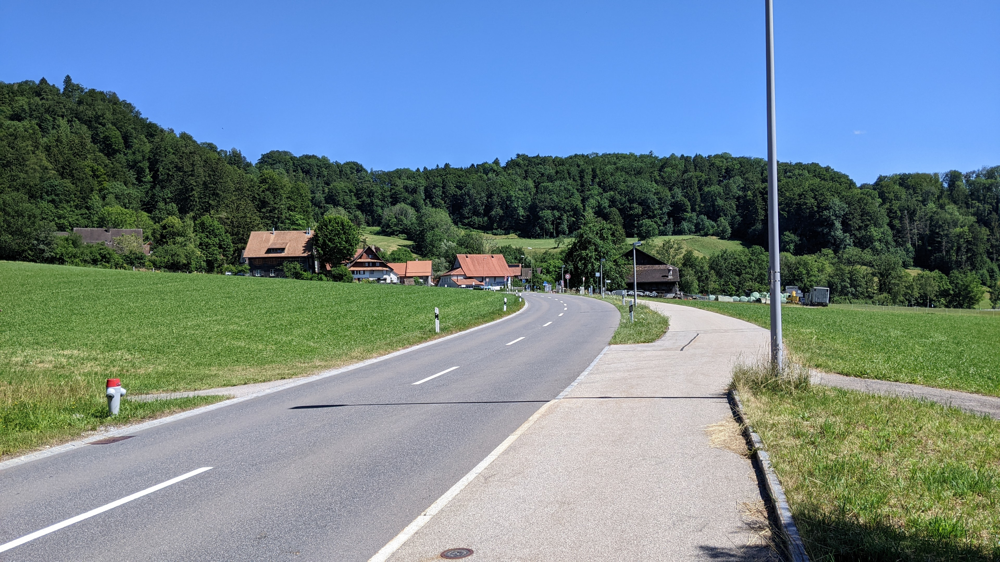

# Aeugst am Albis

[Webseite der Gemeinde](https://www.aeugst-albis.ch/)  
[Gemeindegebiet auf Openstreetmap.org](https://www.openstreetmap.org/relation/1682079)

Die Gemeinde Aeugst am Albis ist eine Gemeinde mit rund <q cite="https://www.aeugst-albis.ch/gemeinde/zahlen-fakten.html/21">2'000 Einwohner\*innen</q>. <q cite="https://www.aeugst-albis.ch/gemeinde/unser-dorf.html/19">Topografisch besteht die Gemeinde aus zwei unterschiedlichen Teilen. Einerseits aus dem Aeugstertal mit dem Oberlauf der Reppisch angesiedelten Weilern sowie dem Türlersee und andererseits dem Aeugsterberg mit dem an seinem südwestlichen Abhang gelegenen Dorf Aeugst.</q> Aeugst liegt ca. 13 km Luftlinie südsüdwestlich der Stadt Zürich und ca. 3 km Luftlinie ostsüdöstlich von Affoltern am Albis.  
Zwischen dem Dorf Aeugst und dem Wiler Müliberg liegen fast 2 km zu Fuss, zwischen dem Dorf Aeugst und dem Türlersee liegen ca. 1.8 km zu Fuss und zwischen Müliberg und dem Aeugstertal liegen 750 m zu Fuss.

## Transport

### Privatverkehr

Die Affolternstrasse (innerhalb des Dorfes "Dorfstrasse" genannt) verbindet das Dorf Aeugst in die eine Richtung mit Affoltern am Albis und in die andere Richtung mit der Strasse 383. Die Strasse 383 wiederum verbindet Adliswil und Langnau im Sihltal mit Mettmenstetten über den Albis. Im Aeugstertal verbindet die Reppischtalstrasse Waldegg und Stallikon mit der Strasse 383.  
Die nächstgelegenen Autobahnen sind die A4 in Affoltern am Albis und die A3 in Thalwil.

### Öffentlicher Verkehr

Auf dem Gemeindegebiet von Aeugst am Albis gibt es 6 Bushaltestellen, die von insgesamt 3 Buslinien bedient werden. Die Linie 236 hält im Stundentakt an den im Aeugstertal liegenden Haltestellen "Kloster" und "Landhus". Sie verbindet Hausen am Albis mit dem Bahnhof Wiedikon. Die Linie 235 hält ebenfalls im Stundentakt (am Samstag nur am Nachmittag und am Sonntag gar nicht) an den Haltestellen "Aeugstertal, Kloster", "Aeugst am Albis, Müliberg", "Aeugst am Albis, Höchweg", "Aeugst am Albis, Dorf" und "Aeugst am Albis, Grossacher". Sie verbindet Aeugst mit dem Bahnhof Wiedikon am Samstag Morgen und an Sonntagen verbindet allerdings nur Aeugst mit dem Aeugstertal. Die Linie 225 hält im Halbstundentakt an den Haltestellen "Aeugst am Albis, Grossacher", "Aeugst am Albis, Dorf", "Aeugst am Albis, Höchweg" und "Aeugst am Albis, Müliberg". Sie verbindet Aeugst mit dem Bahnhof Affoltern am Albis.  
Die Buslinie 225 hat in Affoltern am Albis anschluss auf die S5 nach Zug, die S14 nach Zürich, Oerlikon, Uster und Hinwil und weniger direkten Anschluss auf die S5 nach Zürich, Uster, Rapperswil und Pfäffikon SZ. Die Buslinien 235 und 236 haben in Zürich Wiedikon anschluss an das Netz der VBZ sowie die S-Bahnen S8 von Winterthur nach Pfäffikon SZ, S2 von Unterterzen SG nach Zürich Flughafen und S24 von Zug nach Thayngen SH. Die Busse 235 und 236 könnten ausserdem noch verwendet werden um in Uitikon auf die S10 umzusteigen.

Aeugst ist Teil des ZVV in der Tarifzone 151.

Im Zürcher Nachtnetz werden die Haltestellen "Aeugst a. A., Müliberg", "Aeugst a. A., Höchweg", "Aeugst a. A., Dorf" und "Aeugst a. A., Grossacher" vom Bus N24 4 Mal im Stundentakt angefahren. Das Einsteigen ist an allen Haltestellen untersagt. In Affoltern am Albis kann von der SN5 auf den N24 umgestiegen werden.

## Einkaufsmöglichkeiten

Aeugst hat nicht besonders viele Einkaufsmöglichkeiten. Es gibt eine Volg Filiale, ein kleines ["Dorfstrasslädeli"](https://www.dorfstrasslaedeli.ch), einen [Landladen](http://www.der-landladen.ch) und einige kleine Restaurants.  
Die nächste grössere Einkaufsmöglichkeit ist befindet sich im 3 km entfernten Affoltern am Albis.

## Gemeindewappen

Das Gemeindewappen ist ein rotes Eichhörnchen mit einer gelben Nuss. Das ganze befindet sich auf einem weissen Hintergrund.  
Es gibt ein Restaurant [Eichhörnli](https://eichhoernli-aeugst.ch/index.php) das eine Anspielung auf das Gemeindewappen ist.

## Erfahrungsbericht als Fussgänger

*Dieser Abschnitt enthält Persönliche Meinungen und gefährliches Halbwissen. Alle Aussagen in diesem Abschnitt sollten mit Vorsicht genossen werden, da es gut Möglich ist dass er Fehler enthält. Meine Quelle für diesen Abschnitt ist lediglich 1 Besuch auf dem Gemeindegebiet, den ich als Fussgänger gemacht habe.*

Die Anzahl Gehwege(Schweizerdeutsch: Trottoirs) auf dem Gemeindegebiet ist akzeptabel.  
Die Reppischtalstrasse, die durch das Aeugstertal führt, hat auf der gesamten Länge einen kombinierten Fahrrad- und Gehweg. Die Mülibergstrasse, die vom Aeugstertal durch Müliberg nach Affoltern a. A. führt, hat nur in den Dörfern Müliberg und Aeugstertal einen Gehweg und/oder eine Fahrradstreifen. Für Fussgänger\*innen gibt es allerdings einen Weg von Müliberg ins Aeugstertal der sogar kürzer ist als die Strasse. Die Sonnenbergstrasse, die Müliberg mit Aeugst verbindet, hat ebenfalls nur innerhalb der Dörfer einen Fahrrad- oder Gehweg. Allerdings gibt es auch hier eine alternative Verbindung für Fussgänger\*innen und Fahrradfahrer\*innen die ungefähr gleich lang ist und von deutlich weniger Autos genutzt wird. Die Aeugsterstrasse/Affolternstrasse/Dorfstrasse, die von Affoltern a. A. durch Aeugst zur Albisstrasse führt, hat ebenfalls nur innerhalb des Dorfes einen Fahrrad- oder Gehweg. In diesem Fall gibt es allerdings keine Offensichtliche Alternative für Fahrradfahrer\*innen und Fussgänger\*innen. Und auch die Jonentalstrasse, die von Affoltern a. A. durch das Jonental zur Albisstrasse und Rifferswil führt, hat keinen Fahrrad- oder Gehweg. Es gibt Wald-/Feldwege weiter oben und/oder weiter unten, diese sind allerdings nicht gleich kurz wie die Jonentalstrasse. Vermutlich die beste alternative hier ist die Wängibadstrasse, die zwar auch keinen Fahrrad- und Gehweg hat, aber zumindest nicht so stark befahren ist.  
Die meisten anderen Strassen haben ebenfalls keine Fahrrad- oder Gehwege, allerdings kann man dort die Strassen recht gut mitbenutzen da der Autoverkehr gering und langsam genug ist.

Auf dem gesamten Gemeindegebiet gibt es ziemlich viele Feld- und Waldwege, die in einem guten Zustand sind. Es gibt auch mehrere Sitzbänke, einige Brünnen und ein paar Feuerstellen (hauptsächlich in der Nähe des Türlersees).

Die Aussicht im Dorf Aeugst ist genial. Bei gutem Wetter kann man den Wildspitz, die Rigi (Kulm und Hochflue), den Pilatus (zumindest vermute ich dies) und weitere innerschweizer Berge sehen. Im südöstlichen Teil des Dorfes sieht man ausserdem auch noch die Stadt Zug und den Zugersee.  
Der Gipfel des Aeugsterbergs ist so gut wie gar nicht markiert und Aussicht hat man von dort auch nicht (Dies ist allerdings nicht zwingend etwas schlechtes).

## Fotos

  
Das Dorf Aeugst am Albis, fotografiert von [hier](https://www.openstreetmap.org/search?whereami=1&amp;query=47.26411%2C8.47950#map=19/47.26411/8.47950) am 25.06.2022. *(Eine Person wurde aus Datenschutzgründen durch ein schwarzes Rechteck unkenntlich gemacht.)*

  
Das Dorf Aeugst am Albis, fotografiert von [hier](https://www.openstreetmap.org/search?whereami=1&amp;query=47.26411%2C8.47950#map=19/47.26411/8.47950) am 25.06.2022.

  
Der Müliberg Wiler, fotografiert von [hier](https://www.openstreetmap.org/search?whereami=1&amp;query=47.28024%2C8.48030#map=19/47.28024/8.48030) am 25.06.2022.

  
Der westliche Teil vom Aeugstertal Wiler, fotografiert von [hier](https://www.openstreetmap.org/search?whereami=1&amp;query=47.28535%2C8.47891#map=19/47.28535/8.47891) am 25.06.2022.

  
Der südliche und östliche Teil vom Aeugstertal Wiler, fotografiert von [hier](https://www.openstreetmap.org/search?whereami=1&amp;query=47.28577%2C8.47922#map=17/47.28577/8.47922) am 25.06.2022.

  
Der Wiler um die Bushaltestelle Landhus, fotografiert von [hier](https://www.openstreetmap.org/search?whereami=1&amp;query=47.28249%2C8.49518#map=19/47.28249/8.49518) am 25.06.2022.

  
Der Wiler um das Pegasus small world Museum, fotografiert von [hier](https://www.openstreetmap.org/search?whereami=1&amp;query=47.27920%2C8.50112#map=19/47.27920/8.50112) am 25.06.2022.

  
Der Türlersee, fotografiert von [hier](https://www.openstreetmap.org/search?whereami=1&amp;query=47.27479%2C8.49548#map=19/47.27479/8.49548) am 25.06.2022. *(Alle Personen wurden aus Datenschutzgründen mit schwarzen Rechtecken unkenntlich gemacht.)*

  
Aussicht vom nordwesten von Aeugst, fotografiert von [hier](https://www.openstreetmap.org/search?whereami=1&amp;query=47.27193%2C8.48017#map=19/47.27193/8.48017) am 25.06.2022.

  
Aussicht vom nordwesten von Aeugst, fotografiert von [hier](https://www.openstreetmap.org/search?whereami=1&amp;query=47.27193%2C8.48017#map=19/47.27193/8.48017) am 25.06.2022.

  
Aussicht vom nordwesten von Aeugst, fotografiert von [hier](https://www.openstreetmap.org/search?whereami=1&amp;query=47.27193%2C8.48017#map=19/47.27193/8.48017) am 25.06.2022.

  
Aussicht vom nordwesten von Aeugst, fotografiert von [hier](https://www.openstreetmap.org/search?whereami=1&amp;query=47.27193%2C8.48017#map=19/47.27193/8.48017) am 25.06.2022.

  
Aussicht vom südosten von Aeugst, fotografiert von [hier](https://www.openstreetmap.org/search?whereami=1&amp;query=47.26783%2C8.48968#map=19/47.26783/8.48968) am 25.06.2022.
