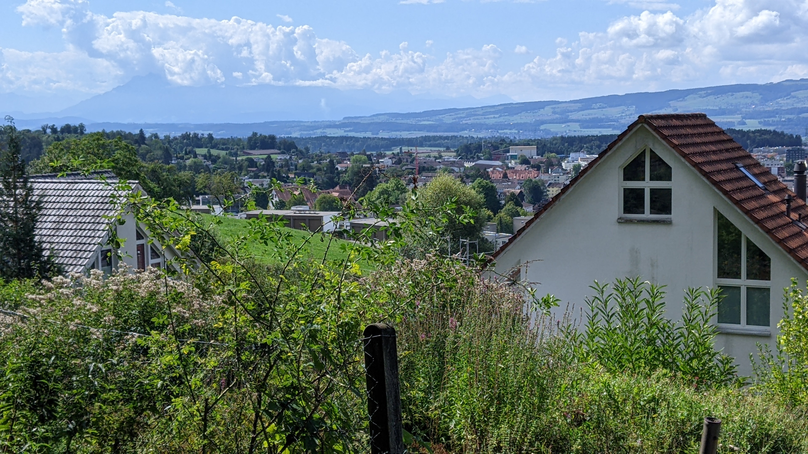
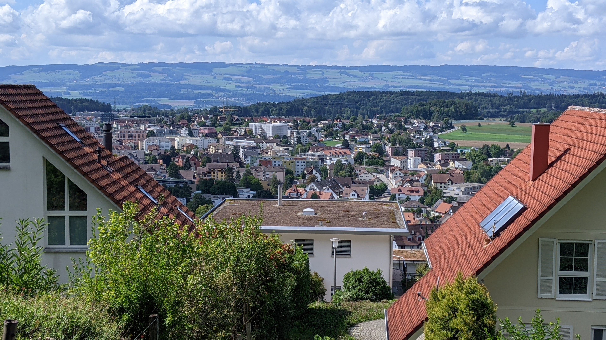
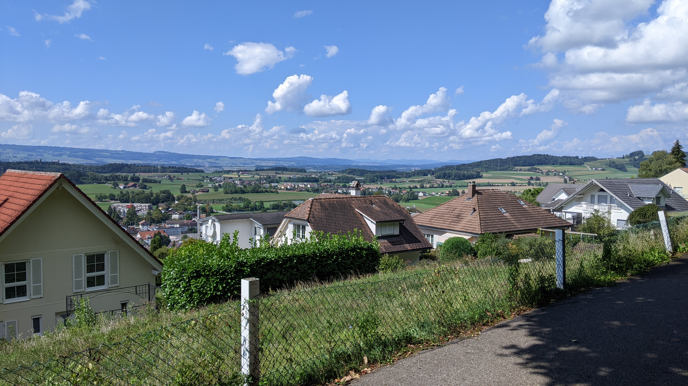
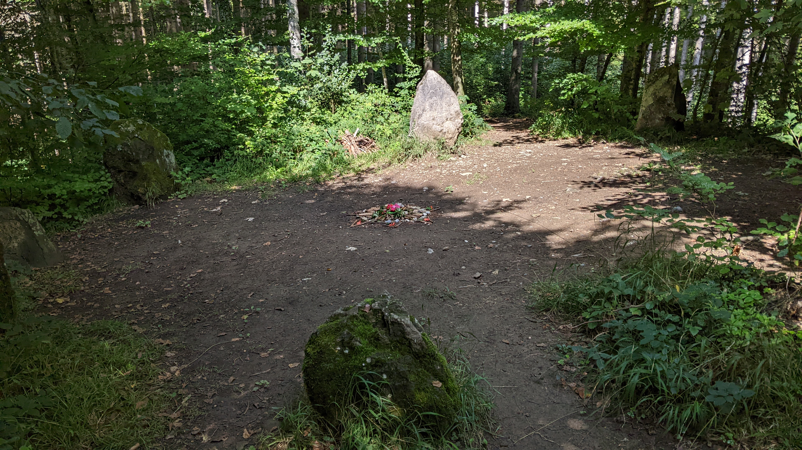
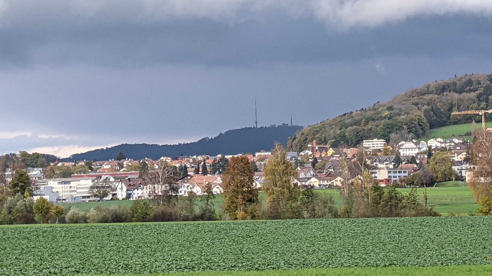

# Affoltern am Albis

[Webseite der Gemeinde](https://www.stadtaffoltern.ch/)  
[Gemeindegebiet auf Openstreetmap.org](https://www.openstreetmap.org/relation/1682080)

Die Gemeinde Affoltern am Albis ist eine Gemeinde mit über 12'000 Einwohner\*innen. Die Gemeinde besteht aus der Stadt Affoltern und dem ca. 800 m entfernten Dorf Zwillikon.  
Affoltern liegt ca. 13 km Luftlinie südwestlich von Zürich.

## Transport

### Privatverkehr

Die Zürichstrasse führt durch Affoltern aus Hedingen im Norden und Mettmenstetten im Süden. Die Ottenbacherstrasse führt durch Zwillikon aus Hedingen im Norden und Ottenbach im Westen.  
Ausserdem befindet sich direkt südlich der Stadt auch noch die Autobahnausfahrt 31b der A4.

### Öffentlicher Verkehr

Affoltern am Albis ist Teil der Tarifzone 156 des Zürcher Verkehrsverbundes. Auf dem Gemeindegebiet liegt der Bahnhof Affoltern am Albis und 13 Bushaltestellen.

#### Zug

Der Bahnhof Affoltern am Albis wird von der S5 und der S14 der zürcher S-Bahn jeweils im Halbstunden-Takt bedient, diese ergänzen sich allerdings nicht zu einem perfekten 15-Minuten-Takt sondern die abfahrten sind 10 und 20 Minuten auseinander. Für die S14 dient Affoltern als Endstation, die S5 geht allerdings noch weiter in südliche Richtung bis nach Zug. In Nördliche Richtung verkehren beide mit gleichen stopps bis Zürich Altstetten. Nach Zürich Altstetten geht die S14 direkt in den Bahnhof Löwenstrasse des Zürcher Hauptbahnhofs und die S5 hält noch in Zürich Hardbrücke bevor sie in den Bahhof Museumstrasse des Zürcher Haupbahnhofs geht. Die S14 fährt nach dem Haupbahnhof unter anderem noch Zürich Oerlikon, Uster, Wetzikon und Hinwil an. Die S5 fährt nach dem Hauptbahnhof unter anderem noch Zürich Stadelhofen, Uster, Wetzikon, Rapperswil SG und Pfäffikon SZ an.

#### Bus

Vom Bahnhof Affoltern verkehren die Busse 214, 200, 225, 223, 217, 212 und 215. Der Bus 200 verkehrt alle 30 Minuten via Hedingen, Bonstetten, Wettswil, Zürich Sihlcity nach Zürich Bahnhof Enge. Der Bus 212 verkehrt alle 30 Minuten via Obfelden nach Ottenbach. Der Bus 214 verkehrt alle 30 Minuten via Zwillikon nach Ottenbach. Der Bus 215 verkehrt alle 30 Minuten via (u.a.) Obfelden, Ottenbach, Birmensdorf an den Bahnhof Wiedikon. Der Bus 223 verkehrt alle 30 Minuten via Mettmenstetten und Rifferswil nach Hausen am Albis. Der Bus 225 verkehrt alle 30 Minuten nach Aeugst am Albis. Der Bus 217 verkehrt alle 30 Minuten nach Muri im Kanton Aargau. Der zuletzt erwähnte Bus verlässt das ZVV Gebiet.

#### Nachtnetz

Im Nachtnetz wird Affoltern am Albis 4 mal jeweils stündlich von der Nacht S-Bahn SN5 in beide Richtungen bedient. Der Nachtbus N24 verkehrt ebenfalls 4 mal jeweils stündlich nach Aeugst a. A., Hausen a. A., Rifferswil und Mettmenstetten nach Knonau.

## Einkaufsmöglichkeiten

In Affoltern am Albis gibt es ziemlich viele Einkaufsmöglichkeiten. An der oberen Bahnhofsstrasse befinden sich hauptsächlich kleinere Läden. Grössere Läden gibt es entweder im Zentrum Oberdorf oder im Industriegebiet südlich des Bahnhofs.

## Gemeindewappen

<q cite="https://www.stadtaffoltern.ch/wappen">Als Stadtwappen führt Affoltern am Albis im gespaltenen Schild links in Gold einen grünen Apfelzweig mit drei roten Früchten; rechts von Silber und Schwarz geschachtelt.</q>

Auf der oberen Bahnhofsstrasse kann man an mindestens zwei Orten 3 kleine, eiserne Äpfel finden. Dies Äpfel haben vermutlich den gleichen Ursprung wie die Äpfel im Wappen.

### Gemeinde Logo

Affoltern am Albis hat neben ihrem Gemeindewappen auch noch ein Gemeinde Logo, das man an verschiedenen Orten antrifft (unter anderem auf ihrer Webseite). Im Logo sieht man ein rotes "A" ohne den Querstrich und mit dem rechten Strich komplett vertikal. Links neben dem "A" und parallel zum linken Strich sieht man noch einen grünen und gelben Strich. Links unterhalb der grünen und gelben Striche befindet sich der Text "Affoltern", rechts neben dem roten "A" befindet sich das Wort "Stadt" in ein wenig kleinerer Schrift, unter dem "A" befindet sich das Wort "am" ebenfalls in der kleineren Schriftgrösse, und unterhalb des Wortes "Stadt" befindet sich das Wort "Albis" ebenfalls in der kleineren Schriftart. Das ganze wurde vermutlich so designt, dass man es sowohl als "Affoltern am Albis" als auch als "Affoltern, Stadt am Albis" lesen kann.

## Erfahrungsbericht als Fussgänger

*Dieser Abschnitt enthält Persönliche Meinungen und gefährliches Halbwissen. Alle Aussagen in diesem Abschnitt sollten mit Vorsicht genossen werden, da es gut Möglich ist dass er Fehler enthält. Meine Quelle für diesen Abschnitt sind lediglich 2 Besuche auf dem Gemeindegebiet, die ich als Fussgänger gemacht habe.*

Die obere Bahnhofsstrasse wird nahezu gar nicht von Autos verwendet sondern ist primar für Fussgänger gedacht. An der Strasse liegen verschiedene kleine Läden und nicht weit davon entfernt liegt auch noch ein Marktplatz und die Stadtverwaltung.

Allgemein ist die Anzahl Gehwege(Schweizerdeutsch: Trottoirs) sehr gut. Explizite Fahrradwege gibt es allerdings nicht so viele.

## Fotos

  
Die Aussicht vom Panoramaweg mit Blick nach Süden, fotografiert von [hier](https://www.openstreetmap.org/search?whereami=1&amp;query=47.28276%2C8.46097#map=19/47.28276/8.46097) am 04.09.2022.

  
Die Aussicht vom Panoramaweg mit Blick nach Westen, fotografiert von [hier](https://www.openstreetmap.org/search?whereami=1&amp;query=47.28276%2C8.46097#map=19/47.28276/8.46097) am 04.09.2022.

  
Die Aussicht vom Panoramaweg mit Blick nach Nordwesten, fotografiert von [hier](https://www.openstreetmap.org/search?whereami=1&amp;query=47.28276%2C8.46097#map=19/47.28276/8.46097) am 04.09.2022.

  
Ein Steinkreis im Wald oberhalb des Bisliker Weihers, fotografiert von [hier](https://www.openstreetmap.org/search?whereami=1&amp;query=47.28509%2C8.46579#map=19/47.28509/8.46579) am 04.09.2022.

  
Ein Steinkreis im Wald oberhalb des Bisliker Weihers, fotografiert von [hier](https://www.openstreetmap.org/search?whereami=1&amp;query=47.28509%2C8.46579#map=19/47.28509/8.46579) am 04.09.2022.

  
Die Aussicht von Zwillikon mit Blick nach Nordosten (in Richtung Uetliberg). Fotografiert von [hier](https://www.openstreetmap.org/search?whereami=1&amp;query=47.28974%2C8.43689#map=19/47.28974/8.43689) am 05.11.2022.
