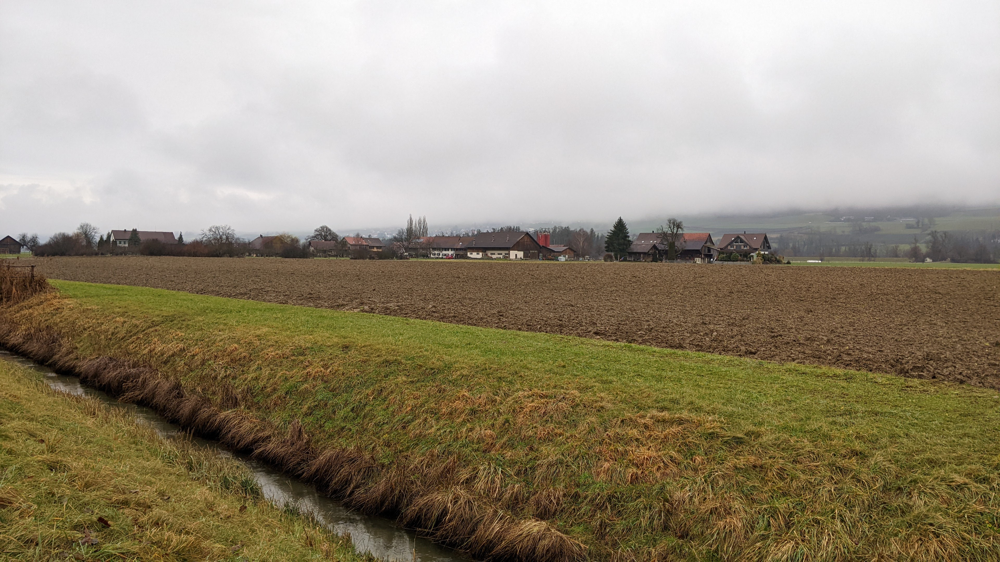
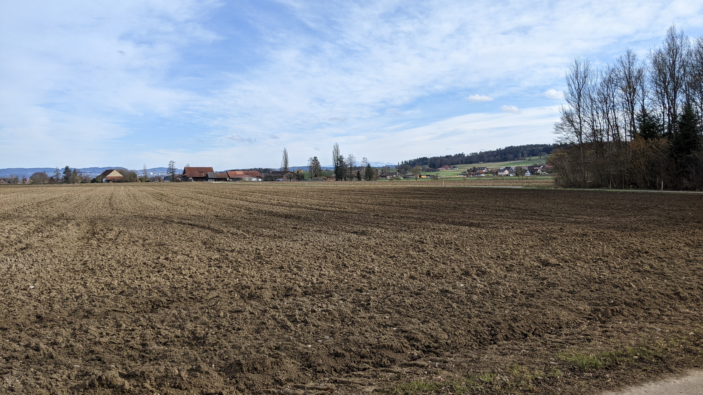
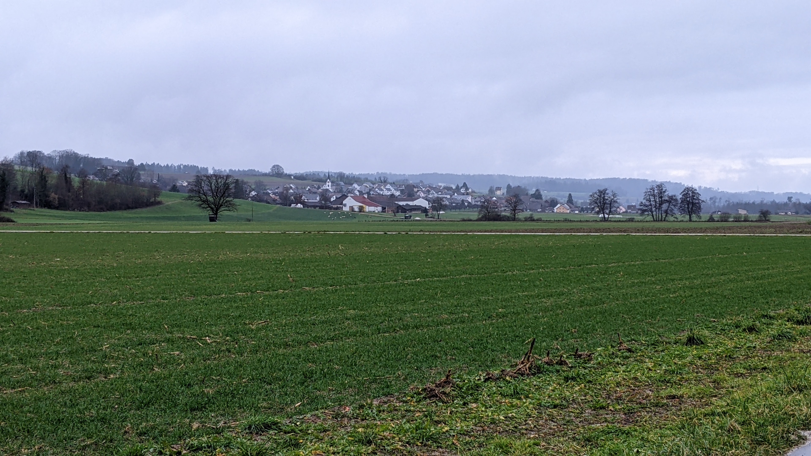
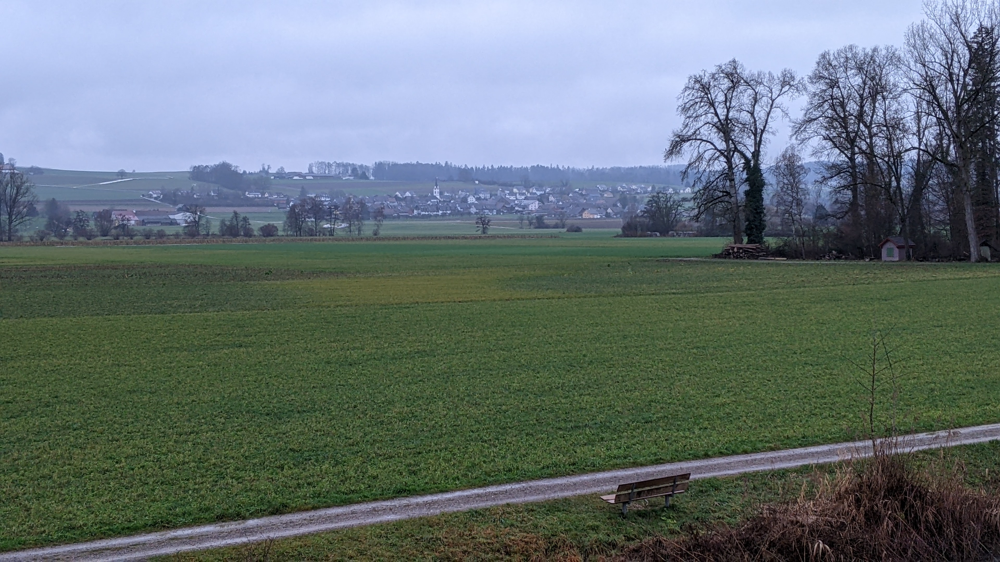
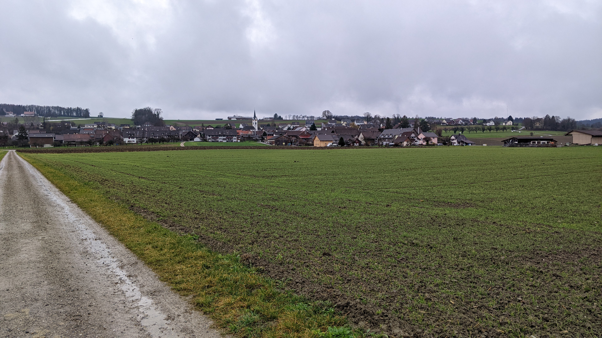
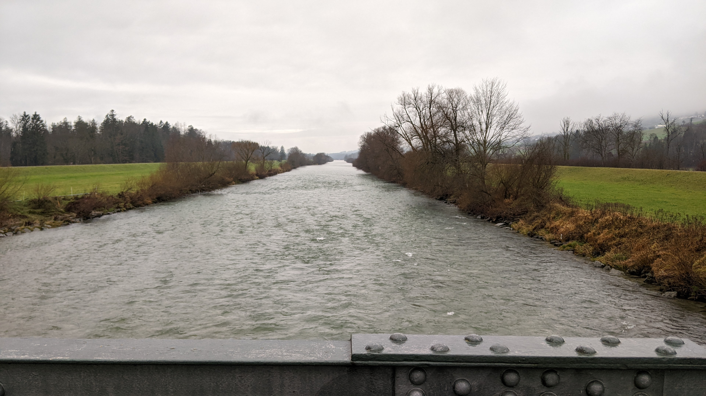
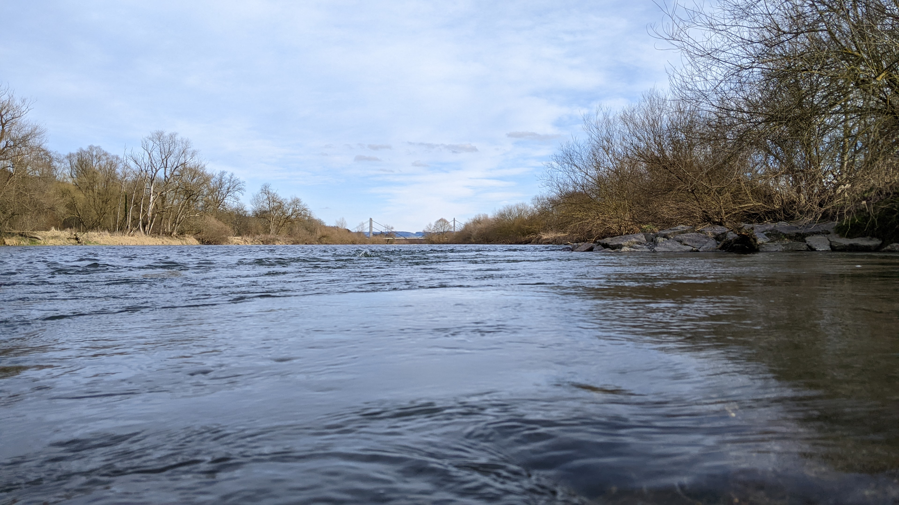

# Altikon

[Webseite der Gemeinde](https://www.altikon.ch/)  
[Gemeindegebiet auf Openstreetmap.org](https://www.openstreetmap.org/relation/1682082)

Die Gemeinde Altikon ist eine Gemeinde mit ca. <q cite="https://www.altikon.ch/portraet/zahlen.html/132">709</q> Einwohner\*innen. Die Gemeinde besteht aus dem Dorf Altikon, dem 1.6 km Luftlinie entfernten Wiler Herten, dem 1.5 km Luftlinie entfernten Wiler Feldi und dem 700 m Luftlinie entfernten Wiler Schneit.  
Altikon liegt 9 km Luftlinie nordnordöstlich von Winterthur und 8.8 km Luftlinie westlich von Frauenfeld.  
Die Gemeinde gehört zum Bezirk Winterthur und ist Teil des Zürcher Weinlands. Im Süden grenzt Altikon an die Gemeinden Dinhard und Rickenbach, im Südosten an die Gemeinde Ellikon an der Thur, im Nordosten an die Thurgauer Gemeinde Uesslingen-Buch, im Norden an die Thurgauer Gemeinde Neunforn und im Westen an die im Bezirk Andelfingen liegende Gemeinde Thalheim an der Thur.  
Der Fluss Thur bildet die nördliche Gemeindegrenze und ist Gleichzeitig auch die Kantonsgrenze zwischen den Kantonen Zürich und Thurgau.

## Transport

### Privatverkehr

Im Norden der Gemeinde Altikon befindet sich die [Altiker Thurbrücke](https://www.openstreetmap.org/way/43684183)\[[1](./Altikon_Zusatz.md#Altikerbrücke%20bzw.%20Thurbrücke)\]. Über diese Brücke führt die Thurgauer Kantonsstrasse K7 von Niederneunforn als Zürcher Strasse 504 durch Altikon nach Rickenbach im Süden. Im nördlichen Teil von Altikon heisst diese Strasse Neunfornerstrass und im südlichen Teil von Altikon heisst sie Rickenbacherstrasse. In Rickenbach führt die Strasse 353 weiter nach Rickenbach Sulz. Von dort führt dann die Strasse 1 zur Autobahnausfahrt 72 der A1 und Winterthur in die eine Richtung und Frauenfeld in die andere Richtung.

Die Strasse 502 führt von Frauenfeld und Ellikon an der Thur im Osten durch Altikon nach Thalheim und Andelfingen im Westen. Diese Strasse heisst in Altikon Thurtalstrasse.  
Die Stationstrasse führt vom Westen des Dorfs Altikon zum Bahnhof Thalheim-Altikon und von dort weiter nach Eschlikon ZH und Welsikon bei Dinhard. Von Welsikon führt dann die Strasse 506 nach Dinhard und Rickenbach Sulz und die Strasse 510 nach Seuzach und Winterthur Rosenberg.  
Die Strasse 508 führt nach Süden nach Dinhard. In Altikon heisst diese Strasse Bergstrasse.

### Öffentlicher Verkehr

Altikon befindet sich in der Tarifzone 163 des ZVV. Die Haltestelle "Altikon, Brückenwaage" im Dorf Altikon und die Haltestelle "Altikon, Herten" im Wiler Herten werden abseits der Hauptverkehrszeiten im Stundentakt und während der Hauptverkehrszeiten im Halbstundentakt von der Buslinie 615 bedient. Diese Buslinie verbindet Altikon mit dem Bahnhof Rickenbach-Attikon. An diesem Bahnhof besteht anschluss an die S24 und die S30 der Zürcher S-Bahn, in die eine Richtung nach Frauenfeld und Weinfelden und in die Andere Richtung nach Winterthur. Der Anschluss mit den Zügen von und nach Winterthur benötigt dabei keine lange Wartezeit. Der Anschluss mit den Zügen von und nach Frauenfeld/Weinfelden benötigt allerdings fast 30 Minuten Geduld. (Mit Glück ist es teilweise Möglich den vorherigen Zug oder Bus noch zu erreichen, aber diese Verbindung hat offiziell eine negative Umsteigezeit.)  
Winterthur bietet viele Umsteigemöglichkeiten inklusive Zügen die nicht Teil der Zürcher S-Bahn sind. Allerdings kann mit der S24 von Rickenbach-Attikon auch ohne Umsteigen Zürich Flughafen, Zürich Oerlikon, Zürich HB und Zug erreicht werden.

Der Bahnhof Thalheim-Altikon ist der Strasse entlang 1.9 km entfernt oder 2.3 km wenn man Feld- und Waldwege einer Strasse ohne Gehsteig vorzieht. Der Bahnhof Thalheim-Altikon befindet sich in der Tarifzone 160 des ZVV und wird von der S29 und dem Bus 612 bedient. Der Bus 612 verkehrt im Stundentakt nach Andelfingen in die eine Richtung und Dinhard und Seuzach in die andere Richtung. Die S29 verkehrt im Halbstundentakt nach Stein am Rhein in die eine Richtung und Seuzach und Winterthur in die andere Richtung.

Im Zürcher Nachtnetz werden beide Haltestellen in der Gemeinde Altikon und auch der Bahnhof Thalheim-Altikon 3-mal im Stundentakt vom Nachtbus N61 bedient. Rickenbach-Attikon wird ebenfalls 3-mal im Stundentakt von der Linie SN von Winterthur her angefahren und die Verbindung von der SN auf den N61 ist ohne grosse Wartezeit möglich.

#### Möglicher Verbesserungsvorschlag

Zwischen der Endhaltestelle der Buslinie 615 und dem Bahnhof Thalheim-Altikon gibt es nur im Nachtnetz eine Verbindung. Am Tag müsste man die 1.9 oder 2.3 km lange Strecke entweder zu Fuss oder mit dem Fahrrad zurücklegen.

Eine Mögliche Lösung wäre es die Buslinie 615 bis an den Bahnhof Thalheim-Altikon zu verlängern. Mit dem aktuellen Fahrplan wäre dann der Umstieg vom Bus 612 von Seuzach auf den Bus 615 und umgekehrt ohne grosse Wartezeit machbar. Der Umstieg vom Bus 615 auf den Bus 612 nach Andelfingen oder vom Bus 612 von Andelfingen auf den Bus 615 und der Umstieg vom Bus 615 auf die S29 oder von der S29 auf den Bus 615 wären allerdings nur mit Wartezeiten möglich. Ausserdem würde diese Verlängerung der Buslinie 615 dazu führen, dass auf dieser Strecke vermutlich mehr Fahrzeuge eingesetzt werden müssten. Aktuell ist in Altikon, Brückenwaage eine ca. 5 Minuten lange Wartezeit eingeplant. Innerhalb dieser 5 Minuten bis zum Bahnhof Thalheim-Altikon und wieder zurück zu fahren wäre sehr knapp bemessen. Die Bushaltestelle am Bahnhof Thalheim-Altikon müsste dafür vermutlich auch vergrössert werden. Dies sollte aber kein grosses Problem sein, da keine Gebäude in der Nähe sind.

Eine Andere Mögliche Lösung könnte es sein, die Buslinie 612 entweder zwischen den Stationen Dinhard, Grüt und Thalheim-Altikon, Bahnhof oder zwischen den Stationen Thalheim-Altikon, Bahnhof und Thalheim a. d. Thur noch über Altikon, Brückenwaage umzuleiten. Möglicherweise könnte dies sogar erreicht werden, ohne dass bestehende Anschlüsse an S-Bahnen verloren gehen, allerdings würde vermutlich auch hier die Anzahl der benötigten Fahrzeuge steigen. Ausserdem müsste in diesem Fall vermutlich die Haltestelle Altikon, Brückenwaage vergrössert werden. Am Einfachsten wäre es vermutlich dafür den Parkplatz, der aktuell neben der Bushaltestelle ist, in eine Bushaltestelle umzuwandeln.

Offensichtlicherweise gibt es auch noch weitere Möglichkeiten, wie diese Lücke geschlossen werden könnte. So könnte z.B. der erste Vorschlag noch erweitert werden um die Buslinie 615 nicht nur bis zum Bahnhof Thalheim-Altikon zu erweitern, sondern noch weiter.

## Einkaufsmöglichkeiten

In Altikon gibt es nur eine Volg Filiale zum Einkaufen. Grössere Einkaufsmöglichkeiten gibt es in Frauenfeld, Winterthur und Seuzach.

## Gemeindewappen

Das Wappen der Gemeinde Altikon besteht aus 2 nach oben gerichteten, schwarzen Flügeln auf einem weissen Hintergrund.

### Gemeinde Logo

Die Gemeinde Altikon verwendet ein Bild der neuen Altiker Thurbrücke mit dem Text "Gemeinde Altikon" darunter als ihr Logo. Der Text "Gemeinde" ist dabei mit einem grossen G und dem Rest in Kleinbuchstaben geschrieben. Der Text "Altikon" ist allerdings komplett in Grossbuchstaben geschrieben.

## Weiteres

Die Gemeindezeitschrift trägt den Namen "Schlosspost", vermutlich in Anlehnung an das Schloss das einst in Altikon stand.

Zu dem Zeitpunkt als ich auf dem Gemeindegebiet unterwegs war (2023-01-03), stand an der Bushaltestelle Altikon, Brückenwaage eine kleine Kiste mit Büchern. Vermutlich war gedacht dass so die Anwohner\*inne einfacher Bücher miteinander teilen können.

## Erfahrungsbericht als Fussgänger

Im Dorf Altikon gibt es ziemlich viele Gehsteige. Sobald man das Dorf aber verlässt, enden diese alle. Ausserhalb des Dorfes gibt es dafür recht viele Feld- und Waldwege auf denen man problemlos gehen kann.  
Fahrradstreifen oder -wege habe ich nirgends gesehen.

Die [Brücke über den Binnenkanal bei Feldi](https://www.openstreetmap.org/way/282752585) war zum Zeitpunkt meines Besuchs (2023-01-03) halb gesperrt wegen Belagsschäden. Jemand hat auf diese Absperrung dann von Hand die Frage geschrieben, ob diese Brücke auch irgendwann mal repariert werde. (Exaktes Zitat: <q>Wird die Brücke auch mal noch Repariert!?!?</q>) Es scheint also so als ob sie schon ziemlich lange halb gesperrt sei.  
Als ich auf dem Gemeindegebiet unterwegs war (2023-01-03), waren ausserdem noch überraschend viele Feldwege ohne angegebenen Grund gesperrt. Viele ungesperrte Feldwege waren an diesem Tag auch matschig oder hatten Pfüzen. Möglicherweise waren die gesperrten Wege deswegen gesperrt, aber sicher weiss ich das nicht.

## Fotos

  
Der Wiler Feldi, fotografiert von [hier](https://www.openstreetmap.org/search?whereami=1&amp;query=47.57580%2C8.80119#map=19/47.57580/8.80119) am 03.01.2023.

  
Die Wiler Oberherten und Unterherten, fotografiert von [hier](https://www.openstreetmap.org/search?whereami=1&amp;query=47.56583%2C8.79431#map=18/47.56583/8.79431) am 18.02.2023. *(Mein Schatten wurde aus Datenschutzgründen mit einem schwarzen
Rechteck unkenntlich gemacht.)*

  
Der Wiler Schneit und ein kleiner Teil des Dorfes Altikon, fotografiert von [hier](https://www.openstreetmap.org/search?whereami=1&amp;query=47.58158%2C8.77480#map=19/47.58158/8.77480) am 18.02.2023.

  
Das Dorf Altikon, fotografiert von [hier](https://www.openstreetmap.org/search?whereami=1&amp;query=47.57580%2C8.80119#map=19/47.57580/8.80119) am 03.01.2023.

  
Das Dorf Altikon, fotografiert von [hier](https://www.openstreetmap.org/search?whereami=1&amp;query=47.58347%2C8.80117#map=19/47.58347/8.80117) am 03.01.2023.

  
Das Dorf Altikon, fotografiert von [hier](https://www.openstreetmap.org/search?whereami=1&amp;query=47.57715%2C8.78472#map=19/47.57715/8.78472) am 03.01.2023.

  
Aussicht von Oberhalb von Altikon, fotografiert von [hier](https://www.openstreetmap.org/search?whereami=1&amp;query=47.56566%2C8.78757#map=18/47.56566/8.78757) am 18.02.2023.

  
Der Fluss Thur mit Blick flussabwärts, fotografiert von [hier](https://www.openstreetmap.org/search?whereami=1&amp;query=47.58392%2C8.80278#map=19/47.58392/8.80278) am 03.01.2023.

  
Der Fluss Thur mit Blick flussaufwärts, fotografiert von [hier](https://www.openstreetmap.org/search?whereami=1&amp;query=47.58992%2C8.77508#map=19/47.58992/8.77508) am 18.02.2023.

  
[Die Feuerstelle im Nordwesten](https://www.openstreetmap.org/node/5507669195), fotografiert von [hier](https://www.openstreetmap.org/search?whereami=1&amp;query=47.59098%2C8.76670#map=19/47.59098/8.76670) am 18.02.2023.
