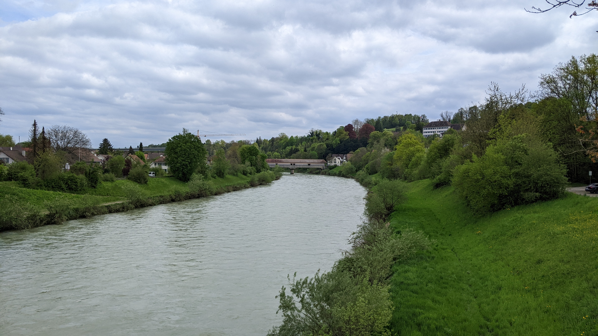
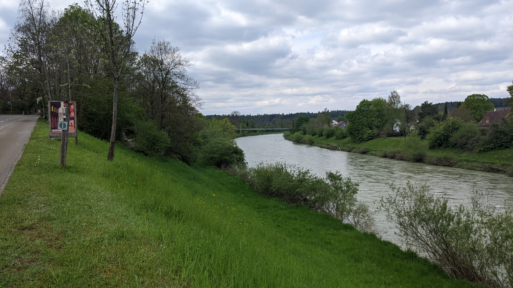
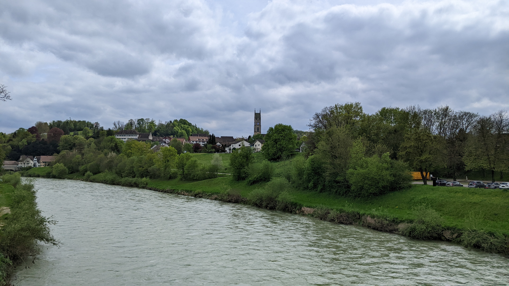
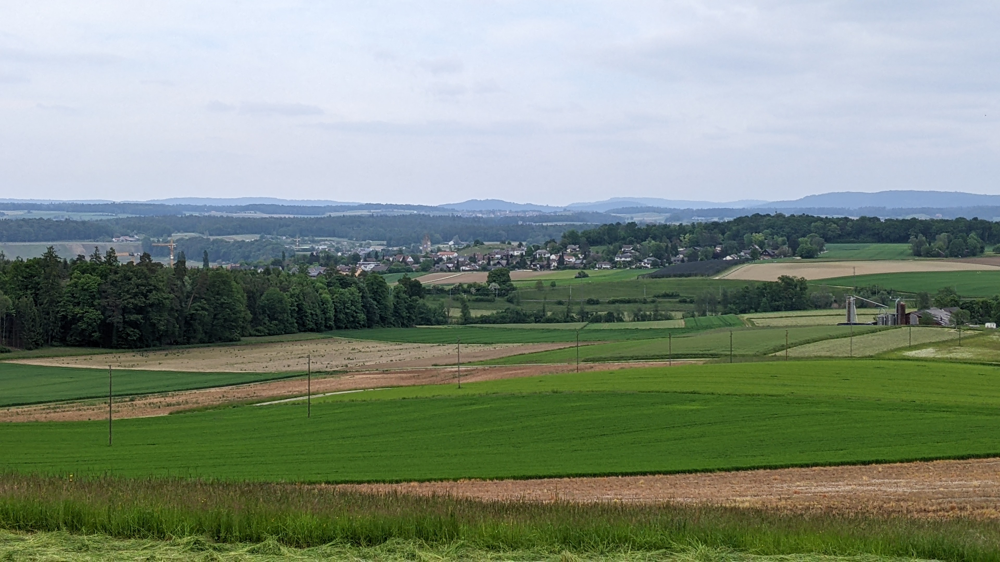
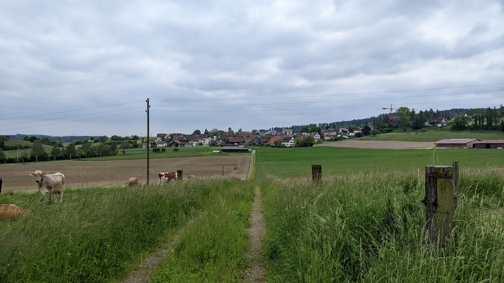

# Andelfingen

[Webseite der Gemeinde](https://www.andelfingen.ch)  
[Gemeindegebiet auf Openstreetmap.org](https://www.openstreetmap.org/relation/1682083)

*Anmerkung: Die Gemeinden Adlikon und Humlikon sind seit Beginn des Jahres 2023 Teil von Andelfingen. Über die Gemeinde Adlikon habe ich aber bereits einen Bericht geschrieben, bevor die Abstimmung dazu angenommen wurde. Adlikon ist deswegen ein wenig Untervertreten in diesem Bericht. Der Bericht über das unabhängige Adlikon ist [hier](./Adlikon_b_A.md) weiterhin verfügbar.*

Die Gemeinde Andelfingen besteht aus den Dörfern Andelfingen, Adlikon und Humlikon und aus den Wilern Dätwil und Niederwil.  
Andelfingen ist der Hauptort des gleichnamigen Bezirks im Kanton Zürich und bezeichnet sich selber als das Herzen des Zürcher Weinlandes. Im Norden grenzt Andelfingen an die Gemeinden Kleinandelfingen und Ossingen. Der Fluss Thur bildet hier die Grenze. Im Westen grenzt Andelfingen an die Gemeinden Flaach, Volken und Dorf, im Osten an die Gemeinde Thalheim an der Thur und im Süden an die Gemeinden Henggart und die zum Bezirk Winterthur gehörende Gemeinde Dägerlen.  
Andelfingen liegt ca. 10.9 km Luftlinie nord-nord-westlich von Winterthur und ca. 12.1 km Luftlinie süd-süd-östlich von Schaffhausen.

## Transport

### Privatverkehr

Die Autobahn A4/E41 durchquert das Gemeindegebiet von Andelfingen von Nord nach Süd und verbindet Andelfingen mit Schaffhausen und Winterthur. Parallel zur Autobahn verläuft die Weinlandstrasse, Teil der Hauptstrasse 15. Die Autobahn und die Weinlandstrasse überqueren die Thur auf separaten Brücken die direkt nebeneinander liegen. Von der Weinlandstrasse gibt es Autobahnauffahrten in Kleinandelfingen und Adlikon. Auffahrten auf die Weinlandstrasse gibt es östlich von Andelfingen, südlich von Andelfingen, westlich von Adlikon östlich von Humlikon und süd-östlich von Humlikon.

Ein wenig kleinere wichtige Strasen sind: die Landstrasse, die von der Weinlandstrasse südlich des Dorfes Andelfingen quer durch das Dorf Andelfingen zur Holzbrücke nach Kleinandelfingen führt. Die Flaachtalstrasse, die von der Landstrasse mitten in Andelfingen nach Westen bis Flaach führt. Von dieser zweigt dann auch noch die Altenerstrasse ab, die über eine andere Holzbrücke nach Alten und dann Marthalen führt. Die Thurtalstrasse, die von der Landstrasse mitten in Andelfingen nach Osten zu einer Auffahrt auf die Weinlandstrasse und dann Gütighausen führt. Dazwischen zweigen dann noch Strassen nach Dätwil, Adlikon und Niederwil ab. Die Humlikoner-/Andelfingerstrasse, die die Landstrasse beim Bahnhof Andelfingen mit Humlikon und der Flaachtalstrasse verbindet. Von dieser zweigt auch noch eine Strasse nach Dorf ab. Die Adliker-/Dorfstrasse, die die Landstrasse südlich von Andelfingen mit Adlikon und Niederwil verbindet. Und die Flaachtalstrasse, die die Weinlandstrasse ganz im süden der Gemeinde Andelfingen vorbei am Dorf Humlikon mit Dorf, Volken und Flaach verbindet.

### Öffentlicher Verkehr

Andelfingen befindet sich in den Tarifzonen 161 und 160 des ZVV. Die Dörfer Andelfingen und Adlikon befinden sich in der Tarifzone 161 und das Dorf Humlikon befindet sich in der Tarifzone 160. Die Gemeinde Andelfingen hat einen Bahnhof und 4 Bushaltestellen. Die Bushaltestellen sind "Andelfingen, Bahnhof", "Adlikon bei Andelfingen", "Niederwil ZH" und "Humlikon Dorfplatz". Ausserdem ist der Bahnhof Henggart von Humlikon aus zu Fuss erreichbar. Die Bahnhöfe Ossingen und Thalheim-Altikon könnte man von Dätwil und Niederwil auch noch erreichen, allerdings bräuchte das ein wenig mehr Zeit. Die Bahnhöfe Andelfingen und Henggart sind beide an der Verbindung Winterthur Schaffhausen, während die Bahnhöfe Ossingen und Thalheim-Altikon an der Verbindung Winterthur Stein am Rhein liegen. Die Bahnhöfe an der zweiten Verbindung werden von der S29 im halbstunden Takt bedient. Der Bahnhof Henggart wird von den S-Bahnen S12 und S33 in einem kombinierten nahezu halbstunden Takt bedient. Der Bahnhof Andelfingen wird noch zusätzlich von der S24 bedient, der die anderen beiden S-Bahnen zu einem nahezu 20-minuten Takt ergänzt.

Die S24 dient als Schnellzug von Andelfingen nach Schaffhausen, von wo der Zug noch bis Thayingen weiter fährt, und nach Winterthur, von wo der Zug noch via Zürich Flughafen, Zürich Oerlikon, Zürich HB Gleis 3-18 (oberirdischer Kopfbahnhof) und Thalwil nach Zug verkehrt. Die S33 verbindet Andelfingen etwas langsamer mit Schaffhausen, wo der Zug endet, und mit Winterthur, wo der Zug ebenfalls endet. Die S12 verkehrt zwischen Schaffhausen und Winterthur gleich wie die S33, allerdings fährt sie in Winterthur als Schnellzug weiter nach Zürich Stadelhofen, Zürich HB Gleis 41-44 (Bahnhof Museumsstrasse) und dann wieder als mit mehr stopps nach Zürich Altstetten, Baden im Kanton Aargau und Brugg im Aargau.

Vom Bahnhof Andelfingen aus verkehren 3 Buslinien. Der Bus 605 verkehrt stündlich nach Kleinandelfingen, Ossingen, Stammheim und Endstation in Oberstammheim. Die S12 von und nach Winterthur hat guten Anschluss an diesen Bus. Der Bus 612 verkehrt wochentags stündlich nach Adlikon bei Andelfingen, Niederwil ZH, Thalheim an der Thur und Thalheim-Altikon Bahnhof, Dinhard und schlussendlich Seuzach. Die S24 von und in beide Richtungen hat guten Anschluss. Der Bus 677 verkehrt stündlich nach "Humlikon, Dorfplatz", Dorf, Flaach, Buch am Irchel und Hettlingen Bahnhof und Hettlingen Dorf. Dieser Bus fährt jeweils gleichzeitig wie der Bus 612 ab.  
Ausserdem gibt es noch den Bus 675 der in "Humlikon, Dorfplatz" stündlich hält. In die Richtung endet er eine Station weiter in "Henggart, Bahnhof", in die andere Richtung verkehrt der Bus nach Dorf, Flaach, Rüdlingen, Buchberg und schlussendlich Rafz. Der Anschluss in Henggart ist mit einer kurzen Wartezeit verbunden.

Im Zürcher Nachtnetz wird der Bahnhof Andelfingen 4 mal von Winterthur und 3 mal von Schaffhausen im Stundentakt bedient in Andelfingen besteht Anschluss an die Nachtbüsse N60 und N65. Die beiden busse ergänzen sich zu einem Stundentakt der im ganzen 4 mal (2 mal pro linie) gefahren wird. Beide Busse halten auch in Adlikon b. Andelfingen. "Humlikon, Dorfplatz" wird vom Bus N64 4 mal im Stundentakt bedient. Auf diesen Bus muss man in Hettlingen umsteigen.

## Einkaufsmöglichkeiten

In den Wilern Dätwil und Niederwil gibt es weder Einkaufsmöglichkeiten noch Restaurants. In den Dörfern Adlikon und Humlikon gibt es ebenfalls keine Einkaufsmöglichkeiten aber es gibt Restaurants. Das Restaurant Post in Adlikon befindet sich direkt hinter dem (seit anfang 2023) alten Gemeindehaus von Adlikon und das Restaurant Einhorn in Humlikon befindet sich auch nicht weit von Humlikons (seit 2023) alter Gemeindeverwaltung entfernt. Das zweite Restaurant davon hat seinen Namen weil das Gemeindewappen von Humlikon ein Einhorn abgebildet hatte. Ausserhalb des Dorfes Andelfingen gibt es ausserdem noch das Restaurant Kreuzstrasse, das sich in der Nähe des Autobahnrastplatzes Chrüzstrass befindet. Vom Rastplatz muss man allerdings sowohl die Autobahn als auch die Weinlandstrasse unterqueren um das Restaurant zu erreichen.  
Innerhalb des Dorfes Andelfingen gibt es eine Volg Filiale, das Restaurant Spätzli-Pfanne direkt daneben, einen Kiosk am Bahnhof, eine Bäckerei mit Café, das Restaurant Löwen (der Name basiert womöglich auf dem Gemeindewappen) und einige weitere kleine Geschäfte. Die Zürcher Kantonalbank und die Raiffeisenbank, sowie die Mobiliar Versichurng haben ebenfalls eine Filiale in Andelfingen.

Ein wenig grössere Geschäfte gibt es in Kleinandelfingen und noch grössere Einkaufsmöglichkeiten gibt es in Winterthur und Schaffhausen.

## Gemeindewappen

Das Wappen hat einen roten Hintergrund und wird durch eine gelbe Linie von links oben nach rechts unten in zwei Teile geteilt. In beiden Teilen befindet sich ein gelber Löwe der nach links schaut, und im linken unteren Teil ist zusätzlich noch ein gelber 6-zackiker Stern, der sich vor dem Löwen befindet.  
Das Wappen ist abgeleitet vom Wappen der Grafschaft Kyburg.

### Gemeinde Logo

Das Logo der Gemeinde Andelfingen zeigt eine stylisierte Skyline des Dorfes Andelfingen mit dem markanten Kirchenturm. Die Skyline ist weiss und im Hintergrund befindet sich ein roter und ein gelber Streifen. Der untere Teil des Logos, hinter der weissen skyline ist grau. In der weissen Fläche steht der Text "Gemeinde Andelfingen willkommen im zürcher Weinland" komplett ohne Grossbuchstaben. Der Text "Gemeinde" ist schwarz und von unten nach oben, der Text "Andelfingen" ist schwarz und fett und der Text "willkommen im zürcher Weinland" ist blau und kleiner geschrieben.

## Weiteres

In der westlichen Unterführung am Bahnhof Andelfingen hängen 9 Bilder die von Primarschülern gemalt wurden.  
Auch die [Bahnunterführung nördlich von Humlikon](https://www.openstreetmap.org/way/122455826) ist schön angemalt.

## Erfahrungsbericht als Fussgänger

Auf dem Gebiet der ehemaligen Gemeinde Adlikon gibt es fast keine Gehsteige und explizite Fahrradstreifen oder -wege. Die meisten Strassen sind hier allerdings auch nicht sehr stark befahren und können dementsprechend von Fahrrädern und Fussgängern mit benutzt werden.  
Auf dem Gebiet der ehemaligen Gemeinde Humlikon gilt ziemlich das gleiche, allerdings würde ich hier die Flaachtalstrasse und die verbindungsstrasse zwischen Humlikon und Andelfingen als Fussgänger eher meiden. Im Falle der Humlikoner-/Andelfingerstrasse kann man dies mit einem nicht allzugrossen Umweg erreichen, im Falle der Flaachtalstrasse geht dies allerdings nicht direkt.  
Auf dem Gebiet der Gemeinde Andelfingen von vor 2023 ist die Situation mit den Gehsteigen und Fahrradstreifen/-wegen schon ein wenig besser. Die Holzbrücke zwischen Andelfingen und Kleinandelfingen hat einen beleuchteten Weg für Fahrräder und Fussgänger, in einem Anbau der sehr gut zum Rest der Brücke passt. Kurz vor der Brücke hat die Haupsstrasse auf beiden Seiten sowohl einen Gehsteig als auch einen Fahrradstreifen. Weiter oben reduziert es sich denn aber zuerst auf einen Gehsteig und 2 Fahrradstreifen, dann auf 1 von beidem und dann noch auf 2 Gehsteige und gar keinen Fahrradstreifen. Allgemein haben die meisten grossen Strassen in alt Andelfingen mindestens einen Gehsteig (sogar die Weinlandstrasse auf der Brücke über die Thur hat einen). Ausserdem gibt es teilweise auch abkürzungen für Fussgänger und Fahrradfahrer (Beispiele: der Kirchweg hinter der Kirche, die Obermühlestrasse von der Landstrasse zur Thurtalstrasse oder der Haldenweg von der Holzbrücke zur Schlossgasse).  
Weiter Flussabwärts von der Holzbrücke gibt es noch eine weitere Brücke die nur für Fussgänger und Fahrradfahrer ist.

Die Feld- und Waldwege sind auf dem gesamten Gemeindegebiet in einem guten Zustand.

Was mich auch ein wenig überrascht hat war die anzahl an Trinkwasserbrünnen, vor allem auf dem Gebiet von alt Andelfingen.  
Auch überrascht hat mich die Grösse des überdachten Fahrradstellplatzes beim Sekundarschulhaus Andelfingen und dass das wenige Meter entfernte Freibad trotzdem nochmal eigene (nicht überdachte) Fahrradplätze hat.

## Fotos

  
Die Holzbrücke über die Thur zwischen Andelfingen und Kleinandelfingen, fotografiert von [hier](https://www.openstreetmap.org/search?whereami=1&amp;query=47.59966%2C8.67631#map=19/47.59966/8.67631) am 2023-04-30.

  
Die Fussgängerbrücke über die Thur zwischen Andelfingen und Kleinandelfingen, fotografiert von [hier](https://www.openstreetmap.org/search?whereami=1&amp;query=47.59670%2C8.68093#map=19/47.59670/8.68093) am 2023-04-30.

  
Das Dorf Andelfingen inklusive Kirchturm, fotografiert von [hier](https://www.openstreetmap.org/search?whereami=1&amp;query=47.59988%2C8.67662#map=19/47.59988/8.67662) am 2023-04-30.

  
Das Dorf Andelfingen, fotografiert von [hier](https://www.openstreetmap.org/search?whereami=1&amp;query=47.57965%2C8.66063#map=19/47.57965/8.66063) mit 2x Zoom am 2023-05-20.

  
Das Dorf Humlikon, fotografiert von [hier](https://www.openstreetmap.org/search?whereami=1&amp;query=47.58300%2C8.66754#map=19/47.58300/8.66754) am 2023-05-20.
