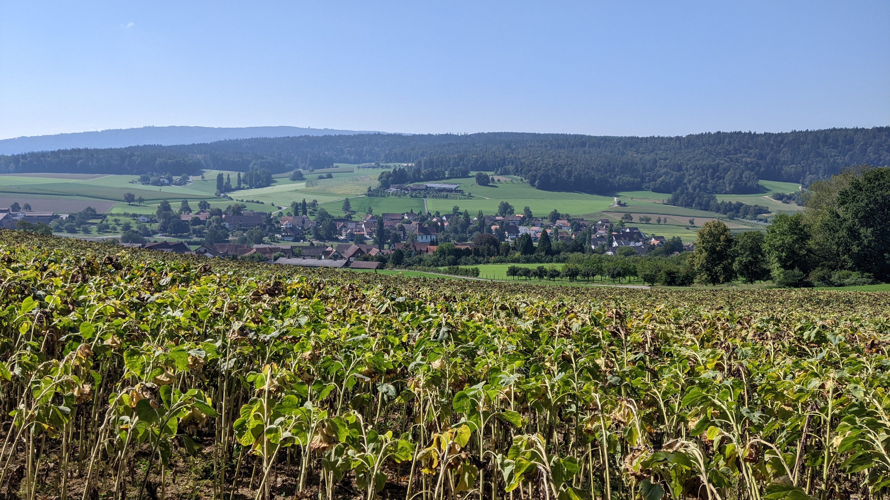
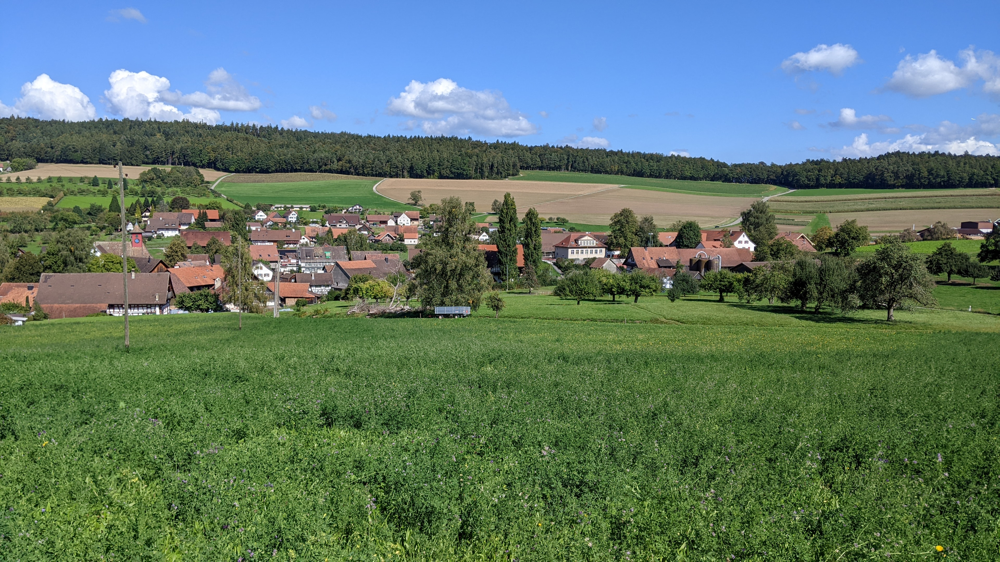
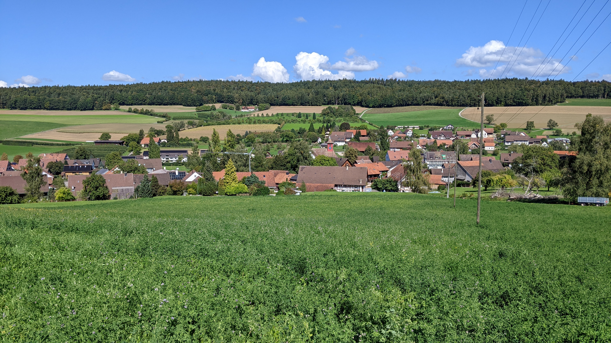
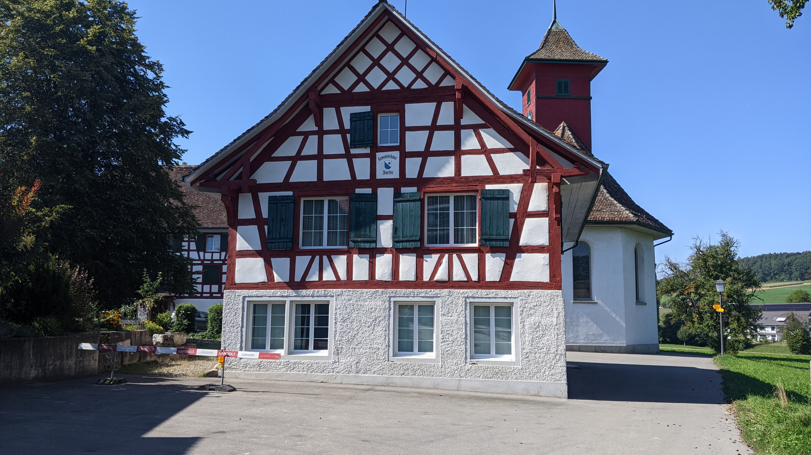

# Bachs

[Webseite der Gemeinde](https://www.bachs.ch)  
[Gemeindegebiet auf Openstreetmap.org](https://www.openstreetmap.org/relation/1682085)

Die Gemeinde Bachs besteht aus dem Dorf Bachs und seinem Umland entlang des Fisibachs im Bachsertal. Die Gemeinde hat eine Fläche von <q cite="https://www.bachs.ch/statistisches-steuerfuesse/">912 ha</q> oder 9.12 km² und hatte <q cite="https://www.bachs.ch/statistisches-steuerfuesse/">im Jahr 2022 639 Einwohner\*innen</q>.  
Das Dorf Bachs selber kann aufgeteilt werden in Altbachs und Neubachs. <q cite="https://www.bachs.ch/geschichte/">Diese Namen entstanden 1763 nach einem Dorfbrand und darauf folgenden Wiederaufbau.</q> Ausserdem gibt es auf dem Gemeindegebiet noch die Wiler und Höfe Tal/Talmüli, Rüebisberg, Brämhof, Hueb, Neumühle, Talwis, Muflen, Stampfli, Zil, Eichhof, Hodleten, Hochrüti, Tiergarten und Schlatt.

Die Gemeinde Bachs gehört zum Bezirk Dielsdorf des Kantons Zürich. Im Norden grenzt es an die Gemeinden Weiach und Stadel, im Osten an die Gemeinde Neerach, im Süden an die Gemeinden Steinmaur, Schöfflisdorf und Oberweningen und im Westen an die im Kanton Aargau gelegenen Gemeinden Siglistorf und Fisibach.  
Das Dorf Bachs ist ca. 18 km Luftlinie nord-nord-westlich des Zürcher Hauptbahnhofs und ca. 7.3 km Luftlinie westlich des Bülacher Bahnhofs.

## Transport

### Privatverkehr

Die Kantonsstrasse K 429, in Bachs "Bachsertalstrasse" genannt, führt von Nordwesten durch Neubachs nach Südosten. In Richtung Nordwesten geht die Strasse weiter bis zum Aargauischen Fisibach. Von Fisibach ist es nicht mehr weit bis zur Hauptstrasse in Kaiserstuhl, die in westliche Richtung dem Rhein entlang bis nach Basel und in östliche entlang dem Rhein und der Töss über Glattfelden nach Winterthur geht. In Richtung Südosten geht die Bachsertalstrasse weiter nach Steinmaur. Unterwegs hat es noch Abzweigungen nach Neerach und Riedt. In Steinmaur gibt die Strasse anschluss an die Wehntalerstrasse, die in westliche Richtung bis nach Leibstadt und in östliche Richtung über Dielsdorf, Zürich Affoltern nach Zürich Irchel geht.

Direkt östlich von Neubachs zweigt die Stadlerstrasse aus der Bachsertalstrasse ab. Die Stadlerstrasse geht nach Stadel. Von Stadel gibt es dann Verbindungen nach Weiach, Zweidlen oder Neerach. Ebenfalls von Stadel kommt man zur Strasse 348, die dann wiederum in nördliche Richtung nach Zweidlen und in südliche Richtung nach Niederglatt führt.

Innerhalb der Gemeinde sind noch die Dorfstrasse wichtig. Die Dorfstrasse führt von der Bachsertalstrasse am westlichen Ende von Neubachs durch Altbachs wieder zurück zur Bachsertalstrasse östlich des Dorfes. Zwischen der Bachsertalstrasse und der Dorfstrasse gibt es im Dorf noch einige weitere Verbindungsstrassen und von der Dorfstrasse gehen auch noch einige Strassen weg die zu kleinen Wilern ausserhalb des Dorfes führen. So zum Beispiel die Mulflerstrasse, die zum Mulflenhof führt, oder die Hodlerterstrasse, die zum Hodleten Wiler führt.

### Öffentlicher Verkehr

Bachs befindet sich in der Tarifzone 118 des Zürcher Verkehrs Verbunds. Auf dem Gemeindegebiet befinden sich die Bushaltestellen "Weiherbach", "Alt-Bachs", "Milchhütte" und "Neu-Bachs". Die Stationen "Alt-Bachs", "Milchhütte" und "Neu-Bachs" befinden sich im Dorf Bachs und die Station "Weiherbach" befindet sich bei der Verzweigung der Bachsertalstrasse und Dorfstrasse ein wenig ausserhalb des Dorfes. Die Station "Stig" in Stadel befindet sich direkt über die Grenze zu Stadel und die Station "Heitlig" in Obersteinmaur liegt 240m von der Gemeindegrenze entfernt.  
Alle diese Bushaltestellen sind Teil der Buslinie 535 die von Bülach Bahnhof über Bachs nach Steinmaur Bahnhof und Oberglatt Bahnhof führt. Die Buslinie verkehrt im Stundentakt in beide Richtungen an allen Tagen der Woche.

In Bülach hat der Bus anschluss an die Buslinien 515, 525, 504, 531, 530 und 501, die S-Bahnen S9, S36, S41 und während der Hauptverkehrszeiten auch die S3 sowohl wie auch ein RE Zug. Der Anschluss an die S9 in beide Richtungen ist sehr gut, der Anschluss an die anderen Züge ist mit einer mehr oder weniger längeren Wartezeit verbunden. Die S9 gibt anschluss nach Schaffhausen in die eine Richtung und Zürich Oerlikon, Zürich Hardbrücke, Zürich HB, Zürich Stadelhofen und Uster in die andere Richtung. Die S3 gibt anschluss nach Zürich Oerlikon, Zürich Hardbrücke, Zürich HB, Zürich Stadelhofen, Effretikon und Wetzikon. Die S41 gibt anschluss nach Winterthur. Die S36 gibt anschluss nach Bad Zurzach, Koblenz und Waldshut. Und der RE gibt anschluss nach Schaffhausen in die eine Richtung und nach Zürich Oerlikon und Zürich HB in die andere Richtung.  
In Steinmaur hat der Bus anschluss an die S15 mit relativ kurzen wartezeiten von und nach Zürich und ein wenig längeren wartezeiten von und nach Niederweningen. In Richtung Zürich gibt die S15 anschluss nach Zürich Oerlikon, Zürich Hardbrücke, Zürich HB, Zürich Stadelhofen, Uster, Wetzikon und Rapperswil.  
Weiterhin könnte man vom Bus 535 noch in Stadel auf die Buslinien 515 und 510 wechseln, in Dielsdorf Wehntalerstrasse auf die Buslinien 593 und 456 (Stationen Dorfzentrum und Bezirksgebäude) und Bahnhof Oberglatt an die Buslinien 510, 525 und 504 sowie an die S-Bahnen S3, S9 und S15.

Im Zürcher Nachtnetz werden die Stationen "Milchhütte" und "Neu-Bachs" 4 mal im Stundentakt von der Linie N50 nur zum aussteigen bedient. In Oberglatt bietet die SN9 anschluss an die N50.

## Einkaufsmöglichkeiten

In Bachs gibt es nur einen kleinen Laden, den [Bachsermärt](https://www.bachsermaert.ch/). Die nächsten grösseren Einkaufsmöglichkeiten befinden sich in Bülach, Neerach oder Dielsdorf.

### Restaurants

Oben im Eichhof gibt es eine Besenbeiz [Eichhof](https://besenbeiz-eichhof.ch/), angeschlossen an den Bachsermärt gibt es das [Bistro Bachs](https://www.bachsermaert.ch/bistro-bachs/) und östlich der Schule befindet sich das Restaurant [Neuhof](https://www.neuhofbachs.com/).

## Schule

Mit der Schule Lindenbuck hat Bachs einen Kindergarten und eine Primarschule. Für die Sekundarschule hat sich Bachs, so wie auch einige andere Gemeinden in der Umgebung, Stadel angeschlossen. Das heisst Sekundarschüler\*innen müssen nach Stadel in die Schule.

## Gemeindewappen

Das Bachser Gemeindewappen ist schräg von links oben nach rechts unten geteilt. Der untere Teil ist blau, der obere Teil ist weiss. Im Weissen Teil befindet sich ein blauer Stern mit 8 Zacken.

Das Wappen kann auf dem Gemeindegebiet auf einigen Trinkwasserbrünnen, einer Scheune, auf dem Gemeindehaus, als Fahne auf einem Privatgrundstück und noch an ein paar weiteren Orten gefunden werden.

### Gemeinde Logo

Das Gemeindelogo zeigt das Gemeindewappen und rechts daneben den Text "Gemeinde Bachs". Beide Wörter sind mit der gleichen Schriftart und Schriftgrösse geschrieben und beide Wörter sind ausschliesslich mit Grossbuchstaben geschrieben. Die Wörter sind auf 2 Zeilen geschrieben und beide Wörter sind zueinander links bündig. Das Wort "Gemeinde" ist in Schwarz geschrieben und das Wort Bachs in Blau.

## Gewässer

Das wichtigste Gewässer in Bachs ist der Fisibach. Der Fisibach beginnt im Südosten und fliesst richtung Nordwesten und schlussendlich, ausserhalb des Gemeinedegebiets, in den Rhein. In den Fisibach fliessen der Hochrütibach und der Balmbach.

## Weiteres

Hinter dem Schulhaus hat die Gemeinde einen öffentlichen Spielplatz namens Bachsolino gebaut.

Im Wald auf der Nordöstlichen Talseite gibt ziemlich viele Feuerstellen, inklusive einer grossen beim Sanzenberg.

Am Nordwestlichen Ende des Gemeindegebietes gibt es 2 Ruinen, wobei die Ruine Waldhausen eigentlich einige Meter ausserhalb des Gemeindegebietes liegt. Das Erdmannliloch ähnelt einer kleinen Höhle mit Mauern und die Ruine Waldhausen ist eine Ruine eines Gebäudes.

## Erfahrungsbericht als Fussgänger

Die Bachsertalstrasse hat auf einem Grossteil der Strecke innerhalb des Gemeindegebietes von Bachs entweder einen von der Strasse getrennten Geh- und Radweg oder einen Gehsteig der auch für Fahrräder gedacht ist. Vom Dorf Bachs nach Steinmaur ist es ein von der Strasse getrennter Geh- und Radweg. Vom Dorf Bachs bis zum Talmüli Hof und dem alten Schulhaus Tal ist es grösstenteils ebenfalls ein von der Strasse getrennter Geh- und Radweg, aber im Gebiet der Höfe Neumühle, Hueb und Talmüli verläuft er als Gehsteig. Vom Hof Talmüli bis zur Gemeindegrenze müsste dann die Strasse benutzt werden. Innerhalb des Dorfes Bachs wechselt es häufiger. Zwischen der Stigstrasse und der Oberdorfstrasse hat es gar nichts. Zwischen der Oberdorfstrasse und der Dorfstrasse hat einen nur für Fussgänger gedachten Gehsteig. Nach der Dorfstrasse wird der Gehsteig wieder zu einem Geh- und Radweg und für eine kurze Distanz gibt es auf der anderen Strassenseite noch einen zweiten Gehsteig.  
Die Dorfstrasse hat nur zwischen der Bachsertalstrasse und der Schmittestrasse einen nur für Fussgänger gedachten Gehsteig.  
Die Stadlerstrasse hat weder eine Gehsteig, Gehweg noch einen Fahrradstreifen.

Abgesehen von der Bachsertalstrasse, der Stadlerstrasse und der Dorfstrasse sind alle Strassen verkehrberuhigt genug, dass diese auch ohne Gehsteige und Fahrradstreifen von Fussgängern und Fahrrädern problemlos genutzt werden können. Die Dorfstrasse ist auch noch ziemlich ruhig und kann deswegen auch mit ein wenig Vorsicht genutzt werden. Die Bachsertalstrasse und Stadlerstrasse sind auch nicht all zu stark befahren allerdings würde ich Fussgängern nicht empfehlen diese zu benützen (zumindest nicht auf den Strecken die keinen Gehsteig haben).  
Die Gemeinde Bachs hat auf beiden Talseiten ziemlich viele Feld- und vorallem Waldwege, die alle in einem guten Zustand sind.

## Fotos

  
Das Dorf Bachs, fotografiert von oberhalb des Reservoirs [hier](https://www.openstreetmap.org/search?whereami=1&amp;query=47.53029%2C8.44544#map=19/47.53029/8.44544) am 2023-09-10.

  
Der östliche Teil des Dorfes Bachs, fotografiert von unterhalb des Eichhofs [hier](https://www.openstreetmap.org/search?whereami=1&amp;query=47.52182%2C8.43686#map=19/47.52182/8.43686) am 2023-09-24.

  
Der Zentrale Teil des Dorfes Bachs, fotografiert von unterhalb des Eichhofs [hier](https://www.openstreetmap.org/search?whereami=1&amp;query=47.52209%2C8.43666#map=19/47.52209/8.43666) am 2023-09-24.

  
Das Gemeindehaus und die Kirche des Dorfes Bachs, fotografiert von [hier](https://www.openstreetmap.org/search?whereami=1&amp;query=47.52475%2C8.43961#map=19/47.52475/8.43961) am 2023-09-10.

  
Die Feuerstelle Sanzenberg, fotografiert von [hier](https://www.openstreetmap.org/search?whereami=1&amp;query=47.54571%2C8.41745#map=19/47.54571/8.41745) am 2023-09-10.

  
Das [Erdmannliloch](https://www.openstreetmap.org/node/6419670946), fotografiert von [hier](https://www.openstreetmap.org/search?whereami=1&amp;query=47.54215%2C8.41353#map=19/47.54215/8.41353) am 2023-09-10.
