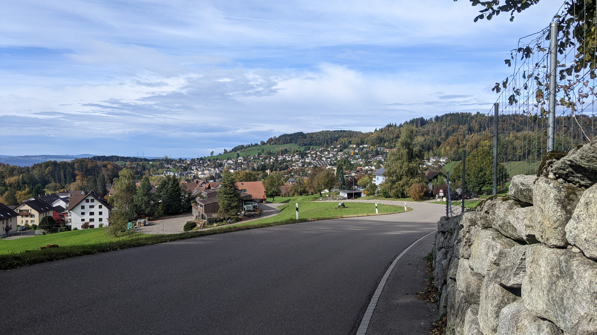
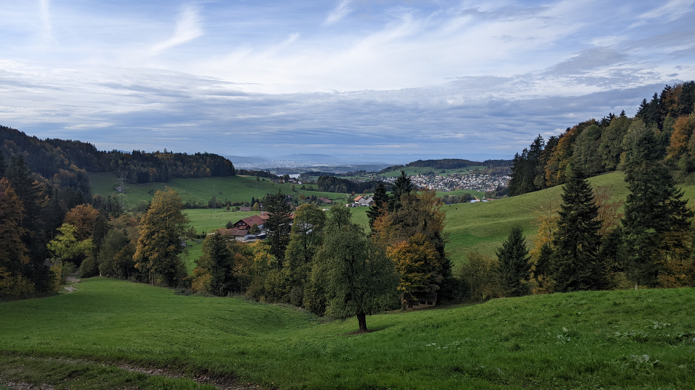
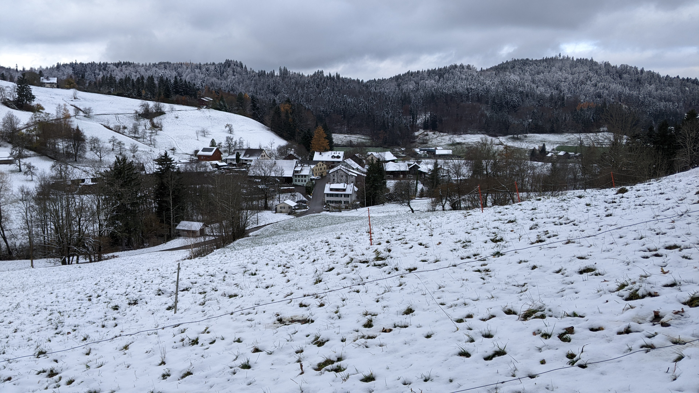
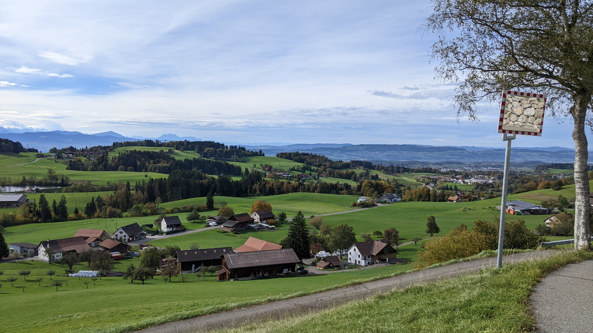
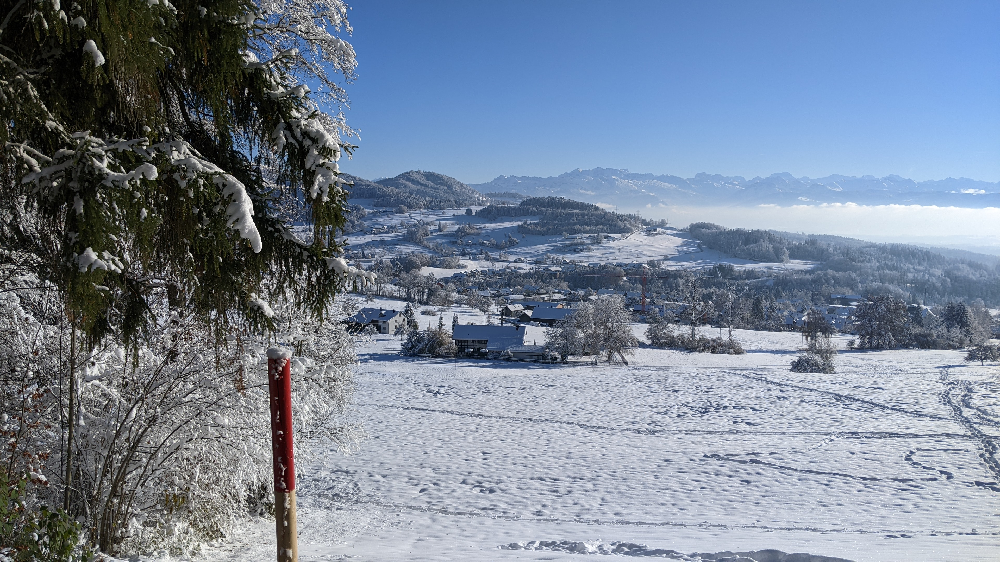
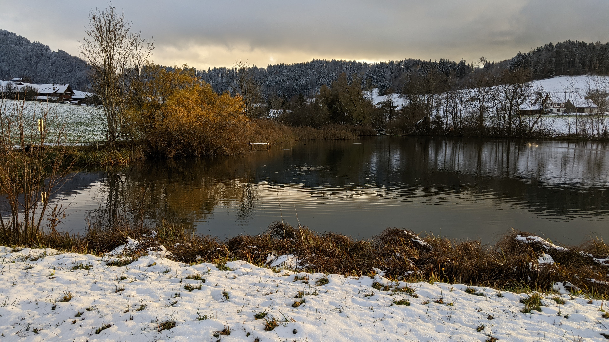
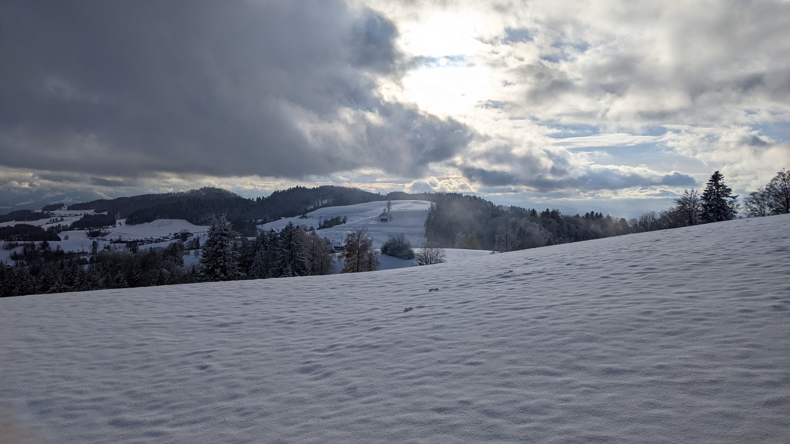

# Bäretswil

[Webseite der Gemeinde](https://www.baeretswil.ch/)  
[Gemeindegebiet auf Openstreetmap.org](https://www.openstreetmap.org/relation/1682099)

Die Gemeinde Bäretswil besteht aus den Dörfern Bäretswil und Adetswil und einer menge Umland vorallem in nördliche und östliche Richtung. Die Gemeinde hat eine Fläche von <q cite="https://www.baeretswil.ch/gemeindeinzahlen">2'220 ha oder 22 km²</q> und hatte <q cite="https://www.baeretswil.ch/gemeindeinzahlen">im Jahr 2022 5'105 Einwohner\*innen</q>.  
Die Dörfer Adetswil und Bäretswil sind mittlerweile zusammen gewachsen und die Grenze zwischen ihnen ist kaum noch sichtbar. Neben den Dörfern Bäretswil und Adetswil besteht die Gemeinde aus <q cite="https://www.baeretswil.ch/gemeindeinzahlen">den Aussenwachten Bettswil, Wappenswil, Tisenwaldsberg, Neuthal, Hof, Hinterburg, Tanne, Ghöch, Fehrenwaldsberg und Kleinbäretswil und über hundert Einzelsiedlungen</q>.

Die Gemeinde Bäretswil gehört zum Bezirk Hinwil des Kantons Zürich. Im Norden grenzt Bäretswil an die im Bezirk Pfäffikon gelegene Gemeinde Bauma, im Osten an die Gemeinde Fischenthal, im Süden an die Gemeinde Hinwil, im Süd-westen an die Gemeinden Wetzikon und die im Bezirk Pfäffikon gelegene Gemeinde Pfäffikon und im Nord-westen an die im Bezirk Pfäffikon gelegene Gemeinde Hittnau.  
Das Dorf Bäretswil ist ca. 23.9 km Luftlinie ost-süd-östlich des Zürcher Hauptbahnhofs und ca. 5 km Luftlinie nord-östlich des Wetziker Bahnhofs.

## Transport

### Privatverkehr

Die Grösste und wichtigste Strasse in Bäretswil ist die Wetziker-/Baumastrasse. Die Strasse führt von Wetzikon durch das Dorf Bäretswil nach Bauma. Nördlich von Bäretswil, in Richtung Bauma, heisst die Strasse Baumastrasse und südlich von Bäretswil, in Richtung Wetzikon, heisst die Strasse Wetzikerstrasse. In Bauma endet die Strasse an der Hauptstrasse von Winterthur nach Rapperswil, die durch das Tösstal führt. In Wetzikon führt die Strasse zum Ochsen-Kreisel in Stadtteil Kempten. Von dort führen Strassen nach Pfäffikon ZH, Hinwil und Oberwetzikon.

Im nördlichen Teil des Dorfes Bäretswil zweigt die Adetswilerstrasse von der Baumastrasse in Richtung westen ab. Die Strasse führt durch Adetswil, wird zur Hittnauerstrasse und führt nach Norden nach Oberhittnau.  
Fast im Zentrum des Dorfes Bäretswil verbindet die Bahnhofstrasse die Adetswilerstrasse mit der Wetziker-/Baumastrasse vorbei am alten Bahnhof.  
Westlich des Dorfes Adetswil zweigt die Kemptnerstrasse von der Hittnauerstrasse in Richtung süden ab. Die Strasse führt nach Kempten zur Kemptner Hittnauerstrasse (eine andere Strasse als die Bäretswiler Hittnauerstrasse).  
Weslich von Bäretswil Oberdorf und einige Meter östlich der Bushaltestelle Eishalle zweigt die Ringwilerstrass Richtung süden von der Wetzikerstrasse ab. Die Ringwilerstrasse verlässt das Gemeindegebiet von Bäretswil ziemlich bald und führt dann durch Ringwil nach Girenbad.  
Die Höhenstrasse zweigt in Bäretswil Oberdorf nach osten von der Wetzikerstrasse ab. Sie führt zur Maiwinkelstrasse und danach als kleinere Wappenswilerstrasse nach Wappenswil, welches Teil der Gemeinde Bäretswil ist.  
Zwischen Bäretswil Oberdorf und dem Dorf Bäretswil zweigt die Bettswilerstrasse nach osten von der Wetzikerstrasse ab. Sie führt durch Vorder und Hinter Bettswil nach Wirzwil, alles Teile der Gemeinde Bäretswil. In Wirzwil endet die Strasse in einer Kreuzung mit der Ghöchstrasse und der Rüeggenthalstrasse.  
In Hinter Bettswil zweigt die Maiwinkelstrasse richtung süden von der Bettswilerstrasse ab. Die Maiwinkelstrasse kreuzt sich mit der Höhenstrasse und verlässt danach die Gemeinde Bäretswil Richtung süden. Ausserhalb von Bäretswil führt die Strasse durch Girenbad und Wernetshausen nach Hinwil.  
Am östlichen Ende des Dorfes Bäretswil zweigt die Rüetswilerstrasse von der Bettswilerstrasse ab. Die Strasse führt durch Rüetswil nach Tannen, beides Teile der Gemeinde Bäretswil.  
Am nördlichen Ende der Bäretswiler Aussenwacht Bussental zweigt die Rüeggenthalstrasse Richtung osten von der Baumastrasse ab. Die Strasse führt durch Hinterberg dann durch Tannen, wo die Rüetswilerstrasse abzweigt, danach durch Unter- und dann Oberruggental nach Wirzwil zur Verzweigung mit der Ghöchstrasse und der Bettswilerstrasse.  
Die Ghöchstrasse führt von der Verzweigung in Wirzwil duch das Ghöch dann Ferenwaltsberg und dann durch Kleinbäretswil nach Gibswil, welches zur Gemeinde Fischenthal gehört.  
Die Hofstrasse zweigt südlich von Neuthal bei Bäretswil von der Baumastrasse Richtung westen ab. Die Hofstrasse führt durch das noch in Bäretswil gelegene Hof und das in Bauma gelegene Bliggenswil zur Niederdürstelenstrasse in Bauma.

Bäretswil hat noch viele weitere kleinere Strassen, wie zum Beispiel die Rosinlistrasse, die Mühlestrasse, die Alte Bettswilerstrasse, die Zelgstrasse, die Allenbergstrasse und noch etliche mehr.

### Öffentlicher Verkehr

Bäretswil befindet sich in der Tarifzone 172 des Zürcher Verkehrs Verbunds. Auf dem Gemeindegebiet befinden sich die Bushaltestellen "Eishalle", "Oberdorf", "Bärenplatz", "Bahnhof", "Frowiesstrasse", "Sunneberg", "Gemeindehaus", "Bussental" und "Neuthal bei Bäretswil". Die Haltestellen "Eishalle", "Bussental" und "Neuthal bei Bäretswil" befinden sich in kleinen Vororten entlang der Hauptstrasse von Wetzikon nach Bauma. Die Haltestelle "Oberdorf" befindet sich im Dorfteil "Oberdorf", die Haltestellen "Gemeindehaus" und "Bärenplatz" und "Bahnhof" befinden sich im Dorfteil Bäretswil und die Haltestellen "Frowiesstrasse" und "Sunneberg" liegen im Dorfteil Adetswil.  
Bäretswil wird von den Buslinien 850 und 851 bedient. Die Buslinie 850 verkehrt im halbstundentakt zwischen Wetzikon Bahnhof und Bauma Bahnhof und hält in Bäretswil an den Haltestellen "Eishalle", "Oberdorf", "Gemeindehaus", "Bussental" und "Neuthal bei Bäretswil". Am abend verkehrt die Buslinie 850 anstatt direkt über "Gemeindehaus" über die Haltestellen "Bärenplatz", "Bahnhof", "Frowiesstrasse" und "Sunneberg". Am Wochenende und an Feiertagen reduziert sich der Takt der Buslinie 850 auf einen ganzstundentakt. Die Buslinie 851 verkehrt im halbstundentakt zwischen dem Wetzikon Bahnhof und "Adetswil, Sunneberg" und hält in Bäretswil an den Haltestellen "Eishalle", "Oberdorf", "Bärenplatz", "Bahnhof", "Frowiesstrasse" und der Endstation "Sunneberg". Während der Hauptverkehrszeiten fährt die Buslinie 851 noch häufiger. Am Wochenende und an Feiertagen reduziert sich der Takt auch hier auf einen ganzstundentakt. Die beiden Buslinien ergänzen sich nicht ganz zu einem 15-Minuten-Takt sondern verkehren 10 und 20 Minuten auseinander. Während der Hauptverkehrszeiten aber ergänzen sich die beiden Linien zu einem 10-Minuten-Takt.

In Wetzikon haben beide Buslinien anschluss an verschiedene Zug und Buslinien. Der Bus 850 hat anschluss an die S5 nach User, Zürich Stadelhofen, Zürich HB, Zürich Hardbrücke, Zürich Altstetten, Affoltern am Albis und Zug oder in die andere Richtung Rüti ZH, Rapperswil und Pfäffikon SZ, die S14 nach Hinwil oder in die andere Richtung nach Uster, Zürich Oerlikon, Zürich HB, Zürich Altstetten und Affoltern am Albis sowie der S3 nach Effretikon, Zürich Stadelhofen, Zürich HB, Zürich Hardbrücke und zu Hauptverkehrszeiten auch noch nach Zürich Oerlikon und Bülach. Der Bus 851 hat anschluss an die S15 nach Rüti ZH und Rapperswil oder in die andere Richtung nach Uster, Zürich Stadelhofen, Zürich HB, Zürich Hardbrücke, Zürich Oerlikon und Niederweningen. Ausserdem besteht von beiden Buslinien unterschiedlicher anschluss an die Buslinien 858, 859, 857, 852, 853, 856, 862, 867, 869 und über die Haltestelle Wetzikon, Bahnhof Süd die Buslinie 883.  
In Bauma bietet der Bus 850 anschluss an die S26 nach Rüti ZH und mit einer fast 30 minütigen Wartezeit nach Winterthur. Umgekehrt hat die S26 von Rüti auch guten Anschluss an den Bus 850 und die S26 von Winterthur benötigt eine fast 30 minütige Wartezeit. Ausserdem besteht in Bauma Bahnhof noch Anschluss von und zu den Buslinien 854 nach Wald und Rüti ZH, 835 nach Hittnau und Pfäffikon ZH und Buslinie 809 nach Sternenberg. Der Umstieg von oder zur Linie 835 benötigt aber mehr als 15 minuten Wartezeit, der Umstieg von oder zur Linie 809 benötigt nicht ganz 10 minuten Wartezeit und ist nur alle 2 Stunden verfügbar und der Umstieg von oder zur Linie 854 benötigt mehr als 10 minuten Wartezeit und ist nur am Abend möglich.

Bäretswil hat auch zwei Bahnhöfe die zur alten [Uerikon-Bauma-Bahn (UeBB)](https://de.wikipedia.org/wiki/Uerikon-Bauma-Bahn) gehörten. Heute werden sie nur noch manchaml von Zügen des [Dampfbahn-Vereins Zürcher Oberland (DVZO)](https://dvzo.ch/) bedient. Diese Fahrten zwischen Hinwil und Bauma sind aber hauptsächlich Erlebnisfahrten und kein ernst zu nehmendes Transportmittel. Die Dampfbahn ist auch nicht Teil des ZVV und tickets müssen deswegen separat gekauft werden.

Im Zürcher Nachtnetz werden alle Haltestellen ausser "Gemeindehaus" 4-mal im Stundentakt von der Linie N87 nur zum aussteigen bedient. In Wetzikon hat man von der SN5 anschluss auf den Bus N87.

### Fahrrad- und Fussverkehr

Die Wetzikerstrasse hat von der Grenze mit Wetzikon bis nach Bäretswil einen Velostreifen auf der einen Strassenseite und einen Gehsteig der auch für Fahrräder gedacht ist auf der anderen Seite. Im Oberdorf werden die Fussgänger und Fahrräder getrennt da die Strasse auf beiden Strassenseiten einen Gehsteig und einen Fahrradstreifen bekommt. Die Markierung für die Fahrradstreifen enden aber kurz danach wieder. Die Strasse verliert kurz vor dem Ende des Dorfes einen Gehsteig wieder und wenige meter danach werden die Fahrräder wieder auf den übrigen Gehsteig geleitet. Vom Dorf Bäretswil bis zur Abzweigung der Hofstrasse von der Baumastrasse verläuft dann ein kombinierter Fuss- und Fahrradweg parallel zur Strasse, der durch einen kleinen Grasstreifen von der Strasse getrennt ist. Bei der vorher genannten Abzweigung endet der kombinierte Fuss- und Fahrradweg dann und einen Gehsteig auf der anderen Strassenseite. Dieser Gehsteig bleibt dann bis zur Gemeindegrenze mit Bauma.  
Die Adetswiler-/Hittnauerstrasse hat auf der gesamten Länge einen fast durchgehenden Gehsteig. Ausserhalb des Dorfes Adetswil bis zur Gemeindegrenze ist dieses aber sehr schmal. Der Gehsteig ist nicht ganz durchgehend weil er von Strassen die in die Adetswiler-/Hittnauerstrasse führen unterbrochen wird.  
Die Bahnhofstrasse hat auf der gesamten Länge mindestens einen Gehsteig. Auf Teilen hat die Strasse auf beiden Seiten einen Gehsteig.  
Die Bettswilerstrasse hat bis zur Abzweigung der Zelgstrasse einen Gehsteig, auch wenn dieser ausserhalb des Dorfes nicht mehr sehr breit ist.  
Es gibt noch ein paar weitere kleinere Strassen mit Gehsteig. Innerhalb des Dorfes sind die meisten anderen Strassen verkehrsberuhigt genug dass man diese als Fussgänger oder Fahrradfahrer relativ gut verwenden kann. Ausserhalb des Dorfes muss man aber teilweise, vorallem als Fussgänger, auf alternativen ausweichen. Diese alternativen sind teilweise etwa gleich lang, teilweise länger aber teilweise auch kürzer als die Strasse.

Bäretswil hat auch ziemlich viele Wanderwege. Der Zustand dieser Wanderwege ist unterschiedlich aber gefährlich ist keiner davon.

## Einkaufsmöglichkeiten

Im Dorf Bäretswil gibt es eine Volg Filiale und eine kleine Coop Filiale. In Adetswil gibt es nochmals eine Volg Filiale. Im Dorf Bäretswil gibt es ausserdem noch eine Apodro Drogerie und eine Voland Bäckerei. Für grössere Einkäufe müsste man aber ins angrenzende Wetzikon oder ins 4.5 km Luftlinie entfernte Industriegebiet von Hinwil.

### Restaurants

Bäretswil hat einige Restaurants über das Gemeindegebiet verteilt. Die bekanntesten davon sind wohl das [Berggasthaus Rosinli](https://www.rosinli.ch/) und das [Restaurant Berg](https://berg8498.ch/) im Ghöch. Es gibt aber auch noch einige mehr wie zum Beispiel das [Restaurant Bahnhof](https://www.baeretswil.ch/restaurants/39119) beim alten Bahnhof Bäretswil, der [Wildi Bistro-Schuppen](https://www.bistro-schuppe.ch/) im alten Bahnhofsgebäude Neuthal und das [Restaurant Ochsen](https://www.ochsen-baeretswil.ch/) an der Adetswilerstrasse im Dorf Bäretswil.

## Schule

Die Gemeinde Bäretswil hat Kindergärten, Primarschulen und eine Sekundarschule. Kindergärten gibt es in Adetswil, Bäretswil Oberdorf Maiwinkel. Primarschulen gibt es in Adetswil, Bäretswil Dorf und Maiwinkel und eine Sekundarschule gibt es im Letten. Der Kindergarten Adetswil befindet sich direkt neben der Primarschule Adetswil und der Kindergarten Maiwinkel befindet sich direkt neben der Primarschule Maiwinkel.

## Gemeindename

Der Name von Bäretswil hatte ursprünglich nichts mit einem Bär zu tun sondern stammt <q cite="https://www.baeretswil.ch/geschichte/4746">von den Namen Berofovilare und Berolfeswilari und bedeutet Weiler des Berolf oder des Berolt</q>.

## Gemeindewappen

Das Wappen von Bäretswil zeigt einen aufrechten, schwarzen Bären mit roter Zunge der nach links schaut. Der Hintergrund des wappen ist einfarbig gold bzw. gelb.  
Laut der Webseite der Gemeinde Bäretswil (spezifisch laut der seite über das Wappen: [https://www.baeretswil.ch/wappen](https://www.baeretswil.ch/wappen)) wurde das Wappen 1927 basierend auf einem Stempel des Gemeinderates offiziell gemacht. Warum der Bär auf dem Stempel war ist nicht komplett klar.

### Gemeinde Logo

Das Logo der Gemeinde ist ähnlich wie das Wappen. Der Hintergrund ist das selbe Gold/Gelb des Wappens in der Form eines Trapezes mit Stufen das nach unten zeigt. Der Bär im Vordergrund ist grau mit schwarzen Umrissen, im Gegensatz zum Bär auf dem Wappen, der solid schwarz ist. Rund um den Bär herum ist ein transparenter Umriss, so dass die Hintergrundfarbe weder links noch rechts die gesamte höhe durchgehend ist.  
Rechts neben dem icon befindet sich der Text "Gemeinde Bäretswil" in schwarz mit einer sans-serif Schriftart. Der Text ist auf 2 Zeilen geschrieben mit dem Wort "Gemeinde" auf der ersten Zeile und dem Wort "Bäretswil auf der zweiten Zeile. Der Text "Gemeinde" ist kleiner und nicht fett, während der Text "Bäretswil" grösser und fett ist. Die erste Zeile ist leicht weiter links als die zweite Zeile.

## Landschaft

### Gewässer

Bäretswil hat ziemlich viele Bäche, die meisten davon enden im Aabach. Der Aabach verlässt Bäretswil im Kemptnertobel nach Wetzikon und mündet schlussendlich in den Pfäffikersee. Der Aabach entspringt nördlich des Allmen, fliesst durch das Wappenswilerriet und den Stöckweiher.  
Im Nödlichen Teil der Gemeinde fliessen alle Bäche in den Wissenbach, der nach Bauma in die Töss fliesst. Der Wissenbach entspringt unter der Waldsberghöchi und fliesst durch Wirzwil, Hinterburg und Neuthal.

### Berge

Das Gemeindegebiet von Bäretswil wird (zumindest für Zürcher verhältnisse) stark durch Berge geprägt.  
Im Süd-osten von Bäretswil befindet sich ein Hügelzug auf dem sich das Ghöch, der höchste Punkt von Bäretswil und die Täuferhöhle befindet. Das Ghöch ist ein Ausflugsgebiet mit Skilift. Die [Täuferhöhle](https://de.wikipedia.org/wiki/T%C3%A4uferh%C3%B6hle) ist eine Höhle, die im 16. Jahrhundert anhängern der Täuferbewegung schutz bot. Der höchste Punkt von Bäretswil befindet sich nur wenige Meter vom 1076 meter hohen Allmen entfernt.  
Die nord-westliche Grenze wird durch einen Hügelzug gebildet, an dessen westlichen Ende sich das Rosinli befindet. Auf dem Rosinli gibt es ein Restaurant mit Spielplatz auf 823 meter über Meer.  
Im Nord-osten befindet sich ein Hügelzug der vom Hohenegg auf 904 meter über Meer oberhalb des Wissenbach Wasserfälle im Neuthal bis zur Bööggenegg auf 972 metern über Meer verläuft.  
Zwischen dem Ghöch und der Bööggenegg im nord-osten befindet sich der 1064 meter hohe Baschlis.  
Nord-östlich vom Dorf Bäretswil gibt es ausserdem noch den 946 meter hohen Jakobsberg und den Greifenberg.

## Fotos

  
Die Dörfer Bäretswil und Adetswil, fotografiert von der Bettswilerstrasse [hier](https://www.openstreetmap.org/search?whereami=1&amp;query=47.33434%2C8.86321#map=19/47.33434/8.86321) am 2023-10-29.

  
Adetswil und das Umland von Bäretswil, fotografiert von unterhalb der Täuferhöhle [hier](https://www.openstreetmap.org/search?whereami=1&amp;query=47.31773%2C8.88517#map=19/47.31773/8.88517) am 2023-10-29.

  
Hinterburg, fotografiert von [hier](https://www.openstreetmap.org/search?whereami=1&amp;query=47.35034%2C8.87077#map=19/47.35034/8.87077) am 2023-11-26.

  
Die Feuerstelle Neuthal mit der Eisenbahnbrücke, fotografiert von [hier](https://www.openstreetmap.org/search?whereami=1&amp;query=47.35826%2C8.86662#map=19/47.35826/8.86662) am 2023-12-17.

  
Aussicht von der Allenbergstrasse über vorder Bettswil, fotografiert von [hier](https://www.openstreetmap.org/search?whereami=1&amp;query=47.33427%2C8.87623#map=19/47.33427/8.87623) am 2023-10-29.

  
Das Dorf Adetswil, fotografiert vom Rosinli [hier](https://www.openstreetmap.org/search?whereami=1&amp;query=47.34331%2C8.83353#map=19/47.34331/8.83353) am 2023-12-03.

  
Das Dorf Adetswil und Neuegg, fotografiert vom Pulten [hier](https://www.openstreetmap.org/search?whereami=1&amp;query=47.34645%2C8.84053#map=19/47.34645/8.84053) am 2023-12-03.

  
Der Stöckweiher, fotografiert von [hier](https://www.openstreetmap.org/search?whereami=1&amp;query=47.32821%2C8.86998#map=19/47.32821/8.86998) am 2023-11-26.

  
Der Skilift Ghöch, fotografiert von hinter der Ghöchweid [hier](https://www.openstreetmap.org/search?whereami=1&amp;query=47.33924%2C8.90803#map=19/47.33924/8.90803) am 2023-11-26.
