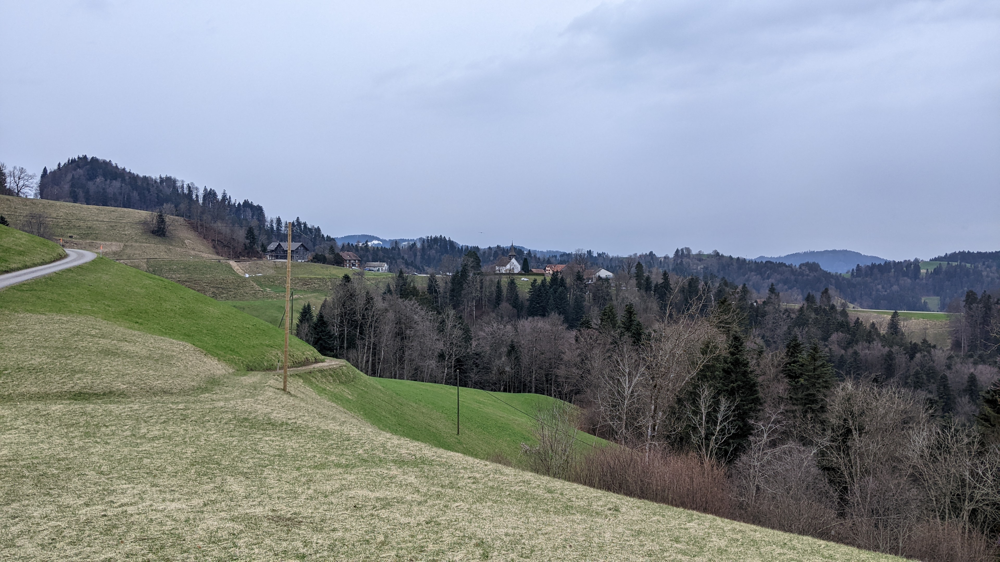

# Bauma

[Webseite der Gemeinde](https://www.bauma.ch/)  
[Gemeindegebiet auf Openstreetmap.org](https://www.openstreetmap.org/relation/1682087)

Die Gemeinde Bauma besteht aus den Orten <q cite="https://www.bauma.ch/gemeindeinzahlen">Bauma, Saland und Sternenberg</q> inklusive einigem Umland. Die Gemeinde hat eine Fläche von <q cite="https://www.bauma.ch/gemeindeinzahlen">2'949 ha</q> oder ca. 29.5 km² und hatte <q cite="https://www.bauma.ch/gemeindeinzahlen">ende des Jahres 2022 eine Bevölkerung von 4'921 Personen</q>. Neben den Orten Bauma, Saland und Sternenberg besteht die Gemeinde Bauma noch aus dem Baumer Vorort Altlandenberg, Hörnen, Dillhaus, Juckeren und vielen weiteren kleinen Siedlungen.

Die Gemeinde Bauma gehört zum Bezirk Pfäffikon des Kantons Zürich. Im Nord-osten grenzt Bauma an die im Kanton Thurgau gelegene Gemeinde Fischingen. Ganz im Nord-osten grenzt Bauma in einem einzigen Punkt an die im Kanton St. Gallen gelegene Gemeinde Mosnang. Im Osten grenzt Bauma an die im Zürcher Bezirk Hinwil gelegene Gemeinde Fischenthal und im Süden an die ebenfalls im Bezirk Hinwil gelegene Gemeinde Bäretswil. Im Süd-westen grenzt Bauma an die Gemeinden Hittnau und Pfäffikon. Und im Nordwesten grenzt Bauma an die Gemeinden Wildberg und Wila.  
Die Orte Bauma und Saland befinden sich im Tösstal, ca. 3.7 km oder 3.1 km Luftlinie voneinander entfernt. Saland liegt dabei weiter nord-westlich und Flussabwärts als Bauma. Sternenberg liegt mehr in den Bergen, 6.0 km oder 4.3 km Luftlinie Östlich von Saland und 5.7 km oder 3.2 km Luftlinie nord-östlich von Bauma. Bauma befindet sich ausserdem <q cite="https://www.bauma.ch/gemeindeinzahlen">24.2 km</q> oder 18.7 km Luftlinie süd-östlich von Winterthur und <q cite="https://www.bauma.ch/gemeindeinzahlen">37.4 km</q> oder 25.4 km Luftlinie östlich von Zürich.

## Transport

### Privatverkehr

Die wichtigste Strasse in Bauma ist die [Hauptstrasse 15](https://www.openstreetmap.org/relation/303397), die Rapperswil SG mit Winterthur durch das Tösstal verbindet. Die Strasse führt von der Grenze mit Fischenthal im Süd-Osten zur Grenze mit Wila im Nord-Westen. Dabei geht die Strasse durch das Zentrum von Bauma, Dillhaus und Saland. In Bauma heisst diese Strasse von der Gemeindegrenze mit Steg bis zum Ortseingang Bauma Stegstrasse, vom Ortseingang Bauma bis zum Orstkern Bauma heisst die Strasse Gublenstrasse, im Dorfkern Bauma teilt sich die Strasse dann in die Dorfstrasse und die Heinrich Gujerstrasse auf, dann heisst die Strasse vom Orstkern bis nach Dillhaus Unterdorfstrasse und von Dillhaus bis zur Gemeindegrenze mit Wila heisst die Strasse Tösstalstrasse.

Auch die Bäretswilerstrasse und die Hittnauerstrasse sind wichtige Strassen. Die Bäretswilerstrasse führt aus der Dorfstrasse im Ortskern von Bauma nach Bäretswil und weiter nach Wetzikon. Die Hittnauerstrasse führt aus der Tösstalstrasse in Saland durch Laubberg nach Hittnau und von dort weiter nach Pfäffikon ZH und Uster.

Weitere wichtige Strassen sind die Strassen von Bauma nach Saland via Sternenberg und die Strasse von Sternenberg nach Fischingen im Kanton Thurgau. Die Strasse von Bauma nach Sternenberg startet im Kern von Bauma aus der Heinrich Gujerstrasse als Sternenbergstrasse. Die Strasse führt zuerst durch Hörnen, dann Schindlet und Musterplatz. Danach führt sie als Höchstockstrasse durch Höchstock nach Sternenberg Rietwies. Von der dortigen Verzweigung mit der Strasse nach Fischingen führt die Strasse als Dorfstrasse weiter durch Sternenberg bis Hinterberg. Von Hinterberg aus heisst die Strasse dann Kohltobelstrasse und später Blitterswilerstrasse und führt durch Vordertobel bis nach Blitterswil und Juckeren. Von Juckeren bis zur Tösstalstrasse ein wenig südlich von Saland heisst die Strasse dann noch Juckerenstrasse. Die Strasse von Sternenberg nach Fischingen im Kanton Thurgau zweigt zwischen Sternenberg Rossweid und Sternenberg Rietwies von der Strasse von Bauma via Sternenberg nach Saland ab. Von dort führt sie als Gfellstrasse via hintere Rossweid, Wies, Lindenhof nach Sternenberg Gfell. Von dort führt die Strasse weiterhin als Gfellstrasse weiter via Obergfell und Schwendi zum Sternenbergpass auf der Gemeindegrenze.

### Öffentlicher Verkehr

Bauma befindet sich in den Tarifzonen 171 und 172 des Zürcher Verkehrs Verbunds. Die Ortschaften im Tal sind in der Tarifzone 172 und Sternenberg ist in der Tarifzone 171.

Auf dem Gemeindegebiet von Bauma gibt es zwei Bahnhöfe, die beide von der S26 im Halbstunden-Takt bedient werden. Der Bahnhof Bauma befindet sich im Ortskern von Bauma und der Bahnhof Saland befindet sich nur wenige Meter von Saland entfernt. Die S26 verbindet Bauma in die eine Richtung mit Rüti ZH, von wo es Züge nach Rapperswil, Pfäffikon SZ, Wetzikon, Uster und Zürich gibt. In die andere Richtung verbindet die S26 Bauma mit Winterthur, von wo aus es Züge in grosse Teile des nord-östlichen Kantons Zürich und die gesamte nord-ost Schweiz gibt.

In Bauma gibt es auch 5 Buslinien die 18 Bushaltestellen bedienen.  
Die Buslinie 850 bedient im Halbstundentakt die Haltestellen "Bauma, Bahnhof", "Bauma, Dorfmitti" und "Bauma, Giesserei Wolfensberger". Diese Buslinie verbindet Bauma via Bäretswil mit Wetzikon. In Bauma kann problemlos von der S26 von Rüti ZH auf die Linie 850 nach Wetzikon umgestiegen werden und von der Linie 850 von Wetzikon auf die S26 nach Rüti ZH. Für Umstiege von bzw. nach Winterthur muss man mehr als 20 Minuten warten. In Wetzikon hat der Bus 850 guten Anschluss an die Züge S3, S14 und S5.  
Die Buslinie 835 bedient im Stundentakt die Haltestellen "Bauma, Bahnhof", "Bauma, Widen", "Saland, Dillhus", "Saland, Juckeren", "Saland, Dorf" und "Saland, Laubberg". Der Bahnhof Saland hat keine eigene Bushaltestelle, ist aber nur 400 Meter von der Haltestelle "Saland, Dorf" entfernt. Die Buslinie 835 verbindet Bauma via Hittnau mit Pfäffikon ZH. In Bauma sind alle Umstiege zwischen der Linie 835 und der S26 mit Wartezeiten verbunden. In Pfäffikon ZH hat der Bus 835 guten Anschluss an die S3 nach Zürich und Anschluss mit ein wenig Wartezeit an die S3 nach Wetzikon.  
Die Buslinie 809 bedient sieben mal am Tag in einem nicht ganz regelmässigen Takt die Haltestellen "Bauma, Bahnhof", "Bauma, Hörnen", "Bauma, Schindlet", "Bauma, Musterplatz", "Sternenberg, Höchstock", "Sternenberg, Rossweid", "Sternenberg, Kirche", "Sternenberg, Sunnenbad", "Sternenberg, Kirche" erneut und "Sternenberg, Gfell". Die Linie 809 verbindet Bauma und Sternenberg miteinander. In Bauma hat der Bus 809 guten Anschluss von und zur S26 von bzw. nach Winterthur und Anschluss mit Wartezeit an die von und zur S26 von bzw. nach Rüti ZH.  
Am Abend wird die Buslinie 835 noch von der Buslinie 837 unterstützt, welche in Bauma an den gleichen Haltestellen hält. Am Morgen früh und am Abend verkehrt auch noch zusätzlich die Buslinie 854 zwischen Bauma und Rüti ZH. Diese Linie bedient in Bauma die Haltestellen "Bauma, Bahnhof", "Bauma, Holderbaum" und "Bauma, Lipperschwändi".

Der Bahnhof Bauma gehörte auch zur alten [Uerikon-Bauma-Bahn (UeBB)](https://de.wikipedia.org/wiki/Uerikon-Bauma-Bahn). Heute wird er nur noch manchmal von Zügen des [Dampfbahn-Vereins Zürcher Oberland (DVZO)](https://dvzo.ch/) bedient. Diese Fahrten von Bauma nach Hinwil und umgekehrt sind aber hauptsächlich Erlebnisfahrten und kein ernst zu nehmendes Transportmittel. Die Dampfbahn ist auch nicht Teil des ZVV und Tickets müssen deswegen separat gekauft werden. In Bauma am Bahnhof steht ausserdem noch die historische Bahnhofshalle der Uerikon-Bauma-Bahn.

Im Zürcher Nachtnetz wird die Gemeinde Bauma von den Buslinien N82 und N87 bedient. Die Linie N82 bedient 4-Mal im Stundentakt von Fehraltorf aus die Haltestellen "Saland, Dorf", "Saland, Juckeren", "Saland, Dillhus", "Bauma, Widen", "Bauma, Bahnhof" und "Saland, Laubberg". Die Linie N87 bedient 4-Mal im Stundentakt von Wetzikon aus die Haltestellen "Bauma, Giesserei Wolfensberger", "Bauma, Dorfmitti", "Bauma, Bahnhof", "Bauma, Holderbaum" und "Bauma, Lipperschwändi".

### Fahrrad- und Fussverkehr

Von der Grenze mit Steg Ortseingang Bauma hat die Hauptstrasse 15 einen kombinierten Geh- und Radweg, teilweise direkt an der Strasse und teilweise durch einen kleinen Grasstreifen von der Strasse getrennt. Dieser Weg ist aber nicht durchgehend auf der gleichen Strassenseite sondern er wechselt die Strassenseite mittels einer Unterführung beim Wiler Boden. Vom Ortseingang bis zum Ortszentrum hat die Strasse dann auf beiden Seiten fast durchgehend sowohl einen Gehsteig als auch einen Fahrradstreifen. Die einzige Ausnahme ist nach der Bushaltestelle Holderbaum, wo der eine Gehsteig für eine kurze Strecke nicht direkt an der Strasse dran sondern wenige Meter entfernt verläuft. Auf dieser Strecke gibt es auch 3 Fussgängerstreifen mit Mittelinseln um die Strasse zu überqueren. Im Ortszentrum hat die Dorfstrasse durchgehend sowohl zwei Gehsteige als auch zwei Fahrradstreifen und auf dieser Strecke befinden sich 5 Fussgängerstreifen, 2 davon mit Mittelinseln. Das gleiche gilt auch für die Heinrich Gujerstrasse im Ortszentrum aber hier ist der Gehsteig nicht immer direkt an der Strasse und es sind 4 Fussgängerstreifen, 2 davon mit Mittelinseln. Vom Ortszentrum Bauma bis zur Abzweigung der Altlandenbergstrasse hat die Hauptstrasse 2 Gehsteige und danach bis zum Bushaltestelle Widen 1 Gehsteig. Bei der Haltestelle Widen wechselt der Gehsteig mithilfe eine Fussgängerstreifens mit Mittelinsel die Strassenseite. Dieser Gehsteig bleibt dann noch bis zur Abzweigung der Widen strasse. Von da bis nach Dillhaus hat die Strasse dann weder einen Gehsteig noch einen Fahrradstreifen. In Dillhaus bekommt die Strasse wieder einen Gehsteig, der dann bis Saland bleibt. In Dillhaus gibt es ausserdem 2 Fussgängerstreifen mit Mittelinseln, bei welchen der Gehsteig auch die Strassenseite wechselt. In Saland dann gibt es wieder zwei Fussgängerstreifen mit Mittelinseln. An der zweiten wechselt der Gehsteig wieder die Strassenseite und dafür gibt es auf der Strassenseite, auf der der Gehsteig war, einen Fahrradstreifen. So geht es dann bis zum Bahnhof Saland, unterwegs gibt es aber noch 2 Fussgängerstreifen mit Mittelinseln. Der Fahrradstreifen führt noch ein wenig weiter, endet dann bei einem weiteren Fussgängerstreifen mit Mittelinsel aber auch. Danach hat die Tösstalstrasse bis zur Gemeindegrenze mit Wila weder einen Gehsteig noch einen Fahrradstreifen.

Die meisten anderen Strassen haben entweder nur auf einer kurzen Strecke einen Gehsteig oder sogar gar keinen. Ausnahmen davon sind die Bäretswilerstrasse, die auf der gesamten Länge mindestens einen Gehsteig hat, die Altlandenbergstrasse, die auf fast der gesamten Länge mindestens einen Gehsteig hat und die Hittnauerstrasse, die bis zum Ortsausgang von Saland 2 Gehsteige hat und dann bis zur Gemeindegrenze mit Hittnau einen kombinierten Fuss- und Fahrradweg.

Viele der übrigen Strassen sind ruhig und langsam genug dass sie auch zu Fuss und mit dem Fahrrad verwendet werden können, auch wenn nichts explizit dafür gebaut wurde. Einzig die Sternenbergstrasse könnte davon noch eine Ausnahme sein, da die Geschwindigkeit da vorallem für Fussgänger\*innen etwas hoch sein könnte. Allerdings ist das Verkehrsaufkommen auch dort nicht wirklich hoch.

Ausserdem hat Bauma noch ziemlich viele Wege abseits von Strassen und auch ziemlich viele Wanderwege. Die meisten von beiden sind in gutem Zustand.

## Einkaufsmöglichkeiten

In Bauma gibt es eine Migros Filiale, eine Denner Filiale, eine Volg Filiale, ein Avec Express am Bahnhof, die [Tösstal Apotheke](https://www.toesstal-apotheke.ch/) und mehr. In Saland gibt es nochmals eine Volg Filiale.

Die nächsten grösseren Einkaufsmöglichkeiten ausserhalb der Gemeinde Bauma gibt es in Pfäffikon ZH, Wetzikon oder Wald, oder noch etwas grössere in Winterthur, Hinwil oder Rapperswil.

### Restaurants

Bauma hat ziemlich viele Restaurants, verteilt über das gesamte Gemeindegebiet. In Bauma selber gibt es das [Gasthaus zur Tanne](http://www.zurtannebauma.ch/index.html) und den [Gasthof Adler](https://hoteladlerbauma.ch/Home/). In Sternenberg gibt es das Restaurant [Sternen](https://sternen-sternenberg.ch/). Und an anderen Orten gibt es noch viele weitere.

## Schule

Die Schulgemeinde Bauma umfasst Kindergärten, Primarschulen und eine Sekundarschule. Die Sekundarschulanlage befindet sich direkt östlich des Ortszentrums von Bauma, die Primarschulanlage Altlandenberg befindet sich zwischen Altlandenberg und Bauma, die Primarshulanlage Haselhalden befindet sich zwischen Juckeren und Dillhaus bei Saland im nord-westen der Gemeinde, die Primarschulanlage Wellenau befindet sich bei Wellenau im osten der Gemeinde und die Primarschulanlage Sternenberg befindet sich zwischen Sternenberg und Sternenberg Gfell.

Die Sekundarschulanlage besteht aus einem Schulhaus mit drei Sektionen und einer Aussenanlage mit Fussballwiese, 100m Sprintanlage, 2 Weitsprungbahnen und einem Handballplatz mit 2 kleinen Basketballfeldern. Hier werden 7 Klassen unterrichtet.

Die Primarschulanlage ist die grösste Primarschulanlage von Bauma. Sie besteht aus dem Kindergarten Altlandenberg 1, Kindergarten Altlandenberg 2 und dem Schulhaus Altlandenberg. Das Schulhaus Altlandenberg wiederum besteht aus 3 Teilen, einer davon ist das Hallenbad Altlandenberg. Die Aussenanlage umfasst eine Fussballwiese, eine 80m Sprintanlage und einen Teerplatz. In der Anlage Altlandenberg werden 6 Schulklassen und 2 Kindergartenklassen unterrichtet.  
Der Kindergarten Dorf, der sich direkt im Zentrum von Bauma befindet, gehört auch noch zur Primarschule Altlandenberg. Hier wird nochmals eine Klasse unterrichtet.

Die Primarschulanlage Haselhalden hat 3 Gebäude, eines davon hat wiederum 3 Teile. In der Haselhalden werden 6 Primarklassen und 1 Kindergartenklasse unterrichtet.\[[1](./Bauma_Zusatz.md#Schule%20Haselhalden%20Lied)\]

Die Primarschulanlage Wellenau hat 2 Gebäude, eines davon mit 2 Teilen und eine Aussenanlage mit Fussballwiese und einen Teerplatz. In dieser Schulanlage werden 2 Primarklassen und 1 Kindergartenklasse unterrichtet.

Die Primarschulanlage Sternenberg hat 2 Gebäude und eine Aussenanlage mit Fussballwiese und einen Teerplatz. In dieser Schulanlage werden 2 Primarklassen unterrichtet.

## Gemeindename

<q cite="https://www.bauma.ch/geschichte/6617">Der Name Bauma entstand aus der Ortsbezeichnung "Hof bei den Bäumen".</q>

## Gemeindewappen

Das Wappen von Bauma zeigt eine grüne Tanne mit rot-braunem Stamm, die auf einem grünen Untergrund steht. Der Hintergrund des Wappens ist weiss bzw. silber. Die Tanne hat 5 von unten nach oben kleiner werdende Ästepaare in alle 3 sichtbaren Richtungen.  
In einer früheren Version des Wappens war anstelle des heutigen Tannenbaums ein Laubbaum zu sehen.

In Bauma gibt es ein [Gasthaus zur Tanne](https://www.openstreetmap.org/node/677298588), Ein Gasthaus mit diesem Namen ist schon so lange Dokumentiert, dass der Name des Gasthauses vermutlich nicht vom Wappen abgeleitet wurde, <q cite="https://www.bauma.ch/wappen">sondern möglicherweise das Wappen vom Gasthaus inspiriert wurde</q>.

Die Gemeinde verwendet den Tannenbaum aus dem Wappen auch um die Stellen zu markieren an denen die Anwohnenden ihre Abfallsäcke, die aufgesammelt werden sollen, rausstellen sollen.

### Gemeindewappen der ehemaligen Gemeinde Sternenberg

Das Wappen von Sternenberg zeigt einen gelben bzw. goldenen sechs-zackigen Stern über einem weissen bzw. silbernen Sechsberg. Der Hintergrund des Wappens ist blau. Ein Sechsberg ist dabei eine Pyramide von sechs kleineren Bergen angeordnet in 3, 2, 1 Bergen pro Reihe.

Auf dem ehemaligen Gemeindegebiet von Sternenberg trifft man die Flagge von Sternenberg immer wieder mal an, vorallem an Fahnenstangen von Privatpersonen.

### Gemeinde Logo

Das Logo der Gemeinde Bauma zeigt links das Wappen und daneben den Text "Gemeinde Bauma". Der Text ist auf 2 Zeilen mit schwarzer Schriftfarbe und einer Schrift ohne Serifen geschrieben. Beide Zeilen zusammen sind ca. halb so hoch wie das Wappen und sie sind oben bündig mit dem Wappen. Beide Zeilen sind ungefähr gleich lang. Der Text "Gemeinde" in der ersten Zeile ist etwas kleiner geschrieben, mit einer Kombination aus Gross- und Kleinbuchstaben und nicht fett. Der Text "Bauma" in der zweiten Zeile ist etwas grösser geschrieben, nur mit Grossbuchstaben und fett.

## Landschaft

### Gewässer

Als Tösstaler Gemeinde wird Bauma ziemlich stark von der Töss geprägt. Alle Bäche auf dem Gemeindegebiet fliessen schlussendlich in die Töss. Die meisten davon direkt auf dem Gebiet von Bauma, einige Bäche ganz im Norden und Nord-osten fliessen aber in den Steinenbach, der dann in Wila in die Töss mündet. Die Töss fliesst aus dem Süd-Osten, von der Grenze mit Fischenthal, nach Nord-Westen, zur Grenze mit Wila.

### Berge

Das Gebiet von Bauma östlich der Töss gehört zu den [Appenzeller Alpen](https://www.openstreetmap.org/relation/11342353) und ist daher (zumindest für zürcher Verhältnisse) stark durch Berge geprägt.  
Sternenberg und das Gebiet darum herum ist ein Ausflugsgebiet für Wanderer. Von Sternenberg Gfell aus startet auch ein Wanderweg auf das Hörnli. Das Hörnli selbst liegt zwar nicht mehr in Bauma, allerdings das Chlihörnli schon. Dieses Chlihörnli ist mit 1'073 Meter über Meer auch der höchste Punkt von Bauma.

## Persönliches Fazit

*Dieser Abschnitt enthält Persönliche Meinungen und gefährliches Halbwissen. Alle Aussagen in diesem Abschnitt sollten mit Vorsicht genossen werden, da es gut Möglich ist dass er Fehler enthält.*

Die Gemeinde Bauma ist eine Flächenmässig grosse, aber Bevölkerungsmässig eher kleine Gemeinde. Sie wird sowohl durch die Voralpen als auch durch das Tösstal geprägt. Durch die Hauptstrasse und die Bahnstrecke im Tösstal ist Bauma relativ gut erschlossen. Die Wege der Töss entlang eignen sich gut für Spaziergänge und die Voralpine Region um Sternenberg bietet viele ruhige, gut ausgebaute und schöne Wanderwege, inklusive dem Wanderweg zum Hörnli und zum Dreiländerstein. Mit der Historischen Bahnhofshalle der Uerikon-Bauma-Bahn und den Ruinen von Alt-Landenberg kann man in Bauma auch Geschichte entdecken.  
Allgemein ist Bauma eine sehr schöne Gemeinde.

## Fotos

  
Das Dorf Bauma, fotografiert von der Ruine Alt-Landenberg [hier](https://www.openstreetmap.org/search?whereami=1&amp;query=47.37264%2C8.87229#map=19/47.37264/8.87229) am 2024-02-25.

  
Altlandenberg und Bauma aus dem Westen, fotografiert von [hier](https://www.openstreetmap.org/search?whereami=1&amp;query=47.37276%2C8.86144#map=19/47.37276/8.86144) am 2024-02-25.

  
Saland und Juckeren aus dem Nord-Westen, fotografiert von oberhalb von Homberg [hier](https://www.openstreetmap.org/search?whereami=1&amp;query=47.39304%2C8.84748#map=19/47.39304/8.84748) am 2024-02-25.

  
Dillhaus und Juckeren aus dem Süden, fotografiert von [hier](https://www.openstreetmap.org/search?whereami=1&amp;query=47.37668%2C8.85604#map=19/47.37668/8.85604) am 2024-02-25.

  
Laubberg aus dem Süd-Osten, fotografiert von [hier](https://www.openstreetmap.org/search?whereami=1&amp;query=47.38406%2C8.84629#map=19/47.38406/8.84629) am 2024-02-25.

  
Sternenberg aus dem Norden, fotografiert von [hier](https://www.openstreetmap.org/search?whereami=1&amp;query=47.39166%2C8.91556#map=19/47.39166/8.91556) am 2024-03-10.

  
Eine Zeichnung von Sternenberg an einer Wand in Gfell, fotografiert von [hier](https://www.openstreetmap.org/search?whereami=1&amp;query=47.38218%2C8.93364#map=19/47.38218/8.93364) am 2024-03-24.

  
Die Berge um Sternenberg mit dem Hörnli und anderen Bergen im Hintergrund mit Blick nach Osten, fotografiert von oberhalb von Ussermatt [hier](https://www.openstreetmap.org/search?whereami=1&amp;query=47.39688%2C8.88580#map=19/47.39688/8.88580) am 2024-03-10.

  
Das Gemeindehaus von Bauma, fotografiert von [hier](https://www.openstreetmap.org/search?whereami=1&amp;query=47.36716%2C8.87916#map=19/47.36716/8.87916) am 2024-02-25.
