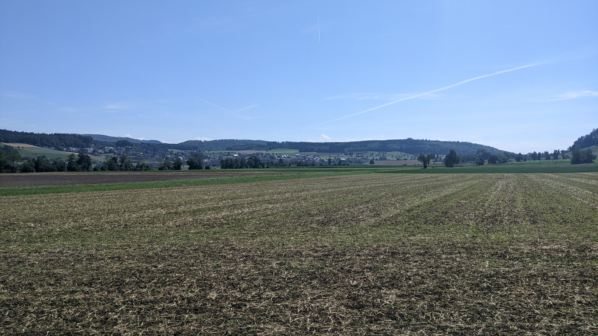

# Bonstetten

[Webseite der Gemeinde](https://www.bonstetten.ch/)  
[Gemeindegebiet auf Openstreetmap.org](https://www.openstreetmap.org/relation/1682092)  
[Wikipedia Artikel der Gemeinde](https://de.wikipedia.org/wiki/Bonstetten_ZH)

Die Gemeinde Bonstetten besteht aus dem Ort Bonstetten, dem etwas kleineren und direkt an Wettswil angrenzenden Schachen Quartier und dem Umland. Die Gemeinde hat eine Fläche von <q cite="https://www.bonstetten.ch/zahlenundfakten">743 ha</q> oder 7.43 km² und eine Bevölkerung von <q cite="https://www.bonstetten.ch/zahlenundfakten">5'657 Personen per Ende 2023</q>. Das Ortszentrum von Bonstetten befindet sich auf <q cite="https://www.bonstetten.ch/zahlenundfakten">543 m.ü.M.</q>.

Die Gemeinde Bonstetten liegt im nördlichen Teil des Bezirks Affoltern, der auch Knonaueramt oder Säuliamt genannt wird. Im Norden grenzt Bonstetten über eine kurze Strecke an die Gemeinde [Aesch ZH](./Aesch_ZH.md) des Bezirks Dietikon und in einem einzigen Punkt an die Gemeinde [Birmensdorf](./Birmensdorf.md) des Bezirks Dietikon. Der grösste Teil der nördlichen Grenze von Bonstetten ist allerdings mit der Gemeinde Wettswil am Albis. Im Osten grenzt Bonstetten an die Gemeinde Stallikon. Im Süden grenzt Bonstetten an die Gemeinde Hedingen. Im Westen grenzt Bonstetten an die Gemeinde Islisberg des Aargauer Bezirks Bremgarten. Die östliche und westliche Grenze folgen je einem Hügelzug, die nördliche und südliche folgen jedoch keinem geografischen Merkmal.  
Das Quartier Schachen liegt ca. 1.3 km Luftlinie nord-nord-östlich von Bonstetten von Zentrum zu Zentrum oder ca. 380 m Luftlinie nördlich von Ortsgrenze zu Ortsgrenze.  
Das Bonstetter Ortszentrum liegt ca. 8.9 km Luftlinie süd-westlich des Zürcher Hauptbahnhofs und ca. 16.1 km Luftlinie nord-nord-westlich des Bahnhofs von Zug.  
Der [tiefste Punkt der Gemeinde Bonstetten](https://www.openstreetmap.org/node/5523466532) befindet sich auf 502 m.ü.M. am Hofibach im Süden des Gemeindegebiets ca. 1.3 km Luftlinie west-süd-westlich des Ortszentrums Bonstetten. Der [höchste Punkt der Gemeinde Bonstetten](https://www.openstreetmap.org/#map=19/47.29812/8.47925) befindet sich auf 715 m.ü.M. auf dem Müliberg im Süd-Osten des Gemeindegebiets ca. 2.1 km Luftlinie süd-süd-östlich des Ortszentrums Bonstetten.

## Transport

### Privatverkehr

Ganz im Westen des Gemeindegebiets verläuft die Autobahn [A4](https://www.openstreetmap.org/relation/192156) von nord nach süd. Die Autobahn ist allerdings nicht sichtbar da sie unterirdisch im Islisbergtunnel verläuft. Ein wenig nördlich der nördlichen Gemeindegrenze befindet sich die Verzweigung 31 [Zürich West](https://de.wikipedia.org/wiki/Verzweigung_Z%C3%BCrich-West) mit dem Autobahnanschluss 31a Wettswil am Albis. Bei der Verzweigung Zürich West verzweigen sich die Autobahnen [A3](https://www.openstreetmap.org/relation/189802) und [A4](https://www.openstreetmap.org/relation/192156). Von der Verzweigung geht die A3 Richtung Osten durch den Uetlibergtunnel, die A4 Richtung Süden durch den Islisbergtunnel und sowohl die A3 als auch die A4 Richtung Nord-Westen durch den Aeschertunnel. Die kombinierte A3 und A4 führt nach dem Aeschertunnel nach Urdorf und dann zur Verzweigung Limmattal, die auch als Limmattalerkreuz bekannt ist. Von der Verzweigung Limmattal führt die Kombinierte A1 und A3 Richtung Westen nach Basel oder Aarau, Olten, Solothurn, Bern, Lausanne und Genf. Von der Verzweigung Limmattal nach Norden führt die kombinierte A1 und A4 durch den Gubristtunnel Kloten und Bülach oder nach Uster oder nach Winterthur und dann entweder Schaffhausen oder Wil, St. Gallen und Rorschach oder Frauenfeld und Kreuzlingen. Von der Verzweigung Limmattal führt ausserdem noch die Autobahn 1H nach Altstetten und in die Stadt Zürich. Von der Verzweigung Zürich West führt die A4 Richtung Süden nach Affoltern am Albis und dann nach Zug und Baar oder nach Arth-Goldau, Schwyz, Brunnen und über die Axenstrasse nach Altdorf und zur Gotthardautobahn oder nach Luzern und dann etweder Stans, Altdorf, durch den Gotthard nach Bellinzona, Lugano und Chiasso oder Alpnach, Sarnen zum Brünigpass. Von der Verzweigung Zürich West führt die A3 nach Zürich Wiedikon oder nach Thalwil, Pfäffikon SZ, Niederurnen, Sargans und Chur.  
Abgesehen vom Autobahnanschluss 31a könnte noch der Autobahnanschluss 31b Affoltern am Albis an der A4 verwendet werden, allerdings ist dieser ungefähr doppelt so weit vom Dorf Bonstetten entfernt.

Abgesehen von der Autobahn eine der wichtigsten Strassen in Bonstetten ist die Zürcherstrasse. Sie führt am westlichen Rand des Dorfes Bonstetten vorbei. Richtung Norden führt die Zürichstrasse zum Autobahnanschluss 31a und danach nach Birmensdorf und Urdorf. Richtung Süden führt die Zürichstrasse nach Hedingen, Affoltern am Albis, Mettmenstetten, Knonau und Cham.  
Die Stationsstrasse startet an der Zürcherstrasse am westlichen Rand des Dorfes Bonstetten und führt am nördlichen Rand des Dorfes entlang und dann ins Schachen Quartier, am Bahnhof vorbei und danach nach Wettswil und zum Autobahnanschluss 31a, wo sie wieder in die Zürcherstrasse mündet. In Wettswil gibt es ausserdem noch eine Abzweigung nach Landikon.  
Die Isenbachstrasse zweigt am nördlichen Rand des Dorfes Bonstetten von der Stationsstrasse ab und führt noch ein wenig länger am nördlichen Rand des Dorfes entlang. Danach führt die Strasse nach Süden durch das Dorf Bonstetten durch und danach als Aumülistrasse nach Aumüli in die Reppischtalstrasse im Reppischtal. Die Reppischtalstrasse führt Richtung Norden nach Stallikon und Sellenbüren und Richtung Süden nach Aeugstertal und zur Albispassstrasse.  
Weitere wichtige Strassen in Bonstetten sind die Schachenstrasse, die östlich von der Stationsstrasse aus der Isenbachstrasse zweigt und das Dorf Bonstetten mit dem Schachen Quartier verbindet und Schlussendlich in die Stationsstrasse mündet. Die Stallikonerstrasse zweigt beim Bahnhof im Schachenquartier von der Stationsstrasse ab, kreuzt dann die Schachenstrasse und führt dann nach Stallikon in die Reppischtalstrasse. Die Islisbergstrasse zweigt nordwestlich des Dorfes Bonstetten von der Zürcherstrasse ab und führt nach Islisberg und Arni im Kanton Aargau in die dortige Zürcherstrasse (diese Zürcherstrasse ist eine andere als die Bonstetter Zürcherstrasse). Im Dorf Bonstetten gibt es noch die Dorfstrasse und die alte Stationsstrasse. Die Dorfstrasse zweigt am nord-westlichen Dorfrand von der Stationsstrasse ab und führt mitten durch das Dorf nach Osten zur Isenbachstrasse. Die Alte Stationsstrasse ist relativ kurz und verbindet einfach die Isenbachstrasse am nördlichen Dorfrand mit der Dorfstrasse mitten im Dorf Bonstetten.

### Öffentlicher Verkehr

Die Gemeinde Bonstetten befindet sich in der Tarifzone 155 des Zürcher Verkehrs Verbunds. Auf dem Gemeindegebiet von Bonstetten gibt es 1 Bahnhof und 7 Bushaltestellen. Der Bahnhof Bonstetten-Wettswil hat 2 Gleise mit einem über 300 Meter langen Perron für beide Gleise. Der Bahnhof befindet sich am westlichen Rand des Schachen Quartiers und ca. 1.2 km Luftlinie nördlich des Dorfzentrums Bonstetten. Direkt östlich neben dem Bahnhof befindet sich die Bushaltestelle "Bonstetten-Wettswil, Bahnhof" mit 4 Buchstabierten Haltepunkten an der Stationsstrasse. Die Bushaltestelle "Bonstetten, Dorfstrasse" liegt ebenfalls an der Stationsstrasse, allerdings auch am nord-westlichen Rand des Dorfes Bonstetten kurz vor der Abzweigung der Dorfstrasse. Die Bushaltestelle "Bonstetten, Dorfplatz" befindet sich direkt im Dorfzentrum von Bonstetten. Die Bushaltestelle "Bonstetten, Isenbach" befindet sich im nord-östlichen Teil von Bonstetten. Die Bushaltestelle "Bonstetten, Lärchenhof" befindet sich im süd-östlichen Teil vom Schachen Quartier. Die Bushaltestelle "Bonstetten, Sunnenberg" befindet sich am süd-östlichen Rand des Dorfes Bonstetten. Die Bushaltestelle "Bonstetten, Lätten" befindet sich beim Lättenhof an der Islisbergstrasse ca. 370 m Luftlinie nord-westlich des Dorfes Bonstetten. Der Bahnhof wird von 2 S-Bahn-linien, den Linien S5 und S14 bedient und die Bushaltestellen werden von insgesamt 8 Buslinien bedient, den Linien 228, 200, 221, 227, 229, 205, 210 und 220.

Die S-Bahnen S5 und S14 verkehren beide 7 Tage die Woche im Halbstundentakt. Die Bahnen ergänzen sich allerdings nicht ganz zu einem Viertelstundentakt sondern verkehren mit Abständen von abwechselnd 10 und 20 Minuten. In südliche Richtung fährt die S5 nach Affoltern am Albis und Zug und die S14 nur bis Affoltern am Albis. In nördliche Richtung verkehrt die S5 nach Zürich Altstetten, Zürich Hardbrücke, Zürich HB, Zürich Stadelhofen, Uster, Wetzikon, Rapperswil SG und Pfäffikon SZ und die S14 nach Zürich Altstetten, Zürich HB, Zürich Oerlikon, Uster, Wetzikon und Hinwil.  
Die Buslinie 228 bedient in Bonstetten die Haltestellen "Bonstetten-Wettswil, Bahnhof", "Bonstetten, Lärchenhof", "Bonstetten, Isenbach", "Bonstetten, Dorfplatz" und "Bonstetten, Dorfstrasse" jeweils von Montag bis Samstag im Halbstundentakt und an Sonn- und Feiertagen im Stundentakt. Die Linie 228 verkehrt in einem Rundkurs durch das Schachen Quartier und das Dorf Bonstetten. Am Bahnhof Bonstetten-Wettswil ist der Umstieg von der S14 von Zürich auf den Bus und vom Bus auf die S5 in beide Richtungen gut gewährleistet.  
Die Buslinie 200 bedient in Bonstetten die Haltestellen "Bonstetten-Wettswil, Bahnhof" und "Bonstetten, Dorfstrasse" jeweils in beide Richtungen von Montag bis Samstag im Halbstundentakt und an Sonn- und Feiertagen im Stundentakt. Die Linie 200 verkehrt von "Zürich, Bahnhof Enge" über "Zürich, Saalsporthalle" bzw. "Zürich, Sihlcity" durch den Üetlibergtunnel nach Wettswil am Albis, Bonstetten, Hedingen und Affoltern am Albis. Am Bahnhof Bonstetten-Wettswil ist der Umstieg von Bus von Zürich auf die S14 nach Zug knapp und auf die S14 nach Zürich gut gewährleistet, der Umstieg vom Bus von Affoltern am Albis auf die S5 in beide Richtungen knapp und auf die S14 nach Affoltern am Albis gut gewährleistet, der Umstieg von der S14 von Affoltern am Albis auf den Bus nach Zürich gut gewährleistet und der Umstieg von der S5 aus beiden Richtungen auf den Bus nach Affoltern am Albis gut gewährleistet. In Zürich Enge besteht Anschluss an die S-Bahnen S24 nach Thalwil, Baar und Zug in die eine Richtung und Zürich Wiedikon, Zürich HB, Zürich Wipkingen, Zürich Oerlikon, Zürich Flughafen, Effretikon, Winterthur und dann entweder Andelfingen und Schaffhausen oder Oberwinterthur, Frauenfeld und Weinfelden in die andere Richtung, die S2 nach Thalwil, Wädenswil, Pfäffikon SZ, Ziegelbrücke und weiteren Stationen in die eine Richtung und Zürich Wiedikon, Zürich HB, Zürich Oerlikon und Zürich Flughafen in die andere Richtung und die S8 nach Thalwil, Wädenswil und Pfäffikon SZ in die eine Richtung und Zürich Wiedikon, Zürich HB, Zürich Oerlikon, Effretikon und Winterthur in die andere Richtung. Ausserdem besteht in Zürich Enge noch Anschluss an die Tramlinien 5 nach Laubegg oder Bürkliplatz, Bellevue und Kirche Fluntern, die Tramlinie 13 nach Albisgüetli oder Paradeplatz, Rennweg, Bahnhofstrasse, Bahnhofquai, Escher-Wyss-Platz und Frankental, an die Tramlinie 17 nach Albisgüetli oder Paradeplatz, Rennweg, Bahnhofstrasse, Bahnhofquai, Escher-Wyss-Platz und Werdhölzli und ein wenig indirekter auch an die Tramlinie 6 nach Paradeplatz, Rennweg, Bahnhofstrasse, Central, ETH Universitätsspital, Kirche Fluntern und Zoo. In Affoltern am Albis besteht nur Anschluss an die gleichen S-Bahn linien wie schon in Bonstetten-Wettswil.  
Die Buslinie 221 bedient in Bonstetten die Haltestellen "Bonstetten-Wettswil, Bahnhof" jeweils von Montag bis Samstag im Halbstundentakt und an Sonn- und Feiertagen im Stundentakt. Die Linie 221 verkehrt in einem Rundkurs durch die benachbarte Gemeinde Wettswil am Albis. Am Bahnhof Bonstetten-Wettswil ist der Umstieg vom Bus auf die S5 in beide Richtungen gut auf die S14 nach Affoltern am Albis weniger gut gewährleistet und der Umstieg von der S5 aus beiden Richtungen auf den Bus gut und von der S14 von Affoltern am Albis auf den Bus weniger gut gewährleistet.  
Die Buslinie 227 bedient in Bonstetten die Haltestellen, "Bonstetten-Wettswil, Bahnhof", "Bonstetten, Lärchenhof", "Bonstetten, Isenbach" und "Bonstetten, Sunneberg" jeweils von Montag bis Samstag im Stundentakt, von Montag bis Freitag von ca. 09:00 Uhr bis ca. 16:00 Uhr auf einer verkürzten Strecke von "Bonstetten-Wettswil, Bahnhof" direkt nach "Stallikon, Dorf". Die Linie 227 verkehrt von Bonstetten über Stallikon nach Birmensdorf. Am Bahnhof Bonstetten-Wettswil ist der Umstieg vom Bus auf die S5 in beide Richtungen gut und während die verkürzte Route aktiv ist auch auf die S14 nach Zürich knapp bis gut gewährleistet und der Umstieg von der S5 aus beiden Richtungen auf den Bus gut und während die verkürzte Route aktiv ist auch von der S14 von Zürich auf den Bus knapp bis gut gewährleistet. In Birmensdorf am Bahnhof besteht wieder anschluss an die gleichen S-Bahn linien wie schon in Bonstetten-Wettswil.  
Die Buslinie 229 bedient in Bonstetten die Haltestellen "Bonstetten-Wettswil, Bahnhof" jeweils von Montag bis Samstag im Stundentakt. Die Linie 229 verkehrt immer zwischen dem Bahnhof Bonstetten-Wettswil und "Wettswil am Albis, Heidenchilen" hin und her. Am Bahnhof Bonstetten-Wettswil ist der Umstieg vom Bus auf die S14 nach Zürich gut und auf die S5 in beide Richtungen mit ein wenig Wartezeit gewährleistet und der Umstieg von der S5 aus beiden Richtungen auf den Bus gut gewährleistet.  
Die Buslinie 205 bedient in Bonstetten die Haltestellen "Bonstetten-Wettswil, Bahnhof", "Bonstette, Dorfstrasse" und "Bonstetten, Lätten" jeweils von Montag bis Freitag in einem nicht perfekten Stundentakt. Der Bus fährt nur von 06:xx Uhr bis 19:xx Uhr mit einer zusätzlichen Verbindung um 00:43 Uhr, die auch Samstags fährt. Zwischen 06:xx Uhr und 07:xx Uhr und zwischen 15:xx Uhr und 19:xx Uhr fährt der Bus sogar im Halbstundentakt. Ausserdem ist die Abfahrtszeit am Bahnhof Bonstetten-Wettswil am Morgen jeweils um xx:24 Uhr und am Nachmittag um xx:17 Uhr. Die Linie 205 verkehrt von Bonstetten über Islisberg nach Arni im Kanton Aargau. Am Bahnhof Bonstetten-Wettswil ist der Umstieg am Morgen vom Bus auf die S14 nach Zürich und am Nachmittag vom Bus auf die S14 nach Affoltern am Albis und am Morgen von der S14 von Affoltern am Albis und am Nachmittag von der S14 von Zürich auf den Bus gut gewährleistet.  
Die Buslinie 210 bedient in Bonstetten die Haltestellen "Bonstetten-Wettswil, Bahnhof", "Bonstetten, Isenbach", "Bonstetten, Dorfplatz" und "Bonstetten, Dorfstrasse" jeweils von Montag bis Freitag 12 mal nur während den Hauptverkehrszeiten meistens im Halbstundentakt. Die Linie 210 verkehrt von "Zürich, Bahnhof Enge" über "Zürich, Saalsporthalle" bzw. "Zürich, Sihlcity" durch den Üetlibergtunnel nach Wettswil und dann durch das Dorf Bonstetten. Am Bahnhof Bonstetten-Wettswil ist der Umstieg vom Bus von Zürich auf die S5 in beide Richtungen, vom Bus von Bonstetten auf die S14 nach Zürich, von der S14 von Zürich auf den Bus von Zürich und von der S5 aus beiden Richtungen auf den Bus nach Bonstetten gut gewährleistet. In Zürich Enge besteht der gleiche Anschluss wie schon beim Bus 200 erwähnt.  
Die Buslinie 220 bedient in Bonstetten die Haltestellen "Bonstetten-Wettswil, Bahnhof" jeweils von jeweils von Montag bis Freitag 11 mal nur während den Hauptverkehrszeiten meistens im Halbstundentakt. Die Linie 220 verkehrt von Zürich Wiedikon über das Zürich Triemli, Waldegg, Birmensdorf und Wettswil nach Bonstetten. In Birmensdorf wird der Bahnhof aber nicht bedient. Am Bahnhof Bonstetten-Wettswil ist der Umstieg am Morgen vom Bus auf die S5 in beide Richtungen und von der S14 von Affoltern am Albis auf den Bus und am Nachmittag vom Bus auf die S14 nach Affoltern am Albis und von der S5 aus beiden Richtungen gut gewährleistet. In Zürich Wiedikon besteht Anschluss an die S-Bahnen S24 nach Zürich Enge, Thalwil, Baar und Zug in die eine Richtung und Zürich HB, Zürich Wipkingen, Zürich Oerlikon, Zürich Flughafen, Effretikon, Winterthur und dann entweder Andelfingen und Schaffhausen oder Oberwinterthur, Frauenfeld und Weinfelden in die andere Richtung, die S2 nach Zürich Enge, Thalwil, Wädenswil, Pfäffikon SZ, Ziegelbrücke und weiteren Stationen in die eine Richtung und Zürich HB, Zürich Oerlikon und Zürich Flughafen in die andere Richtung und die S8 nach Zürich Enge, Thalwil, Wädenswil und Pfäffikon SZ in die eine Richtung und Zürich HB, Zürich Oerlikon, Effretikon und Winterthur in die andere Richtung. Ausserdem besteht in Zürich Wiedikon noch Anschluss an die Tramlinien 9 nach Zürich Triemli oder Paradeplatz, Bürkliplatz, Bellevue, ETH Universitätsspital, Milchbuck, Altried und Hirzenbach und die Tramlinie 14 nach Zürich Triemli oder Bahnhofplatz HB, Bahnhofquai HB, Schaffhauserplatz, Milchbuck, Oerlikon Sternen, Bahnhof Oerlikon Ost und Seebach.

Im Zürcher Nachtnetz wird der Bonstetten von der Nacht S-Bahn SN5 3 mal von Knonau und 4 mal von Zürich im Stundentakt bedient. Die SN5 verkehrt zwischen Knonau via Bonstetten, Zürich Altstetten, Zürich Hardbrücke, Zürich HB, Zürich Stadelhofen, Uster, Wetzikon und Rapperswil SG nach Pfäffikon SZ.  
Am Bahnhof Bonstetten-Wettswil besteht auch die Möglichkeit auf den Nachtbus N23 umzusteigen. Der Nachtbus N23 bedient dann 3 mal im Stundentakt noch die Haltestellen Sunnenberg, Dorfplatz und Dorfstrasse. Der 4. Nachtbus endet bevor er wieder zurück nach Bonstetten kommt. Die Nachtbuslinie ist ein Rundkurs vom Bahnhof Bonstetten-Wettswil über Wettswil am Albis, Landikon bei Birmensdorf, Stallikon und Bonstetten zurück zum Bahnhof Bonstetten-Wettswil.

### Fahrrad- und Fussverkehr

Auf der Strecke von der nördlichen Gemeindegrenze mit Wettswil am Albis bis zur Abzweigung der Stationsstrasse am Dorfrand von Bonstetten hat die Zürcherstrasse weder einen Gehsteig noch einen Fahrradstreifen und keine Zebrastreifen. Es gibt allerdings 2 Mittelinseln, die das queren der Strasse zumindest ein wenig erleichtern. Die eine befindet sich bei der Abzweigung der Islisbergstrasse und die andere befindet sich ca. 100 m nördlich der Abzweigung der Stationsstrasse. Von der Abzweigung der Stationsstrasse bis zur südlichen Gemeindegrenze mit Hedingen hat die Zürcherstrasse auf ungefähr der Hälfte der Strecke einen Gehsteig und keine Fahrradstreifen oder Zebrastreifen. Auf ungefähr der hälfte der Strecke mündet die Chapfstrasse in die Zürcherstrasse und dort zweigt ein Weg von der Chapfstrasse ab, der dann für den Rest der Strecke als, durch einen Rasenstreifen von der Strasse getrennten, Fuss- und Fahrradweg dient.  
Die Stationsstrasse hat von der Abzweigung von der Zürcherstrasse bis zur nördlichen Gemeindegrenze mit Wettswil am Albis einen nahezu durchgehenden Gehsteig aber keine Fahrradstreifen. Bei der Abzweigung der Dorfstrasse gibt es Ausserdem 2 Mittelinseln ohne Zebrastreifen und um die Dorfstrasse zu queren gibt es auch eine Mittelinsel ohne Zebrastreifen. Für die Bushaltestelle Dorfstrasse bekommt die Stationsstrasse kurz zwei Gehsteige, der eine ist allerdings nicht einmal ganz 70 m Lang. Der nächste interessante Punkt ist dan erst wieder die Abzweigung der Isenbachstrasse am nördlichen Dorfrand von Bonstetten, wo der Gehsteig unterbrochen wird und die Isenbachstrasse mit einem Zebrastreifen mit Mittelinsel und Ampel gequert werden kann. Die Stationsstrasse selber kann hier eigentlich nicht gequert werden. Danach befindet sich der nächste interessante Punkt beim Bahnhof Bonstetten-Wettswil im Schachen Quartier. Dort befindet sich ein Zebrastreifen mit kleiner Mittelinsel vor dem Bushaltepunkt C, dann noch ein Zebrastreifen mit kleiner Mittelinsel nach dem Bushaltepunkt C und vor der Abzweigung der Stallikerstrasse und dann erneut ein Zebrastreifen mit kleiner Mittelinsel nach der Abzweigung der Abzweigung der Stallikerstrasse und vor den Haltepunkten A, B und D. Die Stallikerstrasse kann mittels eines Zebrastreifens mit Mittelinsel gequert werden. Das Bahnhofsareal kann als eine Art zweiter Gehsteig genutzt werden. Vom Bahnhof bis zur Gemeindegrenze mit Wettswil am Albis hat die Stationsstrasse dann noch einen, durch einen Rasenstreifen von der Strasse getrennten, Geh- und Fahrradweg auf der anderen Strassenseite des weiter führenden Gehsteigs. Ziemlich genau auf der Gemeindegrenze befindet sich dann noch ein Zebrastreifen mit Mittelinsel.  
Die Isenbach-/Aumülistrasse hat von der Abzweigung von der Stationsstrasse bis zum Schützenhaus Bonstetten immer einen Gehsteig aber nicht immer auf der gleichen Strassenseite und nicht durchgehend. Vom Schützenhaus bis zur Gemeindegrenze hat die Strasse keine Gehsteige mehr. Fahrradstreifen gibt es auf der gesamten Strecke dieser Strasse keine. Bei der Abzweigung von der Stationsstrasse, am Nordrand des Dorfes Bonstetten, gibt es einen Zebrastreifen mit Mittelinsel und Ampel über die Isenbachstrasse. Von dieser Abzweigung bis kurz nach der Abzweigung der alten Stationsstrasse führt ein Gehsteig der vom Dorf entfernten Strassenseite entlang. Kurz nach der Abzweigung der alten Stationsstrasse gibt es einen einfachen Zebrastreifen und der Gehsteig wechselt die Strassenseite. Kurz nach der Strasse Hofwies gibt es einen weiteren Zebrastreifen mit Mittelinsel, der zum Fuss- und Fahrradweg zwischen Bonstetten und dem Schachenquartier führt. Direkt vor der Abzweigung der Schachenstrasse existiert dann erneut ein Zebrastreifen mit Mittelinsel. Bei der Abzweigung der Dorfstrasse ist die Querung der Dorfstrasse über einen Zebrastreifen mit Mittelinsel gewährleistet. Danach führt der Gehsteig noch bis nach der Abzweigung der Rütistrasse, wo er mithilfe eines einfachen Zebrastreifens wieder die Strassenseite wechselt. Bis zur Bushaltestelle Sunnenberg am süd-westlichen Dorfrand von Bonstetten wird der Gehsteig noch von 2 Strassen unterbrochen, die beide weder Zebrastreifen noch Mittelinsel haben. Nach der Bushaltestelle Sunnenberg wird der Gehsteig relativ schmal und nach dem Hof Stein ist es nur noch ein Kiesstreifen neben der Strasse. Beim Schützenhaus Bonstetten endet der Gehsteig dann komplett.

Die Dorfstrasse im Dorf Bonstetten hat auf der gesamten Strecke einen Gehsteig aber keine Fahrradstreifen. Bei der Abzweigung von der Stationsstrasse hat sie eine Querung mit Mittelinsel aber ohne Zebrastreifen, 60 m vor der Abzweigung von der Isenbachstrasse hat sie einen einfachen Zebrastreifen und bei der Abzweigung von der Isenbachstrasse einen Zebrastreifen mit Mittelinsel.  
Die alte Stationsstrasse im Dorf Bonstetten hat einen durchgehenden Gehsteig und keine markierten Querungen.  
Die Stallikerstrasse im Schachen Quartier hat 2 Gehsteige bis zur Gemeindegrenze und keine Fahrradstreifen. Bei der Abzweigung von der Stationsstrasse gibt es einen Zebrastreifen mit Mittelinsel, danach gibt es einfache Zebrastreifen beim Fussweg vom Dorf Bonstetten ins Schachen Quartier, bei der Strasse Schachenmatten und auf beiden Seiten der Schachenstrasse. Auf den letzten etwas mehr als 150 m vor der Gemeindegrenze werden die Gehsteige relativ schmal.  
Die Schachenstrasse, die für viele Schulkinder als Schulweg dient, hat bis zum beginn des Schachen Quartiers einen relativ breiten Gehsteig der auch für Fahrräder gedacht ist. Im Schachen Quartier geht dieser Gehsteig weiter ist allerdings nicht mehr so breit. Fahrradstreifen oder Zebrastreifen hat die Strasse beides nicht.  
Die Islisbergstrasse ausserhalb des Dorfes Bonstetten hat weder einen Gehsteig, noch einen Fahrradstreifen, noch Zebrastreifen.

Innerhalb des Dorfes Bonstetten haben auch einige kleinere Strassen einen Gehsteig, wie zum Beispiel die Friedhofstrasse oder ein Teil der Aumülistrasse. Ausserdem sind die meisten kleineren Strassen, sowohl im Dorf Bonstetten als auch im Schachen Quartier, relativ ruhig und können deswegen auch zu Fuss oder mit dem Fahrrad verwendet werden.

Ausserhalb des Dorfes Bonstetten und des Schachen Quartiers hat die Gemeinde Bonstetten ausserdem noch einige, relativ gut gepflegte Feld- und Waldwege.

## Einkaufsmöglichkeiten

Im Dorf Bonstetten gibt es eine Spar Filiale, eine Metzgerei und einen Bäcker. Ausserdem gibt es [s'Lädeli im Rank](https://rotenbirben.ch/hofladen/). Im Schachen Quartier gibt es eine Coop Filiale, eine Migros VOI Filiale und einen avec am Bahnhof. Für noch grössere Einkäufe gibt es in Affoltern am Albis eine Migros Filiale, eine Lidl Filiale, eine noch grössere Coop Filiale, eine Aldi Schweiz Filiale, eine Jumbo Filiale und noch einiges mehr. Die nächsten Einkaufszentren sind entweder das Sihlcity in Zürich oder das Shoppi Tivoli in Spreitenbach.

### Restaurants

Bonstetten hat einige Restaurants, aber keines das besonders bekannt ist. Nicht weit vom Dorfzentrum Bonstetten entfernt gibt es die Restaurants [Linde](https://linde-bonstetten.ch/Startseite/) und [Löwen](https://www.loewen-bonstetten.ch/) und im Schachen Quartier beim Bahnhof gibt es das Restaurant [Milia's](https://www.milias.ch/).

## Schule

Die Gemeinde Bonstetten hat eine eigene Primarschulgemeinde und eine Sekundarschule zusammen mit Stallikon und Wettswil am Albis, die sich im Schachenquartier von Bonstetten befindet und auch den Namen von Bonstetten trägt. Die nächstgelegene Kantonsschule ist die Kantonsschule Limmattal in Urdorf ca. 9.2 km Luftlinie vom Dorfzentrum Bonstetten entfernt. Es gibt Pläne für eine Kantonsschule in Affoltern am Albis, bis diese Umgesetzt sind wird es aber im 2024 noch einige Jahre dauern.  
Die Primarschule Bonstetten besteht aus der Schulanlage Schachenmatten, das sich am südlichen Ende des Schachen Quartiers befindet, dem Kindergarten Dorf, der sich direkt beim Dorfzentrum Bonstetten befindet, und dem Kindergarten Bodenfeld, der sich ca. 160 m Luftlinie westlich des Dorfzentrums von Bonstetten befindet. Die Schulanlage Schachenmatten liegt ausserdem noch direkt östlich vom Sportzentrum Schachen, direkt südlich der Sekundarschule Bonstetten und direkt östlich des Spielplatzes Schachen.  
Die Sekundarschule Bonstetten besteht aus der Schulanlage im Bruggen, die sich im Schachenquartier direkt nördlich der Primarschule Bonstetten und ziemlich direkt nordöstlich des Sportzentrums Schachen befindet. Sie befindet sich ausserdem ca. 340 m Luftlinie südöstlich des Bahnhofs Bonstetten-Wettswil.

Die Primarschulanlage Schachenmatten besteht aus 4 Schulhäusern, einem Pavillion und einer einfach Turnhalle. Ausserdem gehört eine Aussenanlage mit 2 Pausenplätzen, 1 Allwetterplatz mit 2 Basketballkörben und 4 Handballtoren, 1 Rasenfeld mit 2 Handballtoren und 1 Weitsprunganlage dazu. Die beiden Kindergärten im Dorf Bonstetten bestehen aus jeweils 1 Gebäude. In der Schulanlage Schachenmatten werden 3 Kindergartenklassen, im Kindergarten Dorf 2 Kindergartenklassen und im Kindergarten Bodenfeld 1 Kindergartenklasse unterrichtet. Schulklassen werden in der Schulanlage Schachenmatten 19 Unterrichtet, verteilt über 6 Schuljahre. In der Schulanlage Schachenmatten gibt es auch noch den Schachenhort.

Die Sekundarschulanlage im Bruggen besteht aus 4 Schulhaustrakten und einer einfach Turnhalle. Ausserdem gehört eine Aussenanlage mit 1 Hartplatz mit 2 Handballtoren, 1 Rasenfeld mit 2 Fussballtoren, 1 Basketballkorb unterhalb von Trakt D und 1 Diskgolfziel. Die Sekundarschule Bonstetten unterrichtet 20 Klasse verteilt über 3 Schuljahre und jeweils 3 Niveaus.

## Gemeindename

Die älteste bekannte Erwähnung von Bonstetten war <q cite="https://www.bonstetten.ch/geschichte/11486">1122 als "Boumstettin"</q>.

## Gemeindewappen

Die offizielle Beschreibung des Wappens lautet folgendermassen: <q cite="https://www.bonstetten.ch/wappen">Das Gemeindewappen von Bonstetten ist in schwarz mit goldenem Bord drei aneinanderstossende, geschliffene silberne Rauten.</q> "Bord" ist dabei ein Synonym für Rand, mit "Raute" ist die geometrische Form mit vier gleich langen Seiten aber nicht rechten Winkeln gemeint und das "geschliffen" ist durch Linien zwischen gegenüberliegenden Ecken dargestellt. Das Wappen geht auf ein Wappen vom Freiherr Hermann von Bonstetten zurück, damals allerdings noch ohne goldenen Rand.

Die Webseite der Gemeinde verwendet ein Wappen bei dem alle Rauten gleich gross sind und den goldenen Rand nicht berühren. An anderen Orten, wie zum Beispiel [im Verzeichnis der Gemeindewappen der Antiquarischen Gesellschaft in Zürich](https://www.e-periodica.ch/digbib/view?pid=mag-001:1977:49::7#48) berühren die Rauten aber den goldenen Rand und die äusseren 2 Rauten sind ein wenig kleiner als die Innere.

### Gemeinde Logo

Das Gemeinde Logo zeigt die 3 Rauten aus dem Wappen ohne die Linien durch die Mitte in 3 verschiedenen Farben. Von Links nach Rechts sind diese Farben Dunkel-Grau, Hell-Grau und Gelb/Gold. Die 3 Rauten sind hier alle gleich gross. Rechts daneben steht der Text "Gemeinde Bonstetten" auf 2 Zeilen aufgeteilt. Die 3 Rauten sind nur so hoch wie der Text "Gemeinde und befindet sich links neben diesem Text. Zwischen den Beiden Wörtern befindet sich auch eine Horizontale Linie. Die beiden Wörter sind linksbündig und verwenden eine Schwarze Schriftfarbe und eine Schriftart ohne Serifen. Der Text "Gemeinde" ist grösser geschrieben als der Text "Bonstetten", dafür verwendet der Text "Bonstetten" aber nur Grossbuchstaben und eine fette Schriftart.

Das Logo wird Teilweise auch ohne den Text, also nur mit den 3 Farbigen Rauten, verwendet. Der Text kann teilweise auch ein wenig anders angeordnet sein, die Grundelement bleiben aber eigentlich immer die gleichen.

## Landschaft

Die Gemeinde Bonstetten liegt zwischen dem Hügelzug auf dem sich Islisberg befindet und dem Hügelzug mit dem Sunnenberg. Das Dorf Bonstetten selber befindet sich zusätzlich noch am Fusse des Hügels Birch. Nördlich des Dorfes Bonstetten und westlich des Quartiers Schachen ist das Gemeindegebiet von Bonstetten relativ Flach. Der östliche Teil des Dorfes Bonstetten und des Schachen Quartiers, befindet sich am Hang des Hügelzugs mit dem Sunneberg.

Nördlich des Schachen Quartiers liegen die Weiher Fischbach und Fridgraben, allerdings liegt keiner davon auf dem Gemeindegebiet von Bonstetten.  
Der Dorfbach entspringt am Hügel Birch und fliesst dann unter dem Dorf Bonstetten durch, westlich am Schachen Quartier vorbei, westlich am Fischbachweiher vorbei und dann weiter nach Norden richtung Birmensdorf.  
Der Isenbach ist ein Abfluss vom Lochenweiher oberhalb des Dorfes Bonstetten. Von dort fliesset er durch das Dorf Bonstetten, dann durch das Schachen Quartier, östlich am Fridgrabenweiher vorbei und dann weiter nach Norden richtung Birmensdorf in den selben Bach wie schon der Dorfbach.  
Der Fluechbach entspringt am Hang des Hügelzugs auf dem Islisberg liegt. Danach fliesst er durch die Ebene von Bonstetten und fliesst dann nahezu exakt auf der nördlichen Gemeindegrenze von Bonstetten in den Dorfbach.

## Weiteres

Im Schachen Quartier gibt es das Sportzentrum Schachen, das von den Gemeinden Bonstetten, Stallikon und Wettswil am Albis finanziert wurde. Es besteht aus einer dreifach Turnhalle, einem Hartplatz mit 2 Handballtoren und 4 Basketballkörben, einer 100 m Sprintanlage mit 4 Bahnen, einer 300 m Rundbahn um den Hartplatz und eine Wiese, zwei Weitsprunganlagen und drei Kugelstossanlagen.  
Direkt südlich des Sportzentrums Schachen befindet sich der Spiel- und Begegnugsplatz Schachen. Er besteht aus einem skatepark mit Halfpipe, einem Beachvolleyballfeld, einem Tischtennis Tisch, einer Bocciabahn, einem Disc Golf Ziel, einem Spielplatz und mehr.

Die Gemeinde Bonstetten hat an mehreren Orten Anschlagbretter mit dem Titel "Was lauft z'Bonstetten" platziert.

Die Bibliothek Bonstetten hat oberhalb des Schachen Quartiers ein Lesebänkli und stellt dort teilweise sogar eine Bücherbox bereit.

Auf der Website der Gemeinde kann man ziemlich viele Informationen finden. Die Website hat auch eine integrierte vorlesen Funktion für Personen mit einer Sehbehinderung (die natürlich auch von Personen ohne Behinderungen genutzt werden kann).

## Persönliches Fazit

*Dieser Abschnitt enthält Persönliche Meinungen und gefährliches Halbwissen. Alle Aussagen in diesem Abschnitt sollten mit Vorsicht genossen werden, da es gut Möglich ist dass er Fehler enthält.*

Die Gemeinde Bonstetten fühlt sich sehr freundlich an. Das Schachen Quartier fühlt sich moderner an und bietet mit den Schulen, dem Sportzentrum, dem Bahnhof, den Läden und den Kirchen relativ viele Dienstleistungen und Infrastruktur an, während sich das Dorf Bonstetten selber eher ein wenig traditioneller und ruhiger anfühlt. Für Besucher\*innen gibt es in Bonstetten eigentlich nur die schöne Landschaft, sonst aber nichts besonderes. Für die lokale Bevölkerung bietet die Gemeinde aber recht viel.

## Fotos

  
Das Dorf Bonstetten, fotografiert aus westlicher Richtung von oberhalb des Lätten-Hofs an der Islisbergstrasse [hier](https://www.openstreetmap.org/search?whereami=1&amp;query=47.31842%2C8.45392#map=19/47.31842/8.45392) am 2024-08-11.

  
Der westliche Teil des Dorfes Bonstetten, fotografiert aus nord-östlicher Richtung vom alten Züriweg [hier](https://www.openstreetmap.org/search?whereami=1&amp;query=47.31933%2C8.47594#map=19/47.31933/8.47594) am 2024-08-25.

  
Das Dorf Bonstetten, fotografiert aus nördlicher Richtung von nahe des Albis-Golf Golfplatzes [hier](https://www.openstreetmap.org/search?whereami=1&amp;query=47.33085%2C8.46272#map=19/47.33085/8.46272) am 2024-08-11.

  
Das Schachen Quartier und Wettswil am Albis, fotografiert aus südlicher Richtung vom Waldrand oberhalb des Dorfes Bonstetten [hier](https://www.openstreetmap.org/search?whereami=1&amp;query=47.30751%2C8.47294#map=19/47.30751/8.47294) am 2024-08-25.

  
Eine Holzschnitzerei im östlichen Wald, fotografiert von [hier](https://www.openstreetmap.org/search?whereami=1&amp;query=47.32235%2C8.48423#map=19/47.32235/8.48423) am 2024-08-25.

  
Die Aussicht Richtung Osten mit dem Zürichsee und den St. Galler Alpen, fotografiert von oberhalb des Chäseren-Hofs [hier](https://www.openstreetmap.org/search?whereami=1&amp;query=47.32599%2C8.44844#map=19/47.32599/8.44844) am 2024-08-11.
