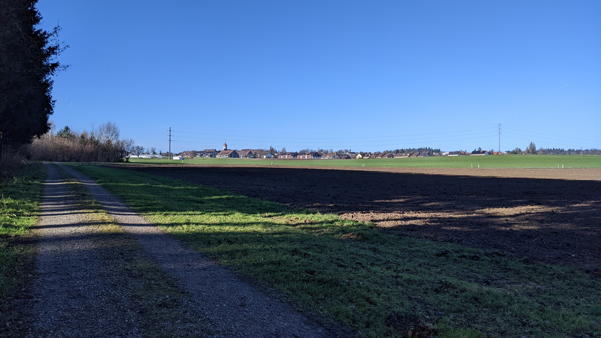
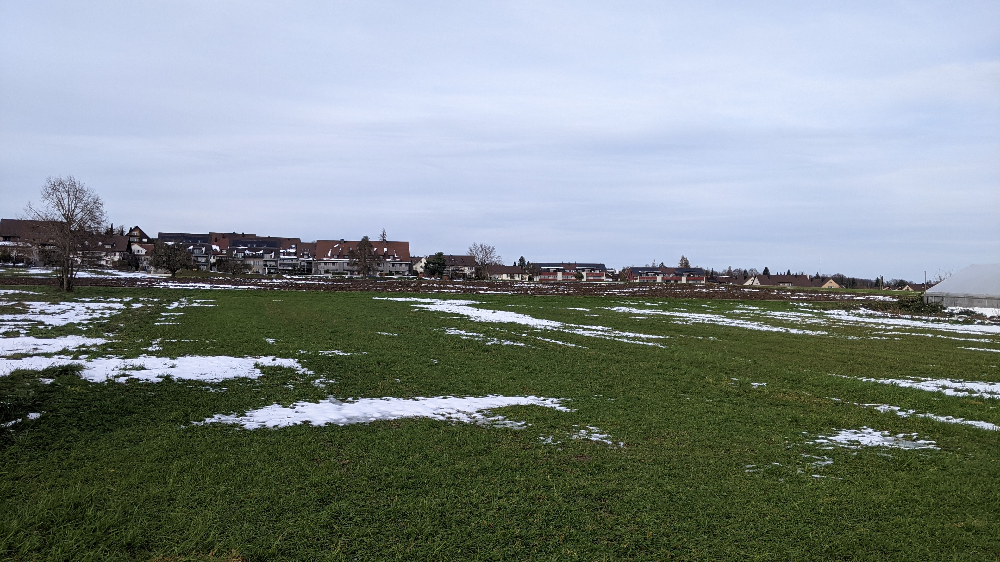
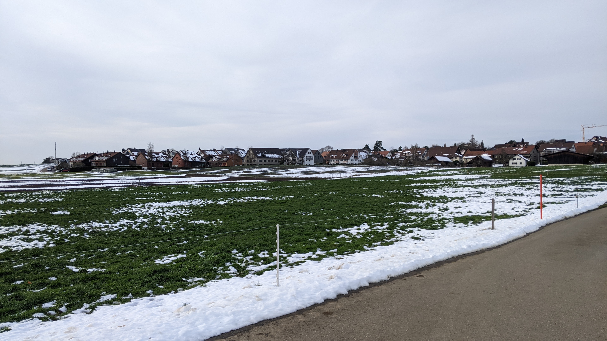
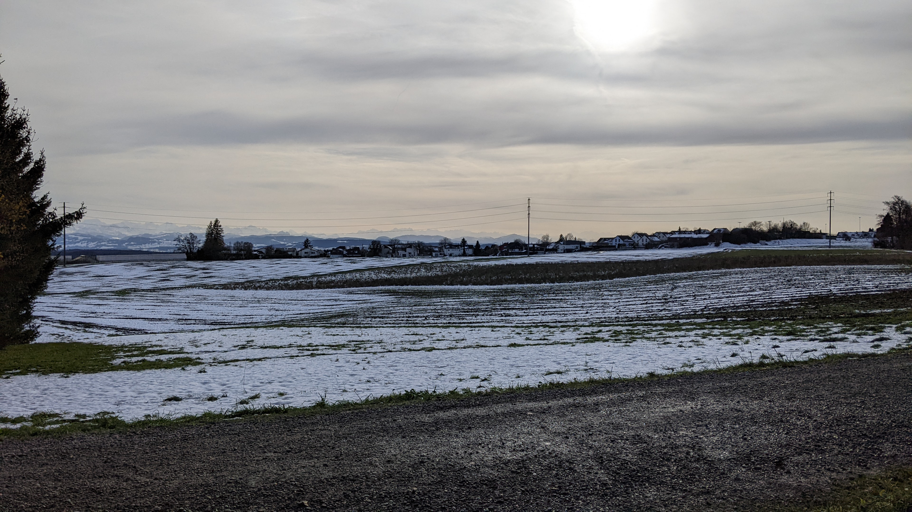
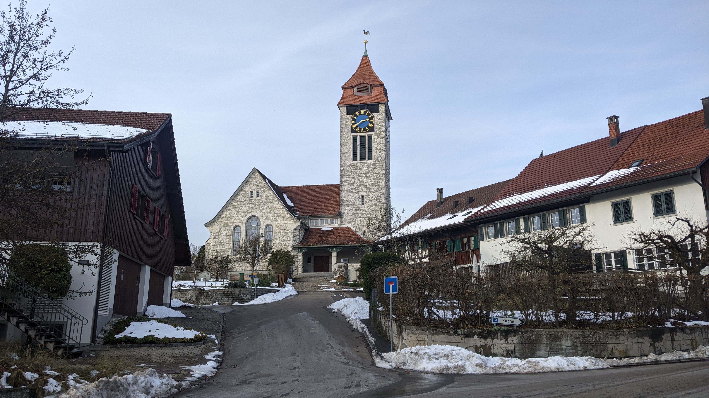
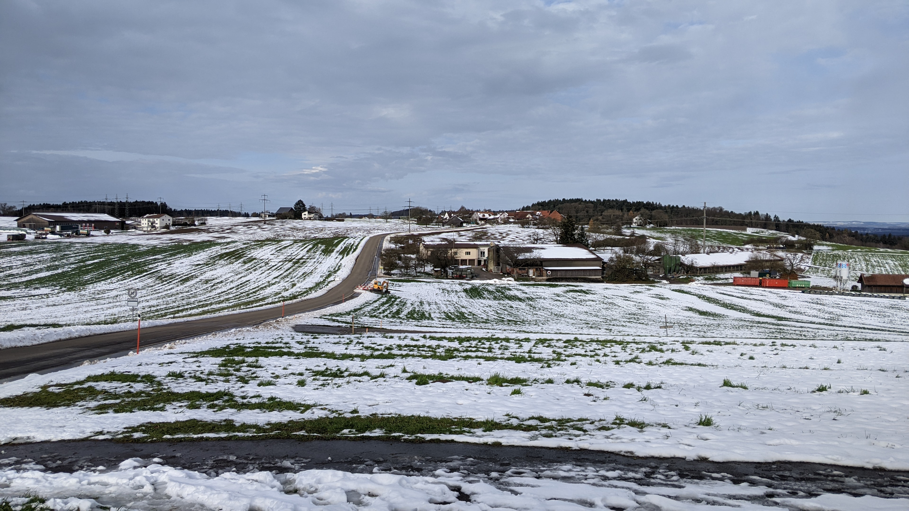
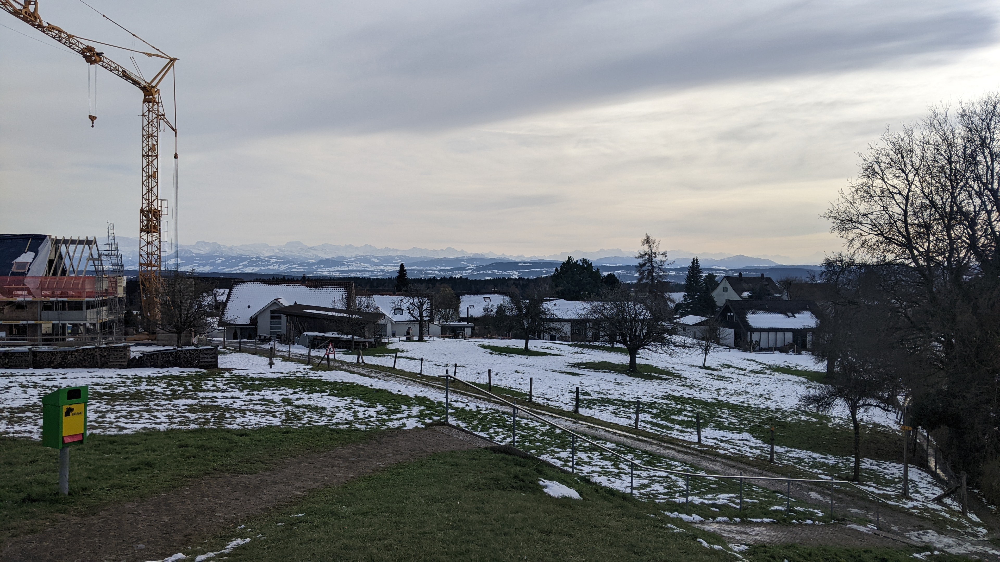
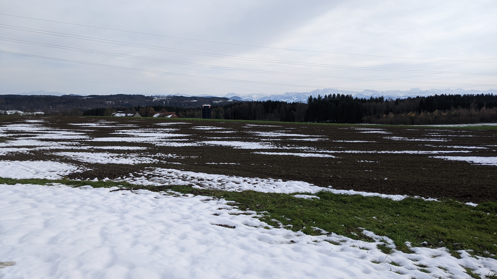
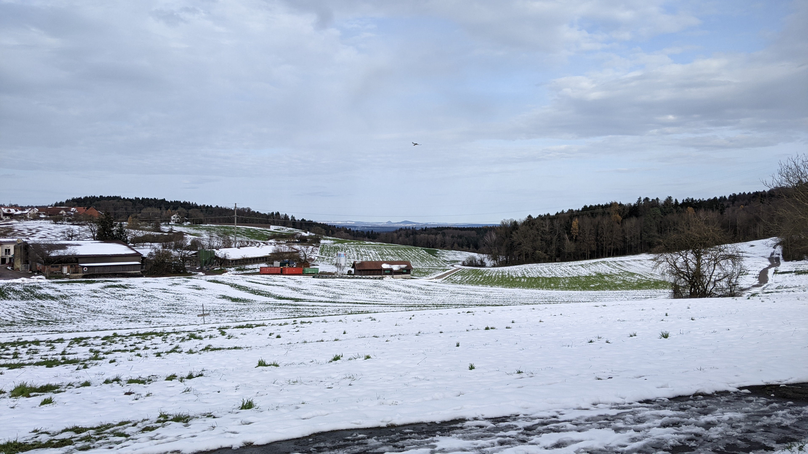

# Brütten

[Webseite der Gemeinde](https://www.bruetten.ch/)  
[Gemeindegebiet auf Openstreetmap.org](https://www.openstreetmap.org/relation/1682094)  
[Wikipedia Artikel der Gemeinde](https://de.wikipedia.org/wiki/Br%C3%BCtten)

Die Gemeinde Brütten besteht aus dem Dorf Brütten, den Wilern Strubikon und Eich, einigen weiteren Bauernhöfen und dem Umland. Die Gemeinde hat eine Fläche von <q cite="https://www.web.statistik.zh.ch/gpv2/?tab=indikatoren&jahr=0&indikatoren=&bfs=3">665 ha</q> oder 6.65 km² und eine Bevölkerung von <q cite="https://www.web.statistik.zh.ch/gpv2/?tab=indikatoren&jahr=0&indikatoren=&bfs=3">2'182 Personen per Ende 2023</q>. Das Ortszentrum von Brütten befindet sich auf <q cite="https://www.web.statistik.zh.ch/gpv2/?tab=indikatoren&jahr=0&indikatoren=&bfs=3">640 m.ü.M.</q>.

Die Gemeinde Brütten befindet sich am Westlichen Rand des Bezirks Winterthur. Im Norden und Osten grenzt Brütten an die Stadtgemeinde Winterthur, im Norden an den Stadtkreis Wülflingen und im Osten an den Stadtkreis Töss. Im Süd-Osten grenzt Brütten an die im Bezirk Pfäffikon gelegene Gemeinde Lindau, im Süd-Westen grenzt die Brütten an die im Bezirk Bülach gelegene Gemeinde Nürensdorf und im Nord-Westen grenzt Brütten an die ebenfalls im Bezirk Bülach gelegene Gemeinde Oberembrach. Die östliche und süd-östliche Gemeindegrenze liegen in einem starken Abhang. Die anderen Gemeindegrenzen von Brütten verlaufen keinen offensichtlichen geografischen Merkmalen entlang.  
Brütten zählt zur Agglomeration der Stadt Winterthur. Das Ortszentrum von Brütten liegt ca. 4.7 km Luftlinie süd-westlich des Bahnhofs Winterthur, ca. 14.7 km Luftlinie nord-östlich des Zürcher Hauptbahnhofs und ca. 8.9 km Luftlinie ost-nord-östlich des Flughafens Zürich in Kloten.  
Der Weiler Strubikon liegt ca. 960 m Luftlinie nord-westlich des Ortszentrums von Brütten und der Weiler Eich liegt ca. 1.65 km Luftlinie nord-westlich des Ortszentrums von Brütten. Der Weiler Eich liegt ausserdem ca. 730 m Luftlinie nord-nord-westlich des Weilers Strubikon.  
Der [höchste Punkt der Gemeinde Brütten](https://www.openstreetmap.org/node/4248798503) befindet sich auf dem Chomberg auf 644 m.ü.M., ca. 1.05 km Luftlinie nord-nord-östlich des Ortszentrums. Der [tiefste Punkt der Gemeinde Brütten](https://www.openstreetmap.org/#map=19/47.473413/8.696035) befindet sich auf 504 m.ü.M. auf der östlichen Gemeindegrenze ca. 1.5 km östlich des Ortszentrums.

## Transport

### Privatverkehr

Die meist befahrene Strasse auf dem Gemeindegebiet von Brütten ist die Zürcherstrasse. Diese verläuft ganzheitlich süd-östlich des eigentlichen Dorfs Brütten nahezu parallel zur süd-östlichen Gemeindegrenze. Diese Strasse führt Richtung Süd-Westen nach Nürensdorf und Bassersdorf und Richtung Nord-Osten zum Winterthurer Quartier Dättnau, nach Winterthur Töss und Winterthur im allgemeinen und zur Autobahn A1 und A4, welche hier die gleiche Autobahn sind.

Die Gernstrasse bzw. Unterdorfstrasse bzw. Steighofstrasse startet und endet in der Zürcherstrasse, führt aber tatsächlich durch das Dorf Brütten, wenn auch nur durch den eher südlichen Teil des Dorfes. Süd-Westlich des Dorfes heisst die Strasse "Gernstrasse", im Dorf heisst die Strasse "Unterdorfstrasse" und östlich des Dorfes heisst die Strasse "Steighofstrasse".  
Im Dorf Brütten zweigt die Tüfistrasse Richtung Süden von der Unterdorfstrasse ab, kreuzt dann die Zürcherstrasse und führt weiter aus dem Brüttener Gemeindegebiet raus nach Lindau Winterberg, Lindau und Effretikon und zur Autobahn A1 und A4, welche auch hier die gleiche Autobahn sind.  
Nahe dem westlichen Ende des Dorfes Brütten zweigt die Strubikonerstrasse Richtung Norden von der Unterdorf- bzw. Gernstrasse ab. Die Strubikonerstrasse führt dann durch die Weiler Strubikon und dann ausserhalb des Brüttener Gemeindegebiets weiter entweder nach Winterthur Wülflingen oder zum Winterthurer Quartier Dättnau oder nach Oberembrach oder nach Pfungen.  
Ganz am westlichen Ende des Dorfes Brütten zweigt die Oberwilerstrasse Richtung Westen von der Gernstrasse ab. Die Oberwilerstrasse führt durch die Bauernhöfe Blatzwiesen und Geretwinkel und nur knapp am Bauernhof Forbüel vorbei. Ausserhalb des Brüttener Gemeindegebiets führt die Oberwilerstrasse weiter nach Oberwil, Birchwil und Bassersdorf.  
Beim Weiler Eich, im nördlichen Teil des Brüttener Gemeindegebiets, zweigt die Mühlbergstrasse Richtung Westen von der Strubikonerstrasse ab. Die Mühlbergstrasse verlässt schon ein paar hundert meter weiter das Gemeindegebiet von Brütten und führt dann nach Oberembrach und Embrach.

Im Dorf Brütten gibt es noch einige weitere Strassen, die wichtigsten davon sind die folgenden. Die Dorfstrasse führt von der Kreuzung der Unterdorfstrasse und der Tüfistrasse nach Nord-Osten in den nördlichen Teil des Dorfes. Die Säntisstrasse zweigt am östlichen Dorfrand von der Unterdorf- bzw. Steighofstrasse Richtung Norden ab und führt am östlichen Dorfrand entlang bis sie im nördlichen Teil des Dorfes eine Kurve nach südwesten macht um dann am gleichen Ort wie die Dorfstrasse zu enden. Die Brüelgasse verbindet die Dorfstrasse mit der Unterdorfstrasse östlich der Dorfstrasse über eine kürzere Strecke als die Dorfstrasse selbst. Das Hintergässli bzw. die Chapfstrasse führt von den gemeinsamen enden der Dorf- und Säntisstrasse noch weiter nach Norden zur Schulanlage Chapf. Die Brühlstrasse verbindet die Säntisstrasse, nahe ihres westlichen Endes, mit der Unterdorfstrasse, über eine kürzere Strecke als die Säntisstrasse selber, und verläuft östlich der Brüelgasse.

### Öffentlicher Verkehr

Die Gemeinde Brütten befindet sich in der Tarifzone 122 des Zürcher Verkehrsverbunds.  
Auf dem Gemeindegebiet von Brütten gibt es 4 Bushaltestellen und keinen Bahnhof. Die Bushaltestelle "Zentrum" befindet sich an der Unterdorfstrasse nur ungefähr 140 m Luftlinie süd-süd-östlich de Dorfzentrums. Die Bushaltestelle "Harossen" befindet sich am östlichen Ende des Dorfs Brütten an der Unterdorfstrasse. Die Bushaltestelle "Hofacher" befindet sich ebenfalls an der Unterdorfstrasse, allerdings am süd-westlichen Dorfende von Brütten. Die nur zu Hauptverkehrszeiten bediente Bushaltestelle "Zelgli" befindet sich an der Tüfistrasse, ca. 230 m Luftlinie süd-westlich des Dorfzentrums von Brütten und nur ca. 45 m von der Abzweigung von der Unterdorfstrasse entfernt.  
Brütten wird von 2 Buslinien bedient. Die Buslinie 660 bedient die Haltestellen Zentrum, Harossen und Hofacher jeden Tag durchgehend in einem Halbstundentakt. Diese Linie verkehrt zwischen Winterthur und Bassersdorf via Brütten, Birchwil und Nürensdorf. Während der Hauptverkehrszeiten verkehren auf der Linie 660 noch zusätzliche Busse die nur zwischen Winterthur und Nürensdorf via Brütten verkehren. Die andere Buslinie die Brütten bedient ist die Buslinie 662. Diese verkehrt nur zu den Hauptverkehrszeiten und bedient die Haltestellen Zentrum, Harossen und Zelgli. Die Buslinie 662 verkehrt zwischen Brütten und Effretikon via Lindau.  
Die Buslinie 660 endet bzw. beginnt in Winterthur an der Haltestelle "Archstrasse/HB". Dort besteht Anschluss an alle Züge und Busse die am Bahnhof Winterthur halten. Dazu gehören 12 S-Bahnlinien, 2 IR und 4 IC Linien der SBB, einige Internationale Linien von bzw. nach Deutschland oder Österreich und 13 andere Buslinien. In Bassersdorf bietet die Linie 660 Anschluss an die S7 nach Kloten, Oerlikon, Hardbrücke, Zürich HB, Zürich Stadelhofen, Meilen, Rapperswil oder nach Effretikon und Winterthur und an die S24 nach Zürich Flughafen, Zürich Oerlikon, Zürich Wipkingen, Zürich HB, Zürich Wiedikon, Thalwil, Baar und Zug oder nach Effretikon, Winterthur und dann entweder nach Andelfingen, Schaffhausen und Thayngen oder nach Oberwinterthur, Frauenfeld und Weinfelden. Die Buslinie 662 beginnt bzw. endet in Effretikon. Neben der S7 und der S24 die auch in Bassersdorf halten, halten hier auch die S8 nach Winterthur oder nach Wallisellen, Oerlikon, Zürich HB, Zürich Wiedikon, Thalwil, Wädenswil und Pfäffikon SZ, die Pfäffikon ZH und Wetzikon oder Stettbach, Zürich Stadelhofen, Zürich HB, Zürich Hardbrücke und zu Hauptverkehrszeiten weiter nach Oerlikon und Bülach und die S19 nach Wallisellen, Oerlikon, Zürich HB, Zürich Altstetten, Dietikon und zu Hauptverkehrszeiten weiter nach Baden und Koblenz oder von Effretikon zu Hauptverkehrszeiten in die andere Richtung nach Pfäffikon ZH.

Im Zürcher Nachtnetz werden die Haltestellen Zentrum, Harossen und Hofacher 4-mal im Stundentakt pro Richtung von der Nachtbuslinie N66 bedient. Die Nachtbuslinie N66 verkehrt jeweils von "Winterthur, Archstrasse/HB" über Winterthur Töss, Brütten, Birchwil, Bassersdorf, Nürensdorf, Brütten und Winterthur Töss zurück nach "Winterthur, Archstrasse/HB". In Winterthur kann von 6 verschiedenen Nachtzügen auf den Nachtbus gewechselt werden. In Bassersdorf besteht nur indirekter Anschluss von einem Nachzug, da der Nachtbus nicht am Bahnhof hält.

Als Teil des Projekts [MehrSpur Zürich-Winterthur](https://company.sbb.ch/de/ueber-die-sbb/projekte/deutschschweiz/region-zuerich/bauprojekte-region-winterthur/zuerich-winterthur-bruettenertunnel.html) ist der Bau des Brüttenertunnels geplant. Dieses hat zwar den Namen von Brütten, wird allerdings nur einen sehr kleinen Teil des Gemeindegebiets von Brütten unterqueren. Auch Vorteile spezifisch für Brütten wird es kaum geben, da das Tunnel als Schnellfahrtunnel und deswegen auch ohne Bahnhöfe geplant ist.

### Fussverkehr

Die Zürcherstrasse hat von der Abzweigung der Gernstrasse bis zum Hof Ifang und dem Tüfiweg einen Gehweg parallel zur Strasse und einen Gehsteig um das Restaurant Stars and Stripes beim Steighof.  
Die Unterdorfstrasse hat von der Abzweigung der Säntisstrasse am östlichen Dorfende bis zur Abzweigung der Oberwilerstrasse am süd-westlichen Dorfende einen Gehsteig. Dieser wird allerdings von der Brühlstrasse, der Brüelgasse, der Dorfstrasse und der Strubikonerstrasse jeweils ohne Zebrastreifen unterbrochen.  
Die Dorfstrasse führt bei der Abzweigung von der Unterdorfstrasse die beiden Gehsteige der Unterdorfstrasse fort. Der eine davon wird nach einem Grundstück sehr schmal und endet dann bei der Abzweigung der Ankengasse. Der andere geht, mit einer unterbrechung durch die Brüelgasse weiter bis zur Säntisstrasse.  
Die Säntisstrasse übernimmt bei der Abzweigung von der Unterdorfstrasse den Gehsteig der Unterdorfstrasse und führt diesen weiter bis zum anderen Ende der Säntisstrasse. Der Gehsteig wird allerdings durch die Harossenstrasse, die Steinlerstrasse, die Haldlerstrasse, die Hagenstrasse und die Brühlstrasse ohne Zebrastreifen unterbrochen.  
Die Strubikonerstrasse übernimmt bei der Abzweigung von der Unterdorfstrasse die beiden Gehsteige der Unterdorfstrasse, der eine endet aber nach ein Paar metern bereits wieder. Der andere Gehsteig führt weiter, mit einem Unterbruch ohne Zebrastreifen durch die Sunnehaldenstrasse, bis in den Wiler Strubikon. Im Wiler Strubikon hat die Strubikonerstrasse dann noch einen kurzen Gehsteig auf der anderen Strassenseite.  
Die Tüfistrasse hat von der Abzweigung von der Unterdorfstrasse bis zur Abzweigung der Zelglistrasse einen Gehsteig auf der einen Strassenseite und dann von der Abzweigung der Zelglistrasse bis zur Abzweigung des Chätzlerwegs am südlichen Dorfende einen Gehweg parallel zur Strasse auf der anderen Strassenseite.  
Die Oberwilerstrasse führt den Gehsteig der Unterdorfstrasse weiter bis er am irgendwann zu einem Kiesweg wird und dann am Ende des Blätzwisenhofs ganz endet. Die Brühlstrasse hat auf der gesamten Länge zwei Gehsteige, jeweils ohne Zebrastreifen unterbrochen durch den Alpenblick, die Harossenstrasse und die Hagenstrasse. Die Brüelgasse hat auf der gesamten Länge einen Gehsteig und von der Abzweigung von der Unterdorfstrasse bis zur Volg Filiale noch einen zweiten Gehsteig auf der anderen Strassenseite.

Auch die Harossenstrasse, die Hagenstrasse, die Steinlerstrasse, die Haldlerstrasse und einige weitere Strassen haben noch einen Gehsteig.

Ausserhalb des Dorfes Brütten hat die Gemeinde Brütten auch noch einige Feld- und Waldwege, die alle relativ gut gepflegt sind.

### Fahrradverkehr

Der einzige Fahrradstreifen auf dem Gemeindegebiet von Brütten führt von der Gemeindegrenze mit Winterthur Töss auf der Zürichstrasse bis zur Abzweigung der Steighofstrasse. Dann führt der Fahrradstreifen auf der Steighofstrasse weiter bis zum östlichen Dorfrand von Brütten und dann weiter auf der dort Abzweigenden Säntisstrasse bis zum Sigilochweg.

Ansonsten wird erwartet dass Fahrräder entweder die Strasse oder den Gehsteig bzw. Gehweg mit benutzen. Abgesehen von der zürcherstrasse sind aber die meisten Strassen keine all zu grosse Gefahr, da die Geschwindigkeiten und das Verkehrsaufkommen tief genug sind.  
Ausserhalb des Dorfes Brütten können ausserdem auch die meisten Feld- und Waldwege mit dem Fahrrad genutzt werden. Viele dieser Feld- und Waldwege sind auch breit genug dass das Kreuzen und Überholen problemlos möglich ist.

## Einkaufsmöglichkeiten

Im Dorf Brütten gibt es nur eine Volg Filiale und die [Bäckerei Bosshart](https://www.baeckerei-bosshart.ch/) und ausserhalb des Dorfes, an der Zürcherstrasse, gibt es einen Migrol Tankstellenshop. Ausserdem gibt es ausserhalb des Dorfes Brütten noch den Hofladen [GmüesTäsche](https://www.gmueestaesche.ch/index.php).

Ca. 2.6 km Luftlinie vom Dorfzentrum Brütten entfernt, in Winterthur Töss, befindet sich eine Lidl Filiale, ca. 3.95 km Luftlinie vom Dorfzentrum Brütten entfernt, in Nürensdorf, befindet sich eine Migros Filiale, ca. 3.75 km Luftlinie vom Dorfzentrum Brütten entfernt, in Birchwil, befindet sich eine Landi Filiale und ca. 4.8 km Luftlinie vom Dorfzentrum Brütten entfernt, in Bassersdorf, befindet sich sowohl eine Coop als auch eine grössere Migros Filiale. Ausserdem befindet sich ca. 3.7 km Luftlinie vom Dorfzentrum Brütten entfernt, in Winterthur, das Einkaufszentrum [Lokwerk](https://lokwerk.ch/) mit unter anderem einer Coop Filiale, ca. 4.4 km Luftlinie vom Dorfzentrum Brütten entfernt, in Winterthur, das Einkaufszentrum [Neuwiesen](https://neuwiesen.ch/) mit unter anderem einer Migros Filiale und ca. 4.6 km Luftlinie vom Dorfzentrum Brütten entfernt, ebenfalls in Winterthur, das Einkaufszentrum [Archhöfe](https://archhoefe.ch/) mit unter anderem einer Aldi Filiale. Zusätzlich ist auch noch der Hauptbahnhof Winterthur mit all seinen Läden nur ca. 4.6 km Luftlinie vom Dorfzentrum Brütten entfernt.

### Restaurants

Vermutlich das grösste Restaurant in Brütten ist das [Stars and Stripes](https://www.starsandstripes.ch/de/p/standorte/brutten-1078.html) Restaurant, zu dem auch das Motel Steighof gehört. Dieses Restaurant liegt etwas ausserhalb des Dorfes Brütten an der Verzweigung der Zürcherstrasse und der Steighofstrasse.

Weitere Restaurants in Brütten sind die Pizzeria [d'Antonio](https://antonio-bruetten.my-webseite.ch/) im süd-westlichen Dorfteil und das Café Blätzwisen beim Blätzwisenhof ein paar Meter nord-westlich des westlichen Dorfrands von Brütten.

## Schule

Brütten hat eine eigene Primarschule mit Kindergarten aber keine eigene Sekundarschule. Die Sekundarschulkinder von Brütten besuchen die Sekundarschule in Nürensdorf, zusammen mit den Kindern von Nürensdorf.

### Primarschule

Die Primarschule der Gemeinde Brütten befindet sich ganz im Norden des Dorfes Brütten, ca. 290 m Luftlinie vom Dorfzentrum entfernt. Das dortige Schulareal Chapf umfasst 2 Schulhäuser, 1 Einzelturnhalle, einen beleuchteten Hartplatz mit 2 Handballtoren und 4 Basketballkörben, eine beleuchtete Wiese mit 2 Fussballtoren, eine 100m Sprintanlage mit 2 Bahnen und einer Weitsprunganlage am einen Ende und einen weiteren Pausenhof. Ausserdem befindet sich bei der Schulanlage noch der Tennisclub von Brütten, der eine Squashwand und 3 beleuchtete Tennisplätze hat und bei der Schule befindet sich auch noch eine kleine Skatinganlage. An der Primarschule Brütten werden 6 Klassen über 6 Schuljahre verteilt unterrichtet, jede Schulklasse hat Schulkinder in 2 verschiedenen Schuljahren.

### Kindergarten und Spielgruppe

Ebenfalls auf dem Schulareal Chapf befindet sich der Kindergarten der Gemeinde Brütten. In diesem Kindergarten werden 3 Klassen unterrichtet.

### Sekundarschule

Für die Sekundarstufe besuchen die Brüttener Schulkinder die Schule Hatzenbühl, auch "Hatzi" genannt, in Nürensdorf. Diese befindet sich ca. 3.2 km  Luftlinie süd-westlich vom Dorfzentrum Brütten. Dort werden 150 - 180 Kinder in 9 Klassen verteilt über 3 Schuljahre und in 2 Niveaus unterrichtet. Die Schulklassen bestehen jeweils aus 1 Schuljahr und 2 Niveaus.

### Kantonsschule

Die nächste Kantonsschule von Brütten ist die Kantonsschule Büelrain in Winterthur, ca. 4.8 km Luftlinie entfernt. Diese ist mit der Buslinie 660 und dann einem ca. 650 m langen Fussweg erreichbar.  
Weitere Kantonsschulen in der Umgebung von Brütten sind die Kantonsschulen im Lee und Rychenberg in Winterthur, ca. 5.8 km Luftlinie vom Dorfzentrum Brütten entfernt, die Kantonsschule Zürcher Unterland in Bülach, ca. 10.8 km Luftlinie vom Dorfzentrum Brütten entfernt und die Kantonsschule Zürich Nord in Oerlikon, ca. 12.8 km Luftlinie vom Dorfzentrum Brütten entfernt.

## Gemeindename

<q cite="https://www.bruetten.ch/geschichte/4474">Brütten wurde im Jahr 876 als "Pritta" zum ersten Mal urkundlich erwähnt.</q> Aus "Pritta" wurde dann über die Jahre "Brütten". 

## Gemeindewappen

Die Beschreibung des Wappens von Brütten lautet wie folgt: <q cite="https://www.e-periodica.ch/digbib/view?pid=mag-001:1977:49::7#49">In Blau eine silberne Sichel mit goldenem Griff.</q> "Gold" wird dabei als "Gelb" dargestellt und "Silber" als "Weiss". Die Sichel ist nach links geöffnet.

### Gemeinde Logo

Das Gemeindelogo zeigt das Wappen der Gemeinde und kreisförmig darum herum den Text "Gemeinde Brütten". Der Text "Gemeinde" ist oberhalb des Wappens von links nach rechts geschrieben und der Text "Brütten" ist unterhalb des Wappens ebenfalls von links nach rechts geschrieben. Der gesamte Text ist nur in Grossbuchstaben, mit schwarzer Schriftart ohne Serifen geschrieben.

## Landschaft

Die Gemeinde Brütten liegt auf etwas ähnlichem wie einer Hochebene oberhalb des Dättnauerbergs. In Richtung Winterthur und Töss geht es über 100m hinunter. Das Dorf Brütten liegt ausserdem nochmals an einem Hang, dessen höchster Punkt der Chomberg ist. Der Chomberg ist auch Teil des Dättnauerbergs. Der Dättnauerberg bildet die östliche und die süd-östliche Gemeindegrenze.

Brütten hat einige kleine Bäche im Wald im Osten und Süden des Gemeindegebiets. Alle diese Bäche fliessen ausserhalb von Brütten zusammen und dann in die Töss, welche dann wiederum in den Rhein fliesst. Ausserdem hat Brütten noch 2 kleine Weiher. Den Entenweiher westlich des Dorfes und den Neubruch Teich nördlich des Dorfes Brütten und nord-östlich des Weilers Strubikon.

## Weiteres

In Brütten befindet sich der [geodätische Mittelpunkt des Kantons Zürich](https://www.openstreetmap.org/node/7294715853). Am gleichen Ort befindet sich auch ein Aussichtspunkt mit Sitzbänken und sogar einer hängenden Schaukelbank.

Am Sigilochweg wurde <q cite="https://zueriost.ch/wirtschaft/2024-11-13/dieses-windrad-dreht-quer-in-der-landschaft">Ende 2024 für 2 Jahre ein neues Windrad getestet</q>.

Am Waldrand, entlang des Aspenrietwegs nördlich des Dorfes Brütten, gibt es ziemlich viele Sitzbänke. Alle Sitzbänke haben eine Farblose version des Gemeindewappens auf der Rückenlehne.

## Persönliches Fazit

*Dieser Abschnitt enthält Persönliche Meinungen und gefährliches Halbwissen. Alle Aussagen in diesem Abschnitt sollten mit Vorsicht genossen werden, da es gut Möglich ist dass er Fehler enthält.*

Die Gemeinde Brütten ist eine Gemeinde die dadurch auffällt, dass sie in nichts wirklich besonders gut oder besonders schlecht ist. Brütten ist nicht allzuweit von der Stadt Winterthur entfernt aber trotzdem durch den Dättnauerberg ein wenig von ihr getrennt. Brütten ist nicht allzuweit vom Flughafen Zürich entfernt aber trotzdem weit genug, dass der Fluglärm nicht mehr ganz so schlimm ist. Brütten ist sowohl per Strasse als auch per ÖV ganz okay erschlossen, ist aber selber kein Knotenpunkt. Brütten hat keine riesigen Erhebungen in der Landschaft und kein besonderes Ausflugsziel, aber trotzdem gibt es recht schöne Aussichten in die Alpen.

## Fotos

  
Das Dorf Brütten, fotografiert von Süd-Osten [hier](https://www.openstreetmap.org/search?whereami=1&amp;query=47.467573%2C8.685390#map=19/47.467573/8.685390) am 2024-12-01.

  
Der süd-östliche Teil des Dorfes Brütten, fotografiert von Süden [hier](https://www.openstreetmap.org/search?whereami=1&amp;query=47.469134%2C8.677850#map=19/47.469134/8.677850) am 2024-11-24.

  
Der süd-westliche Teil des Dorfes Brütten, fotografiert von Süd-Osten [hier](https://www.openstreetmap.org/search?whereami=1&amp;query=47.469116%2C8.677614#map=19/47.469116/8.677614) am 2024-11-24.

  
Der nord-östliche Teil des Dorfes Brütten, fotografiert von Norden [hier](https://www.openstreetmap.org/search?whereami=1&amp;query=47.479431%2C8.681798#map=19/47.479431/8.681798) am 2024-11-24.

  
Die Kirche von Brütten, fotografiert von [hier](https://www.openstreetmap.org/search?whereami=1&amp;query=47.473476%2C8.674715#map=19/47.473476/8.674715) am 2024-11-24.

  
Der Wiler Strubikon und der Bauernhof Eichhölzli, fotografiert vom Dorfrand nord-westlichen Dorfrand von Brütten [hier](https://www.openstreetmap.org/search?whereami=1&amp;query=47.472861%2C8.668237#map=19/47.472861/8.668237) am 2024-11-24.

  
Die Aussicht Richtung Süden, fotografiert vom Aussichtspunkt oberhalb von Brütten [hier](https://www.openstreetmap.org/search?whereami=1&amp;query=47.474662%2C8.672872#map=19/47.474662/8.672872) am 2024-11-24.

  
Die Aussicht Richtung Süden, fotografiert von der Bushaltestelle Harossen [hier](https://www.openstreetmap.org/search?whereami=1&amp;query=47.471511%2C8.681699#map=19/47.471511/8.681699) am 2024-11-24.

  
Die Aussicht Richtung Norden, fotografiert vom nord-westlichen Dorfrand von Brütten [hier](https://www.openstreetmap.org/search?whereami=1&amp;query=47.472861%2C8.668237#map=19/47.472861/8.668237) am 2024-11-24.

  
Der Teich Neubruch nord-östlich von Strubikon, fotografiert von [hier](https://www.openstreetmap.org/search?whereami=1&amp;query=47.480526%2C8.669838#map=19/47.480526/8.669838) am 2024-11-24.

  
Die Feuerstelle beim Vogt-Brunnen, fotografiert von [hier](https://www.openstreetmap.org/search?whereami=1&amp;query=47.482798%2C8.678081#map=19/47.482798/8.678081) am 2024-11-24.
