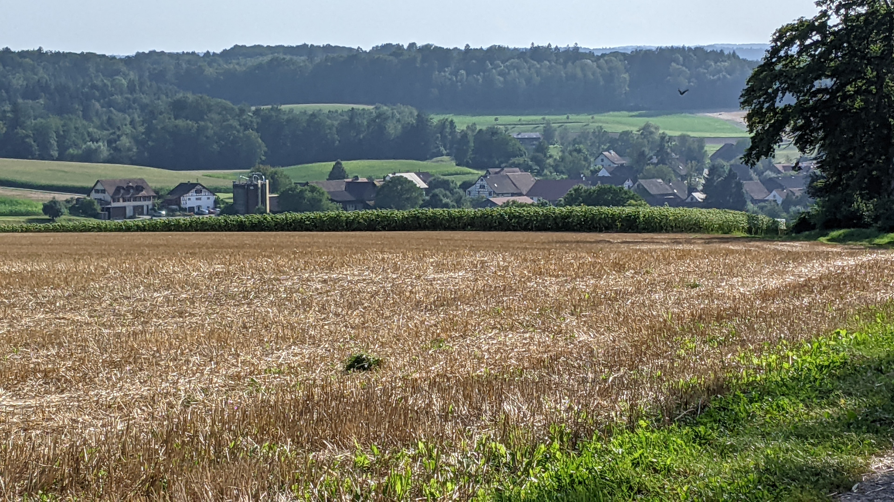

# Adlikon (bei Andelfingen)

*Update from the 28.11.2021: The municipality of Adlikon has decided in a popular vote that they want to become part of the municipality of Andelfingen. The voting documents for this can be found [here](https://www.adlikon.ch/_docn/3362330/Beiblatt_Fusionsabstimmung.pdf) (As long as the municipality of Adlikon hasn't deleted them yet).*

[Website of the municipality](https://www.adlikon.ch/)  
[Municipal territory on Openstreetmap.org](https://www.openstreetmap.org/relation/1682076)

The municipality of Adlikon is a <q cite="https://www.adlikon.ch/portrait_uebersicht">small rural community with approximately 700 citizens that consists of the 3 villages Adlikon, Dätwil and Niederwil.</q> Adlikon is located 9.5 kilometers north of Winterthur.  
Adlikon and Niederwil are 2.3 km apart, Adlikon and Dätwil are 2.4 km apart and Niederwil and Dätwil are 2.5 km apart.

## Transportation

On business days the bus line 612 stops once per hour in Adlikon and Niederwil. From the village Adlikon to the train station Andelfingen it is 1.9 km, where 3 trains per hour operate to Winterthur. From the village Dätwil to the train station Ossingen it is 3.1 km and from the village Niederwil to the train station Thalheim-Altikon it is 3.6 km. From both station the S29 operates with a semi-hour frequency.  
The autobahn exit 11 of the autobahn A4 is located just 600 m away from the village Adlikon.

## Experiential report as a pedestrian

*This segment contains personal opinions and dangerous superficial knowledge. All statements in this segment should be taken with a pinch of salt because it is very much possible that it contains errors. My source for this segment are just 2 visits on the municipal territory that I made as a pedestrian.*

It seems like there are only very few sidewalks and bike lanes on the municipal territory. The only place where I saw a sidewalk next to the street was on the short segment of th Thurtalstrasse, that is located on the municipal territory.  
On the other hand there are a lot of field and/or forest paths that are used by very few or cars at all and are primarily or only used by pedestrians and cyclists. These field and forest paths seem to be in a good condition.

The bicycle seems to be quite popula in the region.

## Photos

  
The Thurbridge Ossingen, photographed from [here](https://www.openstreetmap.org/search?whereami=1&amp;query=47.60345%2C8.72081#map=19/47.60345/8.72081) on the 14.08.2021

  
The village Dätwil, photographed from [here](https://www.openstreetmap.org/search?whereami=1&amp;query=47.60103%2C8.71749#map=17/47.60102/8.71749) on the 14.08.2021

  
The village Niederwil, photographed from [here](https://www.openstreetmap.org/search?whereami=1&amp;query=47.58392%2C8.72056#map=19/47.58392/8.72056) on the 25.09.2021

  
The village Adlikon, photographed from [here](https://www.openstreetmap.org/search?whereami=1&amp;query=47.58138%2C8.70125#map=19/47.58138/8.70125) on the 25.09.2021

  
The community hall of Adlikon, photographed on the 25.09.2021 *(The license plates have been made unreadable for data protection reasons)*

  
The village Adlikon, photographed from [here](https://www.openstreetmap.org/search?whereami=1&amp;query=47.58290%2C8.68542#map=18/47.58290/8.68542&amp;layers=N) on the 25.09.2021
