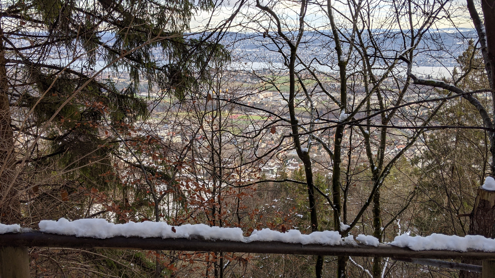
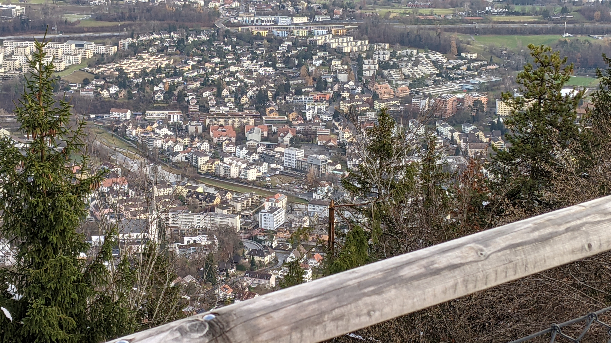
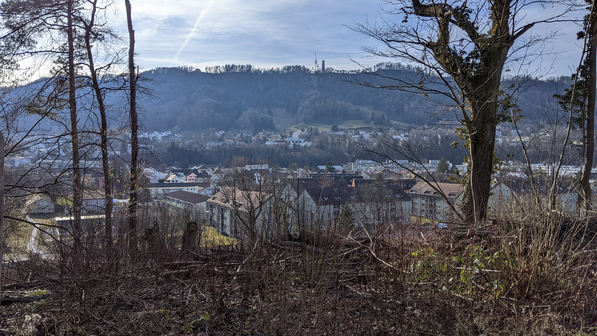

# Adliswil

[Website of the municipality](https://www.adliswil.ch)  
[Municipal territory on Openstreetmap.org](https://www.openstreetmap.org/relation/1682077)

The municipality of Adliswil is a city with around 19'000 citizens. Adliswil is located directly to the south of Zurich, 8 km away from Zurich main station.

## Transportation

On the municipal territory of Adliswil there are the train stations Sood-Oberleimbach, Adliswil and Sihlau. All 3 stations are served in a 20 minute frequency by the S4. At the train station Adliswil there are connections to 6 different bus lines. Also the valley station of the aerial cable car Adliswil-Felsenegg is located 400m away from the train station Adliswil.

## Experiential report as a pedestrian

*This segment contains personal opinions and dangerous superficial knowledge. All statements in this segment should be taken with a pinch of salt because it is very much possible that it contains errors. My source for this segment are just 2 visits on the municipal territory that I made as a pedestrian.*

There are quite a lot of sidewalks but not a lot of explicit cycle lanes. However the sidewalks are often intended to be used by both pedestrians and cyclists. There are some smaller streets without a sidewalk, but it is usually not a problem to walk or cycle on those streets.

## Photos

  
View from the Felsenegg path, photographed on the 01.12.2021

  
The municipality Adliswil from the Restaurant Felsenegg, photographed from [here](https://www.openstreetmap.org/search?whereami=1&amp;query=47.30891%2C8.50965#map=19/47.30891/8.50965) on the 01.12.2021

  
View from the mountain station of the LAF, photographed from [here](https://www.openstreetmap.org/search?whereami=1&amp;query=47.31015%2C8.50754#map=19/47.31015/8.50754) on the 01.12.2021

  
The municipality Adliswil, photographed from [here](https://www.openstreetmap.org/search?whereami=1&amp;query=47.31873%2C8.53685#map=19/47.31873/8.53685) on the 01.12.2021

  
The municipality Adliswil, photographed from [here](https://www.openstreetmap.org/search?whereami=1&amp;query=47.30889%2C8.52721#map=19/47.30889/8.52721) facing west on the 12.02.2022

  
The municipality Adliswil, photographed from [here](https://www.openstreetmap.org/search?whereami=1&amp;query=47.30889%2C8.52721#map=19/47.30889/8.52721) facing north on the 12.02.2022

  
The district Sood of the municipality Adliswil, photographed from [here](https://www.openstreetmap.org/search?whereami=1&amp;query=47.31731%2C8.53029#map=19/47.31731/8.53029) facing west on the 12.02.2022
