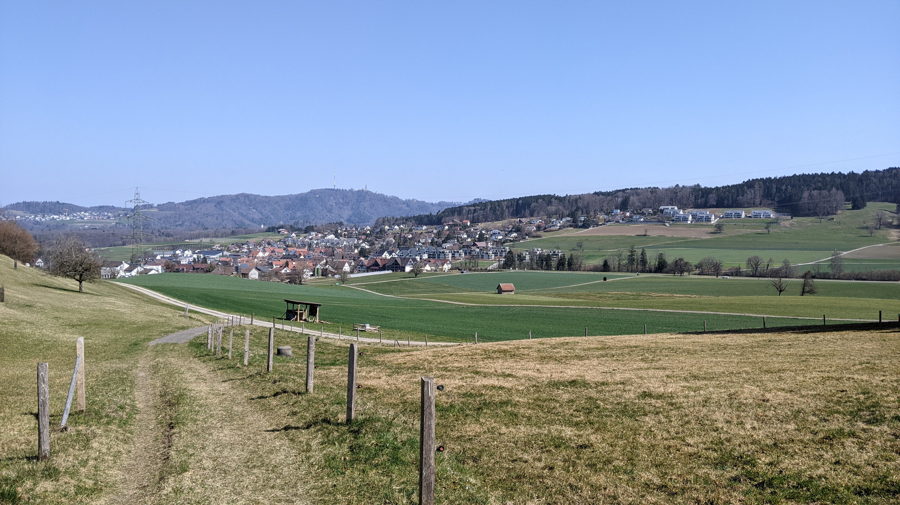
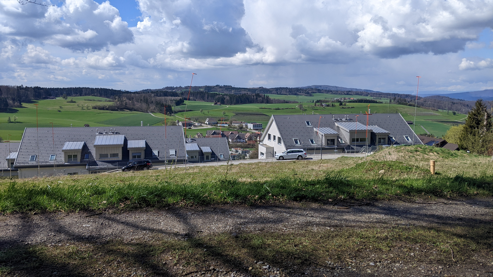
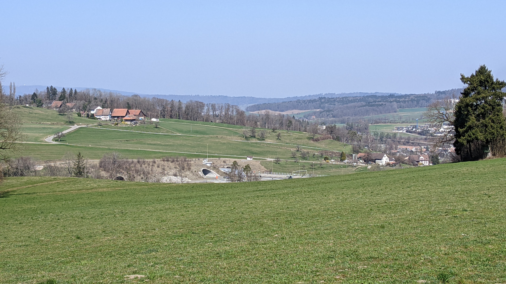

# Aesch ZH

[Website of the municipality](https://www.aesch-zh.ch)  
[Municipal territory on Openstreetmap.org](https://www.openstreetmap.org/relation/1682078)

The municipality Aesch ZH (in the past it has been called Aesch bei Birmensdorf) is a municipality with approximately 1'700 citizens. Aesch ZH is located directly to the south of Birmensdorf and it is 8.7 km as the crow flies south-west of Zurich mainstation.

## Transportation

### Private transport

Die Street K 406 (in Aesch ZH it is called "Dorfstrasse") connects Aesch with Arni (canton Aargau) and Oberlunkhofen (canton Aargau) in one direction and with Birmensdorf in the other direction. The Autobahn A3/A4 can be reached through Birmensdorf without having to drive through the center of Birmensdorf.  
The Aescher tunnel of the Autobahn A3/A4 is located below the municipality Aesch ZH.

### Public transport

There are 2 bus stops on the municipal territory of Aesch that are served by the same 2 bus lines. The bus lines 215 and 245 both stop in seperate half-hourly intervals (on sundays in hourly intervals) at the stations "Heiligenmattstrasse" and "Gemeindehaus". The 2 bus lines don't quite combine to 15 minute intervals, probably because the connections in Birmensdorf also don't quite have 15 minute intervals.  
The bus lines connect in Birmensdorf onto Zurichs S5 to Zug, Zurichs S14 to Affoltern am Albis, Zurichs S5 to Pfäffikon SZ via Zurich Altstetten, Zurich Hardbrücke, Zurich mainstation, Zurich Stadelhofen and Uster, and Zurichs S14 to Hinwil via Zurich Altstetten, Zurich mainstation, Zurich Oerlikon and Uster. In Muri Aargau the bus line 245 connects onto Aargaus S25 to Brugg AG, Aargaus S26 to Rotkreuz, Aargaus S26 to Olten via Lenzburg and Aarau, and partially also with Aargaus S42 to Zurich mainstation via Dietikon and Zurich Altstetten, the RE to Lenzburg, Aarau and Olten, and the RE to Rotkreuz. In addition the Bus 215 goes to Affoltern am Albis and both bus lines could be used to connect onto Zurichs S10 in Uitikon or Zurichs S24, S8 and S2 in Zurich Wiedikon. However I think these connections are less important.

Aesch is part of the ZVV in the fare zone 154.

In Zurichs night network both bus stops in Aesch ZH are served by the bus N22 4 times in an hourly interval. Getting on is not permitted. In Birmensdorf one can change from the SN5 onto the N22.

## Shopping facilities

Aesch doesn't have very many shopping facilities and it also doesn't need them because it is a relatively small municipality and the shopping facilities in Birmensdorf are less than 2km away. However there is still a Volg store, a few small restaurants and a Selecta vending machine at the bus stop "Gemeindehaus".

## Municipal crest

The municipal crest is really simple (three red arrows pointing down, on a white background) and can be seen surprisingly often on the municipal territory.

## Experiential report as a pedestrian

*This segment contains personal opinions and dangerous superficial knowledge. All statements in this segment should be taken with a pinch of salt because it is very much possible that it contains errors. My source for this segment are just 2 visits on the municipal territory that I made as a pedestrian.*

The amount of sidewalks on the municipal territory is quite okay. The Dorfstrasse has a sidewalk all the way, the Lielistrasse has a sidewalk between the Dorfstrasse and the primary school building, and the Haldenstrasse has a sidewalk almost all the way. However I didn't see any explicit cycle paths or cycle strips.  
Aside from the Dorfstrasse, most streets are not very heavily trafficked and can therefore also be used by pedestrians and cyclists without any issues.

On the entire municipal territory there quite a lot of field and forest paths that are in a good condition. There are also quite a lot of benches and completely in the east of the municipality there even is a [fireplace](https://www.openstreetmap.org/node/4693679993).

During my visit I saw surprisingly many (especially in relation to the size of the municipality) other pedestrians and cyclists were not rare either.

## Photos

  
The municipality Aesch ZH, photographed from [here](https://www.openstreetmap.org/search?whereami=1&amp;query=47.33778%2C8.42983#map=19/47.33778/8.42983) on the 20.03.2022.

  
The municipality Aesch ZH, photographed from [here](https://www.openstreetmap.org/search?whereami=1&amp;query=47.33316%2C8.42717#map=19/47.33316/8.42717) on the 20.03.2022. *(Two people have been made unrecognizable with black rectangles for data protection reasons.)*

  
The municipality Aesch ZH, photographed from [here](https://www.openstreetmap.org/search?whereami=1&amp;query=47.33430%2C8.44500#map=18/47.33430/8.44500) on the 09.04.2022.

  
The municipality Aesch ZH, photographed from [here](https://www.openstreetmap.org/search?whereami=1&amp;query=47.33213%2C8.44339#map=19/47.33213/8.44339) on the 09.04.2022.

  
The autobahn exit Birmensdorf, photographed from [here](https://www.openstreetmap.org/search?whereami=1&amp;query=47.34216%2C8.42544#map=19/47.34216/8.42544) on the 20.03.2022.
