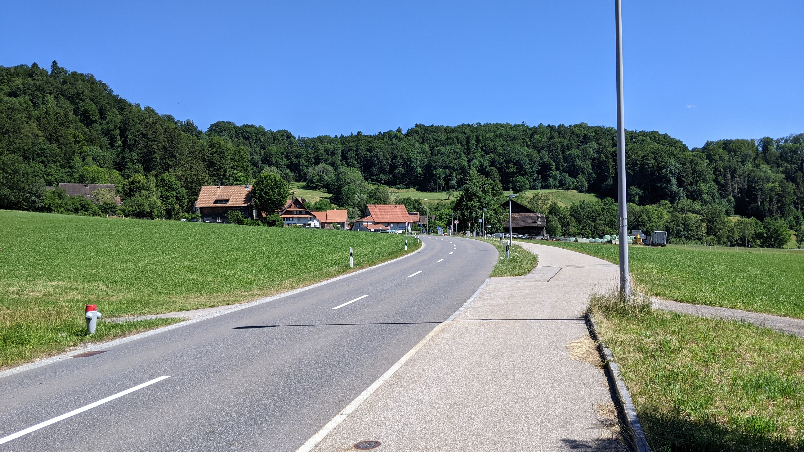

# Aeugst am Albis

[Website of the municipality](https://www.aeugst-albis.ch/)  
[Municipal territory on Openstreetmap.org](https://www.openstreetmap.org/relation/1682079)

The municipality Aeugst am Albis is a municipality with approximately <q cite="https://www.aeugst-albis.ch/gemeinde/zahlen-fakten.html/21">2'000 citizens</q>. <q cite="https://www.aeugst-albis.ch/gemeinde/unser-dorf.html/19">Topographically the municipality is made up of two different parts. For one out of the Aeugstertal with headwater of the Reppisch located hamlet and the Türlersee and for the other the Aeugsterberg with the at it's south-western slope laying village Aeugst.</q> Aeugst is located about 13 km as the crow flies south-west of the city Zurich and about 3 km as the crow flies east-south-east of Affoltern am Albis.  
The village Aeugst and the hamlet Müliberg are nearly 2 km on foot apart, the village Aeugst and the Türlersee are approximately 1.8 km on foot apart and Müliberg and the Aeugstertal are 750 m on foot apart.

## Transportation

### Private transport

The Affolternstrasse (in the village it is called "Dorfstrasse") connects the village Aeugst in one direction with Affoltern am Albis and in the other direction with the street 383. The street 383 in turn connects Adliswil and Langnau in the Sihltal with Mettmenstetten over the Albis. In the Aeugstertal the Reppischtalstrasse connects Waldegg and Stallikon with the street 383.  
The closest Autobahns are the A4 in Affoltern am Albis and the A3 in Thalwil.

### Public transport

On the municipal territory of the municipality there are 6 bus stops that are served by 3 bus lines in total. The line 236 stops hourly at the stops "Kloster" and "Landhus", which are located in the Aeugstertal. It connects Hausen am Albis to the train station Wiedikon. The line 235 also stops hourly (saturdays only in the afternoon and sundays not at all) at the stops "Aeugstertal, Kloster", "Aeugst am Albis, Müliberg", "Aeugst am Albis, Höchweg", "Aeugst am Albis, Dorf" and "Aeugst am Albis, Grossacher". It connects Aeugst to the trainstation Wiedikon, but on saturday mornings and sundays it only connects Aeugst with the Aeugstertal. The line 225 stops half-hourly at the stops "Aeugst am Albis, Grossacher", "Aeugst am Albis, Dorf", "Aeugst am Albis, Höchweg" and "Aeugst am Albis, Müliberg". It connects Aeugst with the train station Affoltern am Albis.  
The bus line 225 connects in Affoltern am Albis on to the S5 to Zug, the S14 to Zurich, Oerlikon, Uster and Hinwil, and less directly to the S5 to Zurich, Uster, Rapperswil and Pfäffikon SZ. The bus line 235 and 236 connect in Zurich Wiedikon on to the network of the VBZ as well as the S-Bahn trains S8 with terminal stops in Winterthur and Pfäffikon SZ, S2 with terminal stops in Unterterzen SG and Zurich Airport, and S24 with terminal stops in Zug and Thayngen sH. The busses 235 and 236 could also be used to connect on to the S10 in Uitikon.

Aeugst is part of the ZVV in the fare zone 151.

In Zurichs night network the stops "Aeugst a. A., Müliberg", "Aeugst a. A., Höchweg", "Aeugst a. A., Dorf" and "Aeugst a. A., Grossacher" are served by the bus N24 4 times in an hourly interval. Getting on is not allowed at all stops. In Affoltern am Albis the SN5 connects on to the N24.

## Shopping facilities

Aeugst doesn't have many shopping facilities. There is a Volg store, a small ["Dorfstrasslädeli"](https://www.dorfstrasslaedeli.ch), a [Landladen](http://www.der-landladen.ch) and a few small restaurants.  
The next bigger shopping facility is located in the 3 km distant Affoltern am Albis.

## Municipal crest

The municipal crest is a red squirrel holding a yellow nut. All of this is placed on a white background.  
There is a restaurant [Eichhörnli](https://eichhoernli-aeugst.ch/index.php), which is a reference to the municipal crest.

## Experiential report as a pedestrian

*This segment contains personal opinions and dangerous superficial knowledge. All statements in this segment should be taken with a pinch of salt because it is very much possible that it contains errors. My source for this segment are just 1 visit on the municipal territory that I made as a pedestrian.*

The amount of sidewalks on the municipal territory is acceptable.  
The Reppischtalstrasse, that leads through the Aeugstertal, has a combined foot and cycling path on the entire length. The Mülibergstrasse, that leads from Aeugstertal through Müliberg to Affoltern a. A., only has a foot or cycling path inside the hamlets. However there is a path from Müliberg to Aeugstertal for pedestrians that is actually even shorter than the road. The Sonnenbergstrasse, that connects Müliberg with Aeugst, also only has a foot or cycle path inside the villages. However there is an alternative for pedestrians and cyclists here as well that is approximately the same length as the road but is used by significantly fewer cars. The Aeugsterstrasse/Affolternstrasse/Dorfstrasse, that connects Affoltern a. A. through Aeugst to the Albisstrasse, also only has a foot or cycle path in the village. In this case however there is no obvious alternative for pedestrians and cyclists. And also the Jonentalstrasse, that leads from Affoltern a. A. through the Jonental to the Albisstrasse and Rifferswil, has no foot or cycle path. There is a forest/field path further up and/or further down, these are however not as short as the Jonentalstrasse. Probably the best alternative here is the Wängibadstrasse, that also doesn't have a foot or cycle path, but at least isn't used by cars as much.  
Most of the other streets also don't have a foot or cycle paths, but at least pedestrians and cyclists can use the streets pretty well because the car traffic is rare and slow enough.

On the entirity of the municipal territory there are quite a lot of field and forest paths that are in a good condition. There are also several benches, a bunch of water wells and a few fireplaces (mainly close to the Türlersee).

The view in the village Aeugst is amazing. In good weather one can see the Wildspitz, the Rigi (both Kulm and Hochflue), the Pilatus (or at least I assume this) and more inner swiss mountains. In the south-eastern part of the village one can also see the city Zug and the Zugersee.  
The peak of the Aeugsterberg is pretty much unmarked and there is no view from there (which isn't necessarily something bad).

## Photos

  
The village Aeugst am Albis, photographed from [here](https://www.openstreetmap.org/search?whereami=1&amp;query=47.26411%2C8.47950#map=19/47.26411/8.47950) on the 25.06.2022. *(One person has been made unrecognizable using a black rectangle for data protection reasons.)*

  
The village Aeugst am Albis, photographed from [here](https://www.openstreetmap.org/search?whereami=1&amp;query=47.26411%2C8.47950#map=19/47.26411/8.47950) on the 25.06.2022.

  
The Müliberg hamlet, photographed from [here](https://www.openstreetmap.org/search?whereami=1&amp;query=47.28024%2C8.48030#map=19/47.28024/8.48030) on the 25.06.2022.

  
The western part of the Aeugstertal hamlet, photographed from [here](https://www.openstreetmap.org/search?whereami=1&amp;query=47.28535%2C8.47891#map=19/47.28535/8.47891) on the 25.06.2022.

  
The southern and eastern part of the Aeugstertal hamlet, photographed from [here](https://www.openstreetmap.org/search?whereami=1&amp;query=47.28577%2C8.47922#map=17/47.28577/8.47922) on the 25.06.2022.

  
The hamlet around the bus stop Landhus, photographed from [here](https://www.openstreetmap.org/search?whereami=1&amp;query=47.28249%2C8.49518#map=19/47.28249/8.49518) on the 25.06.2022.

  
The hamlet around the Pegasus small world museum, photographed from [here](https://www.openstreetmap.org/search?whereami=1&amp;query=47.27920%2C8.50112#map=19/47.27920/8.50112) on the 25.06.2022.

  
The Türlersee, photographed from [here](https://www.openstreetmap.org/search?whereami=1&amp;query=47.27479%2C8.49548#map=19/47.27479/8.49548) on the 25.06.2022. *(All people have been made unrecognizable using black rectangles for data protection reasons.)*

  
View from the north-west of Aeugst, photographed from [here](https://www.openstreetmap.org/search?whereami=1&amp;query=47.27193%2C8.48017#map=19/47.27193/8.48017) on the 25.06.2022.

  
View from the north-west of Aeugst, photographed from [here](https://www.openstreetmap.org/search?whereami=1&amp;query=47.27193%2C8.48017#map=19/47.27193/8.48017) on the 25.06.2022.

  
View from the north-west of Aeugst, photographed from [here](https://www.openstreetmap.org/search?whereami=1&amp;query=47.27193%2C8.48017#map=19/47.27193/8.48017) on the 25.06.2022.

  
View from the north-west of Aeugst, photographed from [here](https://www.openstreetmap.org/search?whereami=1&amp;query=47.27193%2C8.48017#map=19/47.27193/8.48017) on the 25.06.2022.

  
View from the south-east of Aeugst, photographed from [here](https://www.openstreetmap.org/search?whereami=1&amp;query=47.26783%2C8.48968#map=19/47.26783/8.48968) on the 25.06.2022.
